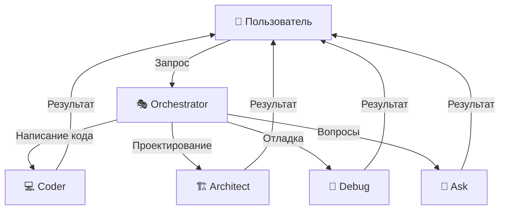
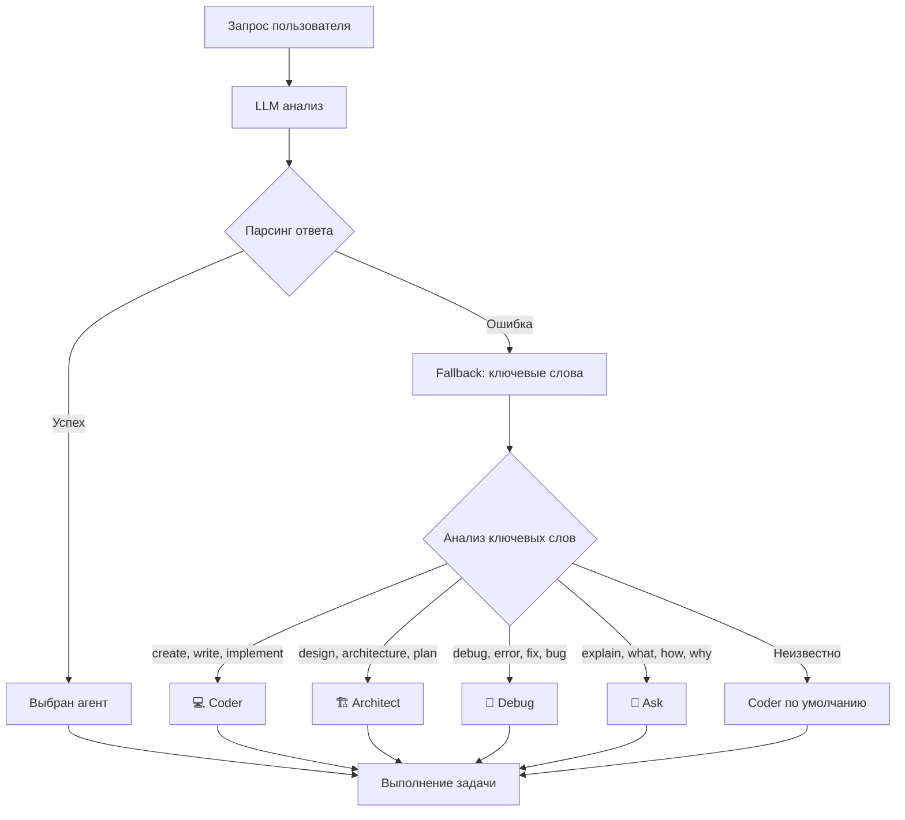
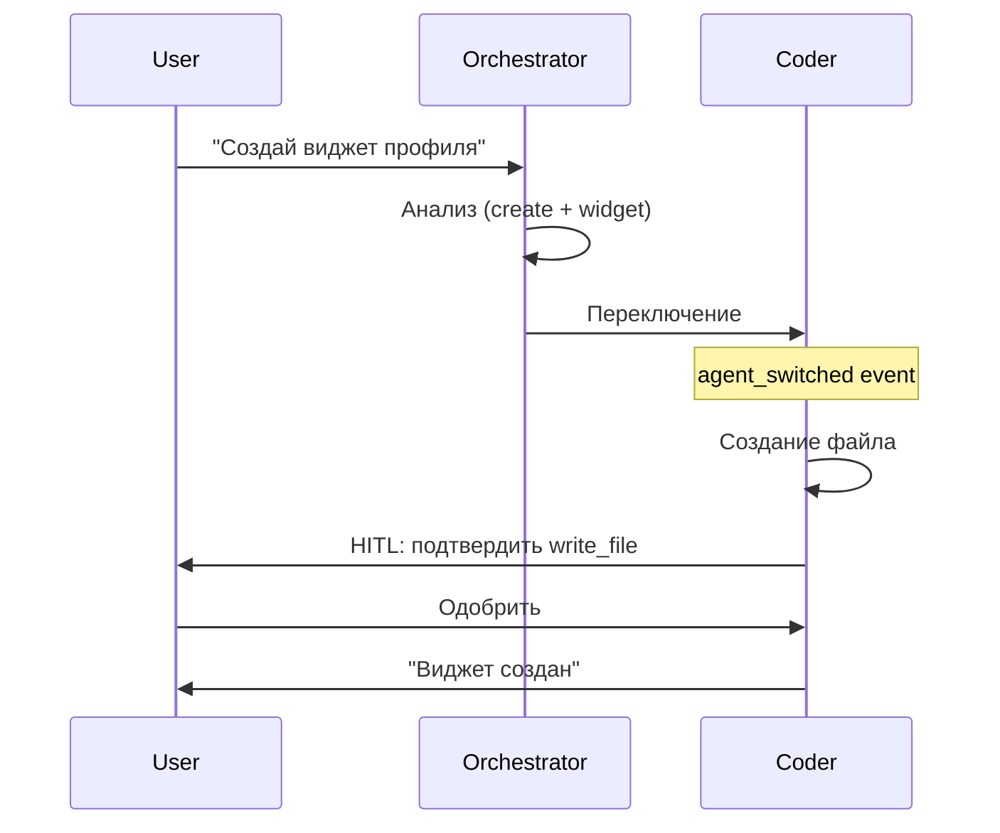
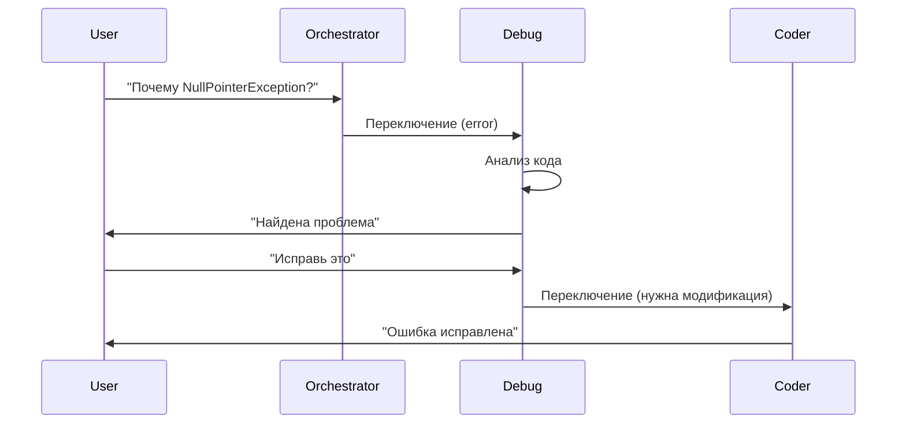
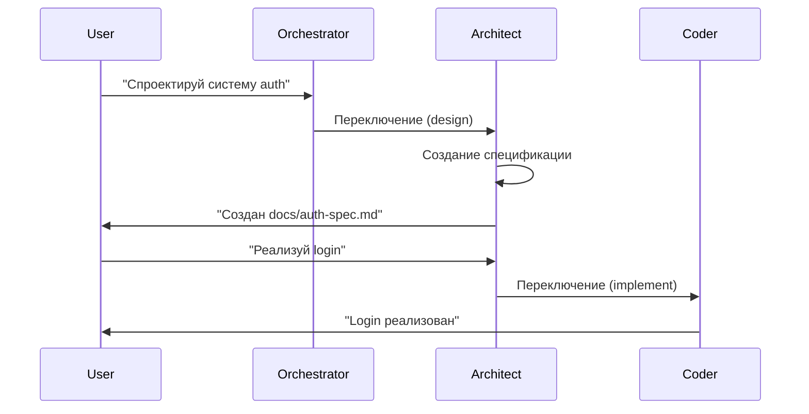
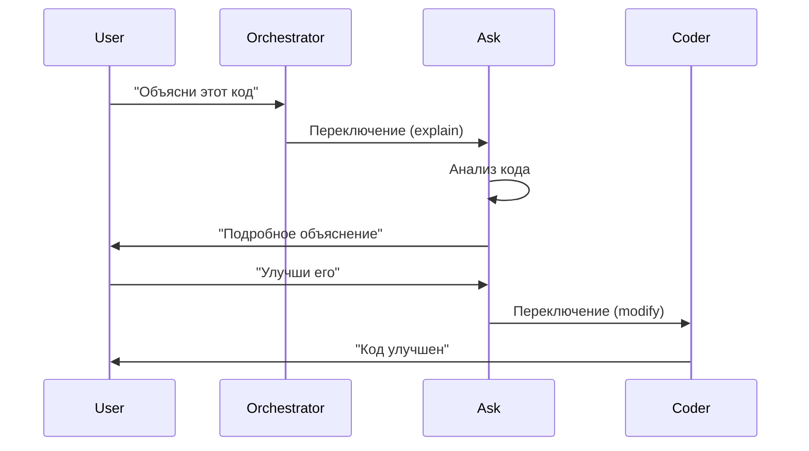

# Агенты системы

Детальное описание 5 специализированных агентов CodeLab, их возможностей, ограничений и сценариев использования.

## Обзор

CodeLab использует мультиагентную архитектуру с 5 специализированными агентами, каждый из которых является экспертом в своей области.



## 🎭 Orchestrator Agent

**Роль**: Главный координатор и маршрутизатор задач.

### Назначение

Orchestrator анализирует запросы пользователя и автоматически выбирает подходящего специализированного агента для выполнения задачи.

### Возможности

**Классификация запросов**:
- LLM-based анализ намерений пользователя
- Определение типа задачи (coding, debugging, architecture, questions)
- Fallback механизм на основе ключевых слов
- Учет контекста и истории диалога

**Маршрутизация**:
- Автоматический выбор агента на основе анализа
- Передача контекста выбранному агенту
- Логирование решений для аналитики

### Доступные инструменты

- ✅ `read_file` - чтение файлов для анализа
- ✅ `list_files` - просмотр структуры проекта
- ✅ `search_in_code` - поиск в коде

### Ограничения

- ❌ Не может модифицировать файлы
- ❌ Не может выполнять команды
- ❌ Не может делать Git операции
- ⚠️ Только анализ и маршрутизация

### Алгоритм классификации



### Ключевые слова для fallback

**Coder**:
- `create`, `write`, `implement`, `add`
- `modify`, `update`, `refactor`, `delete`
- `build`, `develop`, `code`

**Architect**:
- `design`, `architecture`, `plan`, `structure`
- `organize`, `document`, `spec`, `blueprint`

**Debug**:
- `debug`, `error`, `exception`, `bug`
- `issue`, `problem`, `crash`, `fix`
- `troubleshoot`, `diagnose`

**Ask**:
- `explain`, `what`, `how`, `why`
- `tell`, `show`, `describe`, `understand`
- `learn`, `teach`

### Примеры использования

```python
# Автоматическая маршрутизация
message = {
    "type": "user_message",
    "content": "Создай новый виджет для профиля пользователя"
}
# → Orchestrator выберет Coder Agent

message = {
    "type": "user_message",
    "content": "Почему возникает NullPointerException?"
}
# → Orchestrator выберет Debug Agent
```

## 💻 Coder Agent

**Роль**: Разработчик кода, основной исполнитель задач по написанию и модификации кода.

### Назначение

Coder - это главный агент для всех операций, связанных с написанием, модификацией и управлением кодом.

### Возможности

**Разработка кода**:
- Написание нового кода с нуля
- Модификация существующих файлов
- Рефакторинг и оптимизация
- Создание и удаление файлов

**Выполнение команд**:
- Запуск тестов
- Сборка проекта
- Установка зависимостей
- Любые shell команды (с HITL)

**Git операции**:
- Просмотр изменений (git diff)
- Создание коммитов
- Управление ветками

### Доступные инструменты

- ✅ `read_file` - чтение файлов
- ✅ `write_file` - запись файлов (с HITL)
- ✅ `list_files` - просмотр структуры
- ✅ `search_in_code` - поиск в коде
- ✅ `execute_command` - выполнение команд (с HITL)
- ✅ `git_diff` - просмотр изменений
- ✅ `git_commit` - создание коммитов (с HITL)
- ✅ `delete_file` - удаление файлов (с HITL)
- ✅ `apply_diff` - применение изменений

### Ограничения

- ⚠️ Опасные операции требуют HITL подтверждения
- ⚠️ Нет ограничений на типы файлов

### HITL операции

Следующие операции требуют подтверждения пользователя:

1. **write_file** - запись файлов
   ```python
   # Пользователь видит:
   # - Путь к файлу
   # - Содержимое файла
   # - Может редактировать перед сохранением
   ```

2. **delete_file** - удаление файлов
   ```python
   # Пользователь видит:
   # - Путь к файлу
   # - Предупреждение о необратимости
   ```

3. **execute_command** - выполнение команд
   ```python
   # Пользователь видит:
   # - Команду
   # - Рабочую директорию
   # - Может редактировать команду
   ```

4. **git_commit** - создание коммитов
   ```python
   # Пользователь видит:
   # - Сообщение коммита
   # - Список изменений
   # - Может редактировать сообщение
   ```

### Примеры использования

**Создание нового файла**:

```dart
// Dart/Flutter
final message = {
  'type': 'user_message',
  'content': 'Создай файл lib/widgets/user_profile.dart с виджетом профиля'
};

channel.sink.add(jsonEncode(message));
```

**Рефакторинг кода**:

```python
# Python
message = {
    "type": "user_message",
    "content": "Отрефактори функцию calculate() в utils.py, используя list comprehension"
}
```

**Выполнение тестов**:

```bash
# Через Coder Agent
"Запусти тесты для модуля authentication"
# → execute_command("flutter test test/auth_test.dart")
```

### Когда использовать Coder

- ✅ Написание нового кода
- ✅ Модификация существующих файлов
- ✅ Рефакторинг
- ✅ Создание/удаление файлов
- ✅ Выполнение команд
- ✅ Git операции
- ✅ Любые операции с кодом

## 🏗️ Architect Agent

**Роль**: Проектировщик архитектуры и документации.

### Назначение

Architect специализируется на проектировании архитектуры систем и создании технической документации.

### Возможности

**Проектирование**:
- Разработка архитектуры системы
- Создание технических спецификаций
- Планирование структуры проекта
- Дизайн API и интерфейсов

**Документация**:
- Написание README файлов
- Создание архитектурных диаграмм (Mermaid)
- Техническая документация
- API документация

### Доступные инструменты

- ✅ `read_file` - чтение файлов
- ✅ `write_file` - запись файлов (только `.md`)
- ✅ `list_files` - просмотр структуры
- ✅ `search_in_code` - поиск в коде

### Ограничения

- ⚠️ **Может редактировать только `.md` файлы**
- ❌ Не может выполнять команды
- ❌ Не может модифицировать код
- ❌ Не может делать Git операции

### Валидация file patterns

```python
# Architect может писать только .md файлы
✅ "docs/architecture.md"
✅ "README.md"
✅ "api/endpoints.md"

❌ "src/main.dart"  # PermissionError
❌ "lib/utils.py"   # PermissionError
❌ "config.yaml"    # PermissionError
```

### Примеры использования

**Создание архитектурной документации**:

```python
message = {
    "type": "user_message",
    "content": "Спроектируй архитектуру системы аутентификации и создай документацию"
}
# → Создаст docs/auth-architecture.md с диаграммами
```

**Обновление README**:

```dart
final message = {
  'type': 'user_message',
  'content': 'Обнови README.md с информацией о новых возможностях'
};
```

**Создание API документации**:

```python
message = {
    "type": "user_message",
    "content": "Создай документацию для REST API endpoints"
}
# → Создаст docs/api/endpoints.md
```

### Когда использовать Architect

- ✅ Проектирование архитектуры
- ✅ Создание технических спецификаций
- ✅ Написание документации
- ✅ Создание диаграмм
- ✅ Планирование структуры проекта
- ❌ Написание кода (переключится на Coder)

### Переключение на Coder

Когда пользователь просит реализовать спроектированное:

```python
User: "Спроектируй систему логирования"
Architect: "Создана спецификация в docs/logging-spec.md"

User: "Теперь реализуй это"
Architect → Coder: Переключение для реализации
```

## 🐛 Debug Agent

**Роль**: Отладчик и диагност проблем.

### Назначение

Debug специализируется на поиске и диагностике ошибок, анализе проблем и предложении решений.

### Возможности

**Анализ ошибок**:
- Анализ stack traces
- Поиск причин исключений
- Диагностика runtime ошибок
- Анализ логов

**Поиск багов**:
- Статический анализ кода
- Поиск потенциальных проблем
- Code review
- Проверка edge cases

**Диагностика**:
- Выполнение диагностических команд
- Проверка конфигурации
- Анализ зависимостей
- Проверка окружения

### Доступные инструменты

- ✅ `read_file` - чтение файлов
- ✅ `list_files` - просмотр структуры
- ✅ `search_in_code` - поиск в коде
- ✅ `execute_command` - выполнение команд (только безопасные)

### Ограничения

- ❌ **Не может модифицировать файлы (read-only)**
- ⚠️ Может выполнять только безопасные команды
- ❌ Не может делать Git операции
- ⚠️ Для исправления ошибок переключается на Coder

### Безопасные команды

Debug может выполнять только диагностические команды:

```bash
✅ flutter doctor
✅ flutter analyze
✅ dart pub get
✅ cat error.log
✅ ls -la
✅ grep "error" logs/

❌ rm -rf /
❌ flutter clean
❌ git reset --hard
```

### Примеры использования

**Анализ ошибки**:

```dart
final message = {
  'type': 'user_message',
  'content': 'Почему возникает NullPointerException в main.dart строка 45?'
};

// Debug Agent:
// 1. Прочитает main.dart
// 2. Проанализирует код вокруг строки 45
// 3. Найдет причину (неинициализированная переменная)
// 4. Предложит решение
```

**Диагностика проблемы**:

```python
message = {
    "type": "user_message",
    "content": "Приложение падает при запуске, помоги найти причину"
}

# Debug Agent:
# 1. Выполнит flutter doctor
# 2. Проверит логи
# 3. Проанализирует конфигурацию
# 4. Найдет проблему
```

**Поиск бага**:

```python
message = {
    "type": "user_message",
    "content": "Найди почему функция calculate() возвращает неверный результат"
}

# Debug Agent:
# 1. Прочитает код функции
# 2. Проанализирует логику
# 3. Найдет ошибку в вычислениях
# 4. Объяснит проблему
```

### Когда использовать Debug

- ✅ Анализ ошибок и исключений
- ✅ Поиск багов в коде
- ✅ Диагностика проблем
- ✅ Анализ логов
- ✅ Code review
- ❌ Исправление ошибок (переключится на Coder)

### Переключение на Coder

Когда нужно исправить найденную проблему:

```python
User: "Почему NullPointerException?"
Debug: "Найдена проблема: переменная user не инициализирована"

User: "Исправь это"
Debug → Coder: Переключение для исправления
```

## 💬 Ask Agent

**Роль**: Консультант и учитель, отвечает на вопросы.

### Назначение

Ask специализируется на объяснении концепций, ответах на вопросы и обучении.

### Возможности

**Объяснения**:
- Объяснение кода
- Разъяснение концепций
- Описание паттернов
- Объяснение архитектуры

**Консультации**:
- Рекомендации по best practices
- Советы по оптимизации
- Помощь в выборе решений
- Ответы на технические вопросы

**Обучение**:
- Пошаговые объяснения
- Примеры использования
- Сравнение подходов
- Рекомендации по обучению

### Доступные инструменты

- ✅ `read_file` - чтение файлов
- ✅ `search_in_code` - поиск в коде
- ✅ `list_files` - просмотр структуры

### Ограничения

- ❌ **Только чтение, без модификации**
- ❌ Не может выполнять команды
- ❌ Не может модифицировать файлы
- ❌ Не может делать Git операции
- ⚠️ Для изменений переключается на Coder

### Примеры использования

**Объяснение кода**:

```dart
final message = {
  'type': 'user_message',
  'content': 'Объясни, как работает этот код в main.dart'
};

// Ask Agent:
// 1. Прочитает main.dart
// 2. Проанализирует код
// 3. Даст подробное объяснение
// 4. Приведет примеры
```

**Вопрос о концепции**:

```python
message = {
    "type": "user_message",
    "content": "Что такое BLoC паттерн и когда его использовать?"
}

# Ask Agent даст подробное объяснение с примерами
```

**Сравнение подходов**:

```python
message = {
    "type": "user_message",
    "content": "В чем разница между StatefulWidget и StatelessWidget?"
}

# Ask Agent объяснит различия и приведет примеры использования
```

**Рекомендации**:

```python
message = {
    "type": "user_message",
    "content": "Как лучше организовать структуру Flutter проекта?"
}

# Ask Agent даст рекомендации по best practices
```

### Когда использовать Ask

- ✅ Объяснение кода
- ✅ Вопросы о концепциях
- ✅ Консультации по best practices
- ✅ Обучение и примеры
- ✅ Сравнение подходов
- ❌ Модификация кода (переключится на Coder)

### Переключение на Coder

Когда пользователь просит внести изменения:

```python
User: "Объясни этот код"
Ask: "Подробное объяснение..."

User: "Можешь улучшить его?"
Ask → Coder: Переключение для модификации
```

## Сравнение агентов

### Матрица возможностей

| Возможность | Orchestrator | Coder | Architect | Debug | Ask |
|-------------|--------------|-------|-----------|-------|-----|
| **Чтение файлов** | ✅ | ✅ | ✅ | ✅ | ✅ |
| **Запись файлов** | ❌ | ✅ | ✅ (.md) | ❌ | ❌ |
| **Удаление файлов** | ❌ | ✅ | ❌ | ❌ | ❌ |
| **Выполнение команд** | ❌ | ✅ | ❌ | ✅ (safe) | ❌ |
| **Git операции** | ❌ | ✅ | ❌ | ❌ | ❌ |
| **Поиск в коде** | ✅ | ✅ | ✅ | ✅ | ✅ |
| **Просмотр структуры** | ✅ | ✅ | ✅ | ✅ | ✅ |

### Матрица ограничений

| Агент | Основное ограничение | Файловые паттерны |
|-------|---------------------|-------------------|
| **Orchestrator** 🎭 | Только анализ | Нет записи |
| **Coder** 💻 | HITL для опасных операций | Нет ограничений |
| **Architect** 🏗️ | Только .md файлы | `*.md` |
| **Debug** 🐛 | Read-only | Нет записи |
| **Ask** 💬 | Только чтение | Нет записи |

## Сценарии использования

### Сценарий 1: Создание нового компонента



### Сценарий 2: Отладка и исправление



### Сценарий 3: Проектирование и реализация



### Сценарий 4: Обучение и консультация



## Best Practices

### Для пользователей

1. **Доверяйте автоматической маршрутизации**
   - Orchestrator обычно выбирает правильного агента
   - Используйте естественный язык

2. **Явное переключение для специфических задач**
   - Используйте `switch_agent` когда точно знаете нужного агента
   - Полезно для сложных многошаговых задач

3. **Проверяйте HITL запросы**
   - Внимательно читайте что делает операция
   - Редактируйте параметры при необходимости
   - Отклоняйте подозрительные операции

### Для разработчиков

1. **Соблюдайте ограничения агентов**
   - Не пытайтесь обойти file pattern restrictions
   - Используйте правильного агента для задачи

2. **Логируйте переключения агентов**
   - Полезно для аналитики
   - Помогает улучшить классификацию

3. **Обрабатывайте agent_switched события**
   - Обновляйте UI индикатор
   - Информируйте пользователя

## Дополнительные ресурсы

- [Мультиагентная система](/docs/ai-assistant/multi-agent-system)
- [Agent Protocol](/docs/api/agent-protocol)
- [Agent Runtime API](/docs/api/agent-runtime)
- [Event-Driven Architecture](/docs/architecture/event-driven)

---

**Версия**: 1.0  
**Дата**: 21 января 2026  
**Статус**: ✅ Production Ready
