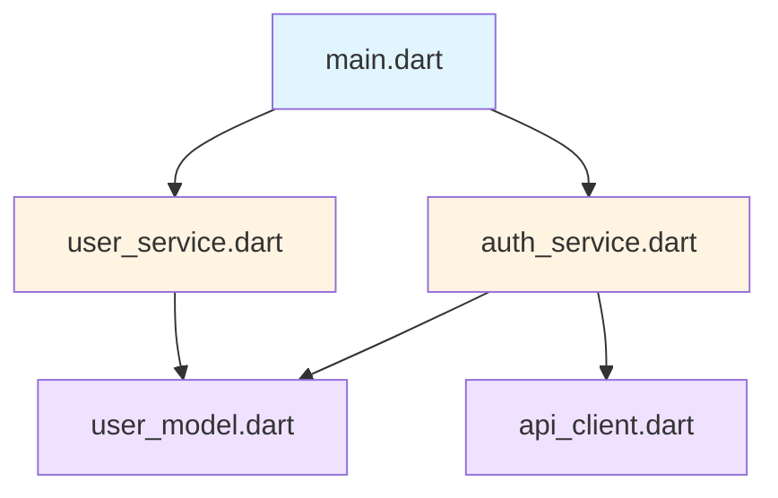

# Context Management

Управление контекстом в мультиагентной системе CodeLab для эффективной работы с проектами.

## Обзор

Система управления контекстом обеспечивает агентам доступ к релевантной информации о проекте, истории взаимодействий и текущем состоянии задачи.

## Компоненты контекста

### 1. Project Context

Информация о структуре и состоянии проекта.

**Включает**:
- Список файлов и директорий
- Тип проекта (Flutter, Python, Node.js, etc.)
- Зависимости (pubspec.yaml, package.json, requirements.txt)
- Конфигурационные файлы
- README и документация

**Сбор**:
```python
project_context = {
    "type": "flutter",
    "root": "/path/to/project",
    "files": ["lib/main.dart", "pubspec.yaml", ...],
    "dependencies": {
        "flutter": "3.38.5",
        "packages": ["provider", "http", ...]
    }
}
```

### 2. Session Context

Контекст текущей сессии взаимодействия.

**Включает**:
- ID сессии
- Текущий агент
- История переключений агентов
- Системный промпт
- Настройки пользователя

**Структура**:
```python
session_context = {
    "session_id": "uuid",
    "current_agent": "coder",
    "agent_history": [
        {"agent": "orchestrator", "timestamp": "..."},
        {"agent": "coder", "timestamp": "..."}
    ],
    "system_prompt": "You are a helpful coding assistant",
    "user_preferences": {
        "autonomy_level": "cautious",
        "language": "ru"
    }
}
```

### 3. Conversation Context

История сообщений и взаимодействий.

**Включает**:
- Сообщения пользователя
- Ответы агентов
- Tool calls и их результаты
- HITL решения

**Структура**:
```python
conversation_context = {
    "messages": [
        {
            "role": "user",
            "content": "Создай виджет UserCard",
            "timestamp": "2026-01-21T10:00:00Z"
        },
        {
            "role": "assistant",
            "agent": "coder",
            "content": "Создаю виджет...",
            "tool_calls": [
                {
                    "tool": "write_to_file",
                    "status": "approved",
                    "result": "success"
                }
            ],
            "timestamp": "2026-01-21T10:00:05Z"
        }
    ]
}
```

### 4. File Context

Контекст открытых и релевантных файлов.

**Включает**:
- Содержимое файлов
- Метаданные (размер, дата изменения)
- Синтаксическое дерево (AST)
- Зависимости между файлами

**Пример**:
```python
file_context = {
    "lib/main.dart": {
        "content": "import 'package:flutter/material.dart'...",
        "size": 1024,
        "modified": "2026-01-21T09:00:00Z",
        "imports": ["package:flutter/material.dart"],
        "classes": ["MyApp", "MyHomePage"]
    }
}
```

## Context Window Management

### Ограничения

Каждая LLM модель имеет ограничение на размер контекста:

| Модель | Context Window | Рекомендуемое использование |
|--------|----------------|----------------------------|
| GPT-4 | 128K tokens | 80K tokens (оставить место для ответа) |
| GPT-3.5 | 16K tokens | 12K tokens |
| Claude 3 | 200K tokens | 150K tokens |
| Ollama (local) | 4K-32K tokens | Зависит от модели |

### Стратегии оптимизации

#### 1. Приоритизация контекста

```python
context_priority = {
    "high": [
        "current_file",
        "recent_messages",
        "active_task"
    ],
    "medium": [
        "related_files",
        "project_structure",
        "dependencies"
    ],
    "low": [
        "old_messages",
        "documentation",
        "examples"
    ]
}
```

#### 2. Сжатие истории

Старые сообщения сжимаются в краткие саммари:

```python
# Оригинал (1000 tokens)
messages = [
    {"role": "user", "content": "Создай виджет..."},
    {"role": "assistant", "content": "Создаю виджет..."},
    # ... много сообщений
]

# Сжатое (100 tokens)
summary = {
    "summary": "Пользователь попросил создать виджет UserCard. Агент создал файл lib/widgets/user_card.dart с базовой реализацией.",
    "key_decisions": ["Использован StatelessWidget", "Добавлен параметр user"],
    "files_modified": ["lib/widgets/user_card.dart"]
}
```

#### 3. Умная загрузка файлов

Загружаются только релевантные части больших файлов:

```python
# Вместо загрузки всего файла (10000 строк)
full_file = read_file("lib/large_file.dart")

# Загружаем только нужную функцию (50 строк)
relevant_code = extract_function("lib/large_file.dart", "targetFunction")
```

## Context Retrieval

### Semantic Search

Поиск релевантного контекста с использованием embeddings:

```python
# 1. Создание embeddings для файлов проекта
embeddings = create_embeddings(project_files)

# 2. Поиск релевантных файлов по запросу
query = "authentication logic"
relevant_files = semantic_search(query, embeddings, top_k=5)

# 3. Добавление в контекст
context.add_files(relevant_files)
```

### Dependency Graph

Автоматическое включение зависимых файлов:



Если агент работает с `user_service.dart`, автоматически загружаются:
- `user_model.dart` (используется в user_service)
- `main.dart` (использует user_service)

## Context Persistence

### Session Storage

Контекст сохраняется в PostgreSQL для восстановления сессий:

```sql
CREATE TABLE sessions (
    session_id UUID PRIMARY KEY,
    user_id UUID NOT NULL,
    current_agent VARCHAR(50),
    context JSONB,
    created_at TIMESTAMP,
    last_activity TIMESTAMP
);

CREATE TABLE messages (
    id UUID PRIMARY KEY,
    session_id UUID REFERENCES sessions(session_id),
    role VARCHAR(20),
    content TEXT,
    agent VARCHAR(50),
    tool_calls JSONB,
    timestamp TIMESTAMP
);
```

### Context Caching

Часто используемый контекст кэшируется в Redis:

```python
# Кэширование структуры проекта
redis.setex(
    f"project:{project_id}:structure",
    3600,  # TTL 1 час
    json.dumps(project_structure)
)

# Кэширование embeddings
redis.setex(
    f"project:{project_id}:embeddings",
    86400,  # TTL 24 часа
    pickle.dumps(embeddings)
)
```

## Context Sharing между агентами

При переключении агентов контекст передается:

```python
def switch_agent(session_id, from_agent, to_agent):
    # 1. Сохранить контекст текущего агента
    context = from_agent.get_context()
    
    # 2. Создать саммари для нового агента
    summary = create_agent_handoff_summary(context)
    
    # 3. Передать контекст новому агенту
    to_agent.load_context(context, summary)
    
    # 4. Добавить специфичный контекст для нового агента
    if to_agent.type == "coder":
        context.add_coding_guidelines()
    elif to_agent.type == "architect":
        context.add_architecture_patterns()
```

## Context-Aware Tool Selection

Агенты выбирают инструменты на основе контекста:

```python
def select_tools(context):
    tools = []
    
    # Базовые инструменты для всех
    tools.extend(["read_file", "list_files", "search_files"])
    
    # Специфичные для типа проекта
    if context.project_type == "flutter":
        tools.extend(["flutter_analyze", "flutter_test"])
    elif context.project_type == "python":
        tools.extend(["pytest", "pylint"])
    
    # Специфичные для агента
    if context.current_agent == "coder":
        tools.extend(["write_to_file", "apply_diff"])
    elif context.current_agent == "debug":
        tools.extend(["execute_command", "browser_action"])
    
    return tools
```

## Best Practices

### Для разработчиков

1. **Минимизируйте контекст** - включайте только необходимое
2. **Используйте кэширование** - не загружайте одно и то же повторно
3. **Сжимайте историю** - старые сообщения → саммари
4. **Приоритизируйте** - важное в начало контекста

### Для пользователей

1. **Будьте конкретны** - четкие запросы требуют меньше контекста
2. **Разбивайте задачи** - большие задачи на подзадачи
3. **Используйте новые сессии** - для несвязанных задач
4. **Очищайте историю** - если контекст стал нерелевантным

## Мониторинг контекста

### Метрики

```python
context_metrics = {
    "total_tokens": 45000,
    "used_tokens": 38000,
    "available_tokens": 7000,
    "context_utilization": 0.84,
    "files_loaded": 12,
    "messages_count": 25,
    "cache_hit_rate": 0.75
}
```

### Предупреждения

Система предупреждает при приближении к лимитам:

```
⚠️ Context window 85% full (110K/128K tokens)
Consider:
- Starting a new session
- Clearing old messages
- Reducing file context
```

## См. также

- [Multi-Agent System](/docs/ai-assistant/multi-agent-system)
- [AI Assistant Overview](/docs/ai-assistant/overview)
- [Session Management](/docs/api/agent-runtime)
