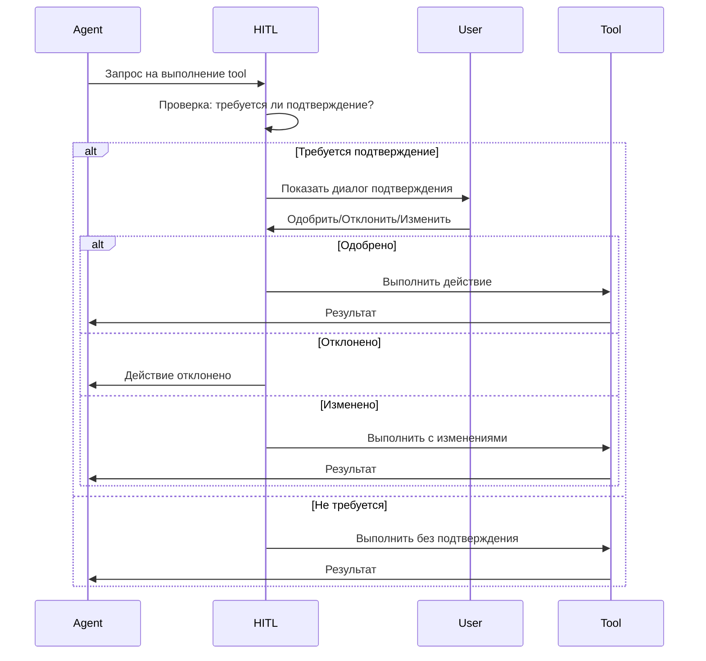

# Human-in-the-Loop (HITL)

Human-in-the-Loop (HITL) — это механизм контроля действий AI агентов, который позволяет пользователю одобрять, отклонять или модифицировать действия перед их выполнением.

## 🎯 Зачем нужен HITL?

### Проблемы автономных агентов

Полностью автономные AI агенты могут:
- ❌ Удалить важные файлы
- ❌ Выполнить опасные команды
- ❌ Внести нежелательные изменения
- ❌ Нарушить структуру проекта

### Решение через HITL

HITL обеспечивает:
- ✅ Контроль критичных операций
- ✅ Предпросмотр изменений
- ✅ Возможность корректировки
- ✅ Безопасность проекта
- ✅ Обучение агента через feedback

## 🔄 Как работает HITL

### Процесс подтверждения



### Типы действий

| Действие | Требует подтверждения | Причина |
|----------|----------------------|---------|
| `read_file` | ❌ Нет | Безопасная операция |
| `list_files` | ❌ Нет | Безопасная операция |
| `search_files` | ❌ Нет | Безопасная операция |
| `write_file` | ✅ Да | Модификация файлов |
| `apply_diff` | ✅ Да | Модификация файлов |
| `execute_command` | ✅ Да | Потенциально опасно |

## 🎨 UI компоненты

### Диалог подтверждения

Когда агент запрашивает выполнение действия, появляется диалог:

```
┌─────────────────────────────────────────────────┐
│  🤖 Агент запрашивает подтверждение             │
├─────────────────────────────────────────────────┤
│                                                 │
│  Агент: Coder                                   │
│  Действие: write_file                           │
│  Файл: lib/services/auth_service.dart          │
│                                                 │
│  ┌───────────────────────────────────────────┐ │
│  │ Предпросмотр изменений:                   │ │
│  │                                           │ │
│  │ import 'package:http/http.dart';          │ │
│  │                                           │ │
│  │ class AuthService {                       │ │
│  │   Future<String> login(                   │ │
│  │     String email,                         │ │
│  │     String password                       │ │
│  │   ) async {                               │ │
│  │     // Implementation...                  │ │
│  │   }                                       │ │
│  │ }                                         │ │
│  └───────────────────────────────────────────┘ │
│                                                 │
│  [✅ Одобрить]  [❌ Отклонить]  [✏️ Изменить]   │
│                                                 │
│  ⚙️ Настройки:                                  │
│  ☐ Запомнить для этого типа действий           │
│  ☐ Не спрашивать для этого файла               │
└─────────────────────────────────────────────────┘
```

### Действия пользователя

#### 1. Одобрить (Approve)

Разрешает выполнение действия без изменений.

**Результат:**
- Действие выполняется
- Агент получает результат
- Продолжает работу

#### 2. Отклонить (Reject)

Отменяет выполнение действия.

**Результат:**
- Действие не выполняется
- Агент получает сообщение об отклонении
- Может попросить альтернативное решение

**Пример:**
```
Агент: "Хочу удалить файл config.yaml"
Пользователь: [Отклонить]
Агент: "Понял, не буду удалять. Могу ли я изменить его вместо этого?"
```

#### 3. Изменить (Modify)

Позволяет внести правки перед выполнением.

**Возможности:**
- Редактирование содержимого файла
- Изменение пути файла
- Корректировка параметров команды

**Пример:**
```dart
// Агент предложил:
class UserService {
  final api = ApiClient();
}

// Пользователь изменил на:
class UserService {
  final ApiClient _api;
  
  UserService(this._api);
}
```

## ⚙️ Настройки HITL

### Уровни контроля

#### Строгий режим (Strict)

**Характеристики:**
- Подтверждение **всех** действий
- Максимальный контроль
- Рекомендуется для критичных проектов

**Требует подтверждения:**
- ✅ Все операции записи
- ✅ Все команды
- ✅ Даже чтение конфиденциальных файлов

#### Средний режим (Medium) - По умолчанию

**Характеристики:**
- Подтверждение опасных действий
- Баланс между контролем и удобством
- Рекомендуется для большинства случаев

**Требует подтверждения:**
- ✅ Запись/изменение файлов
- ✅ Выполнение команд
- ✅ Удаление файлов
- ❌ Чтение файлов
- ❌ Поиск в коде

#### Свободный режим (Permissive)

**Характеристики:**
- Минимум подтверждений
- Максимальная автономность
- Для опытных пользователей

**Требует подтверждения:**
- ✅ Только критичные операции (удаление, системные команды)
- ❌ Обычная запись файлов
- ❌ Безопасные команды

### Настройка в IDE

```typescript
// Настройки HITL в IDE
{
  "hitl": {
    "mode": "medium",  // strict | medium | permissive
    "autoApprove": {
      "readOperations": true,
      "safeCommands": ["flutter pub get", "npm install"]
    },
    "alwaysConfirm": {
      "filePatterns": ["*.yaml", "*.json", ".env"],
      "commands": ["rm", "del", "sudo"]
    }
  }
}
```

## 💾 Персистентность решений

### Сохранение одобрений

HITL сохраняет решения пользователя в базе данных:

```sql
CREATE TABLE tool_approvals (
  id UUID PRIMARY KEY,
  session_id UUID NOT NULL,
  tool_name VARCHAR(50) NOT NULL,
  parameters JSONB NOT NULL,
  status VARCHAR(20) NOT NULL,  -- approved, rejected, modified
  user_feedback TEXT,
  created_at TIMESTAMP DEFAULT NOW()
);
```

### Восстановление после перезапуска

При перезапуске IDE:
1. Загружаются pending approvals из БД
2. Показываются диалоги подтверждения
3. Пользователь может одобрить/отклонить
4. Агент продолжает работу

**Пример:**
```
IDE перезапущена во время работы агента

При запуске:
┌─────────────────────────────────────────┐
│  Восстановление сессии                  │
├─────────────────────────────────────────┤
│  Найдено 2 ожидающих подтверждения:     │
│                                         │
│  1. write_file: lib/models/user.dart    │
│  2. execute_command: flutter pub get    │
│                                         │
│  [Просмотреть и одобрить]               │
└─────────────────────────────────────────┘
```

## 🔒 Безопасность

### Опасные операции

Всегда требуют подтверждения:

#### Удаление файлов
```bash
# Команды удаления
rm -rf *
del /f /s /q *
```

#### Системные команды
```bash
# Потенциально опасные
sudo rm -rf /
format C:
chmod 777 -R /
```

#### Модификация критичных файлов
- `pubspec.yaml` - зависимости Flutter
- `package.json` - зависимости Node.js
- `.env` - переменные окружения
- `docker-compose.yml` - конфигурация Docker

### Защита от обхода

HITL реализован на уровне Tool Executor:
- ❌ Агент не может обойти проверку
- ❌ Нет прямого доступа к файловой системе
- ✅ Все действия проходят через HITL
- ✅ Логирование всех попыток

## 📊 Аналитика HITL

### Метрики

Система собирает статистику:
- Количество запросов на подтверждение
- Процент одобренных/отклоненных
- Время принятия решения
- Частота модификаций

### Обучение агента

HITL данные используются для:
- Улучшения предложений агента
- Понимания предпочтений пользователя
- Адаптации под стиль работы
- Снижения количества отклонений

## 🎓 Best Practices

### Для пользователей

1. **Внимательно читайте предпросмотр**
   - Проверяйте все изменения
   - Обращайте внимание на критичные файлы

2. **Используйте модификацию**
   - Не отклоняйте сразу
   - Попробуйте скорректировать

3. **Настройте под себя**
   - Выберите подходящий уровень контроля
   - Добавьте автоодобрение для безопасных операций

4. **Давайте feedback**
   - Объясняйте причину отклонения
   - Помогайте агенту учиться

### Для разработчиков агентов

1. **Минимизируйте опасные операции**
   - Используйте `apply_diff` вместо `write_file` где возможно
   - Разбивайте большие изменения на маленькие

2. **Предоставляйте контекст**
   - Объясняйте зачем нужно действие
   - Показывайте альтернативы

3. **Учитывайте feedback**
   - Анализируйте отклонения
   - Адаптируйте поведение

## 🔗 Связанные разделы

- [Обзор AI ассистента](overview.md)
- [Инструменты агентов](tools.md)
- [Мультиагентная система](multi-agent-system.md)

## 📚 Дополнительные ресурсы

- [WebSocket Protocol](../api/websocket-protocol.md) - протокол взаимодействия
- [Agent Protocol](../api/agent-protocol.md) - расширенный протокол агента
- [Architecture Overview](../architecture/overview.md) - общая архитектура системы

---

**HITL** — это ключевой механизм безопасности CodeLab, обеспечивающий баланс между автономностью AI и контролем пользователя.
