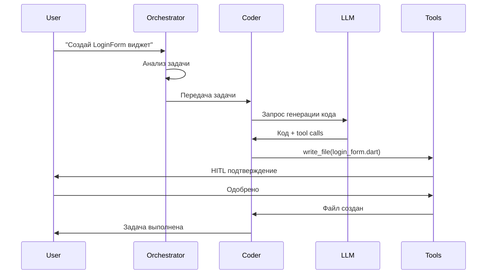

# Обзор AI ассистента

AI ассистент CodeLab — это мультиагентная система, способная автономно выполнять сложные задачи разработки. Система состоит из 5 специализированных агентов, каждый из которых оптимизирован для определенного типа задач.

## 🤖 Мультиагентная архитектура

### Почему мультиагентная система?

Традиционные AI ассистенты используют один универсальный агент, что приводит к:
- ❌ Низкому качеству специализированных задач
- ❌ Сложности в управлении контекстом
- ❌ Отсутствию гибкости в настройке прав доступа

Мультиагентная система CodeLab решает эти проблемы:
- ✅ Каждый агент специализируется на своей области
- ✅ Четкое разделение ответственности
- ✅ Гибкая настройка прав доступа к инструментам
- ✅ Возможность параллельного выполнения задач

## 🎭 Агенты системы

### Orchestrator - Координатор

**Роль:** Анализ задач и маршрутизация к специализированным агентам

**Возможности:**
- Анализ пользовательских запросов
- Определение типа задачи
- Выбор подходящего агента
- Координация работы нескольких агентов

**Инструменты:**
- `read_file` - чтение файлов для анализа
- `list_files` - просмотр структуры проекта
- `search_files` - поиск в коде

**Ограничения:**
- Не может модифицировать код
- Только анализ и маршрутизация

**Пример использования:**
```
Пользователь: "Создай REST API для управления пользователями"

Orchestrator: 
1. Анализирует задачу
2. Определяет, что нужен Architect для проектирования
3. Затем Coder для реализации
4. Передает задачу соответствующим агентам
```

### Coder - Разработчик

**Роль:** Написание и модификация кода

**Возможности:**
- Создание новых файлов и модулей
- Модификация существующего кода
- Рефакторинг
- Реализация функций и классов
- Работа с любыми типами файлов

**Инструменты (полный доступ):**
- `read_file` - чтение файлов
- `write_file` - создание/изменение файлов
- `list_files` - просмотр структуры
- `search_files` - поиск в коде
- `apply_diff` - применение изменений
- `execute_command` - выполнение команд
- `ask_followup_question` - уточняющие вопросы
- `attempt_completion` - завершение задачи
- `read_multiple_files` - чтение нескольких файлов

**Ограничения:**
- Нет (полный доступ ко всем инструментам)

**Пример использования:**
```dart
// Задача: "Добавь метод для валидации email"

class UserValidator {
  // Coder добавит:
  static bool isValidEmail(String email) {
    final emailRegex = RegExp(
      r'^[a-zA-Z0-9._%+-]+@[a-zA-Z0-9.-]+\.[a-zA-Z]{2,}$'
    );
    return emailRegex.hasMatch(email);
  }
}
```

### Architect - Архитектор

**Роль:** Проектирование архитектуры и документация

**Возможности:**
- Проектирование архитектуры системы
- Создание технической документации
- Планирование структуры проекта
- Написание спецификаций

**Инструменты:**
- `read_file` - чтение файлов
- `write_file` - создание/изменение **только .md файлов**
- `list_files` - просмотр структуры
- `search_files` - поиск в коде

**Ограничения:**
- Может создавать/изменять только `.md` файлы
- Не может модифицировать код

**Пример использования:**
```markdown
# Архитектура модуля аутентификации

## Компоненты

### AuthService
- Управление токенами
- Валидация пользователей
- Обновление сессий

### AuthRepository
- Взаимодействие с API
- Кэширование токенов
```

### Debug - Отладчик

**Роль:** Поиск и исправление ошибок

**Возможности:**
- Анализ ошибок и логов
- Поиск багов в коде
- Предложение исправлений
- Анализ stack traces
- Выполнение диагностических команд

**Инструменты:**
- `read_file` - чтение файлов
- `list_files` - просмотр структуры
- `search_files` - поиск в коде
- `execute_command` - выполнение команд для диагностики

**Ограничения:**
- Не может модифицировать файлы (read-only режим)
- Только анализ и рекомендации

**Пример использования:**
```
Ошибка: "Null check operator used on a null value"

Debug агент:
1. Анализирует stack trace
2. Находит проблемный код
3. Предлагает исправление:
   "Замените user.name! на user.name ?? 'Unknown'"
```

### Ask - Консультант

**Роль:** Ответы на вопросы и объяснения

**Возможности:**
- Объяснение кода
- Ответы на технические вопросы
- Рекомендации по best practices
- Обучение и консультации

**Инструменты (минимальные):**
- `read_file` - чтение файлов для анализа
- `search_files` - поиск информации
- `list_files` - просмотр структуры

**Ограничения:**
- Не может модифицировать код
- Не может выполнять команды
- Только чтение и консультации

**Пример использования:**
```
Вопрос: "Как работает BLoC pattern в Flutter?"

Ask агент:
"BLoC (Business Logic Component) - это паттерн управления 
состоянием, который разделяет бизнес-логику от UI. 
Основные компоненты:
1. Events - входящие события
2. States - состояния UI
3. BLoC - обработчик событий и генератор состояний
..."
```

## 🔄 Процесс работы

### Типичный workflow



### Автоматическое переключение агентов

Orchestrator может автоматически переключаться между агентами:

```
Задача: "Создай API и задокументируй его"

Orchestrator:
1. Architect → создает архитектурный документ
2. Coder → реализует API
3. Architect → обновляет документацию с примерами
```

## 🛠️ Инструменты агентов

Подробное описание всех инструментов см. в [документации по инструментам](tools.md).

### Категории инструментов

| Категория | Инструменты | Доступ |
|-----------|-------------|--------|
| **Чтение** | read_file, read_multiple_files, list_files | Все агенты |
| **Поиск** | search_files | Все агенты |
| **Запись** | write_file, apply_diff | Coder, Architect* |
| **Выполнение** | execute_command | Coder, Debug |
| **Коммуникация** | ask_followup_question, attempt_completion | Все агенты |

*Architect может писать только .md файлы

## 🤝 Human-in-the-Loop (HITL)

Система HITL обеспечивает контроль над действиями агентов. Подробнее см. [HITL документацию](hitl.md).

### Уровни контроля

- **Строгий** - подтверждение всех действий
- **Средний** - подтверждение опасных действий (по умолчанию)
- **Свободный** - минимум подтверждений

### Опасные операции

Требуют подтверждения:
- Удаление файлов
- Выполнение системных команд
- Модификация критичных файлов (pubspec.yaml, package.json)
- Массовые изменения

## 📊 Метрики и мониторинг

Система собирает метрики работы агентов:
- Количество переключений между агентами
- Время выполнения задач
- Успешность выполнения
- Использование инструментов
- Токены LLM

## 🔗 Связанные разделы

- [Мультиагентная система](multi-agent-system.md) - детальная архитектура
- [Инструменты агентов](tools.md) - описание всех инструментов
- [HITL механизм](hitl.md) - контроль действий
- [Управление контекстом](context-management.md) - работа с контекстом

---

**Следующий шаг:** Изучите [детали мультиагентной системы](multi-agent-system.md) для глубокого понимания архитектуры.
