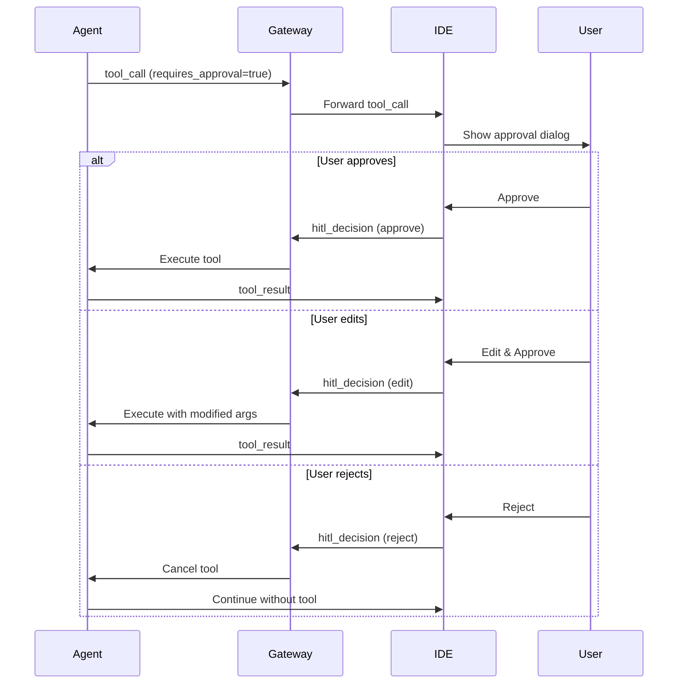

# Agent Protocol

Расширенный протокол для взаимодействия с AI агентом, включающий tool-calls, HITL и управление контекстом.

## Обзор

Agent Protocol расширяет базовый WebSocket протокол дополнительными возможностями для управления AI агентом и выполнения сложных операций.

## Типы сообщений

### 1. Tool Call Request

Запрос на выполнение инструмента в IDE.

```json
{
  "type": "tool_call",
  "call_id": "call_abc123",
  "tool_name": "read_file",
  "arguments": {
    "path": "/src/main.dart"
  },
  "requires_approval": false
}
```

**Поля:**
- `type` (string): `"tool_call"`
- `call_id` (string): Уникальный ID вызова
- `tool_name` (string): Имя инструмента
- `arguments` (object): Параметры инструмента
- `requires_approval` (boolean): Требуется ли подтверждение пользователя

### 2. Tool Result

Результат выполнения инструмента.

**Успех:**
```json
{
  "type": "tool_result",
  "call_id": "call_abc123",
  "result": {
    "content": "file content here"
  }
}
```

**Ошибка:**
```json
{
  "type": "tool_result",
  "call_id": "call_abc123",
  "error": "File not found: /src/main.dart"
}
```

### 3. HITL Decision

Решение пользователя по tool call.

**Одобрить:**
```json
{
  "type": "hitl_decision",
  "call_id": "call_xyz789",
  "decision": "approve"
}
```

**Редактировать:**
```json
{
  "type": "hitl_decision",
  "call_id": "call_xyz789",
  "decision": "edit",
  "modified_arguments": {
    "path": "/src/modified.dart",
    "content": "modified content"
  }
}
```

**Отклонить:**
```json
{
  "type": "hitl_decision",
  "call_id": "call_xyz789",
  "decision": "reject",
  "feedback": "This operation is too risky"
}
```

### 4. Context Update

Обновление контекста диалога.

```json
{
  "type": "context_update",
  "session_id": "session_123",
  "action": "add_file",
  "data": {
    "path": "/src/main.dart",
    "content": "file content"
  }
}
```

### 5. Agent Status

Статус агента.

```json
{
  "type": "agent_status",
  "status": "thinking",
  "message": "Analyzing code..."
}
```

Возможные статусы:
- `idle` - ожидание
- `thinking` - обработка запроса
- `executing_tool` - выполнение инструмента
- `waiting_approval` - ожидание подтверждения
- `error` - ошибка

## Доступные инструменты

### Файловые операции

#### read_file

Чтение содержимого файла.

```json
{
  "tool_name": "read_file",
  "arguments": {
    "path": "/src/main.dart"
  }
}
```

**Результат:**
```json
{
  "result": {
    "content": "void main() { ... }",
    "size": 1024,
    "modified": "2024-01-09T10:00:00Z"
  }
}
```

#### write_file

Запись содержимого в файл.

```json
{
  "tool_name": "write_file",
  "arguments": {
    "path": "/src/new_file.dart",
    "content": "void main() { print('Hello'); }"
  },
  "requires_approval": true
}
```

#### list_files

Список файлов в директории.

```json
{
  "tool_name": "list_files",
  "arguments": {
    "path": "/src",
    "recursive": false
  }
}
```

**Результат:**
```json
{
  "result": {
    "files": [
      {"name": "main.dart", "type": "file", "size": 1024},
      {"name": "utils", "type": "directory"}
    ]
  }
}
```

### Git операции

#### git.diff

Получение diff изменений.

```json
{
  "tool_name": "git.diff",
  "arguments": {
    "path": ".",
    "staged": false
  }
}
```

**Результат:**
```json
{
  "result": {
    "diff": "diff --git a/main.dart b/main.dart\n..."
  }
}
```

#### git.commit

Создание коммита.

```json
{
  "tool_name": "git.commit",
  "arguments": {
    "message": "feat: add new feature",
    "files": ["/src/main.dart"]
  },
  "requires_approval": true
}
```

### Выполнение команд

#### run_command

Выполнение shell команды.

```json
{
  "tool_name": "run_command",
  "arguments": {
    "command": "flutter test",
    "cwd": "/project/path"
  },
  "requires_approval": true
}
```

**Результат (streaming):**
```json
{
  "result": {
    "stdout": "Running tests...\n",
    "stderr": "",
    "exit_code": null
  }
}
```

## HITL (Human-in-the-Loop)

### Опасные операции

Следующие операции требуют подтверждения пользователя:

- `write_file` - запись файлов
- `delete_file` - удаление файлов
- `run_command` - выполнение команд
- `git.commit` - создание коммитов
- `git.push` - отправка в remote

### Workflow HITL



## Управление контекстом

### Добавление файла в контекст

```json
{
  "type": "context_update",
  "action": "add_file",
  "data": {
    "path": "/src/main.dart"
  }
}
```

### Удаление из контекста

```json
{
  "type": "context_update",
  "action": "remove_file",
  "data": {
    "path": "/src/old_file.dart"
  }
}
```

### Очистка контекста

```json
{
  "type": "context_update",
  "action": "clear"
}
```

## Обработка ошибок

### Tool Execution Error

```json
{
  "type": "tool_result",
  "call_id": "call_123",
  "error": "FileNotFoundError: /src/missing.dart",
  "error_code": "FILE_NOT_FOUND"
}
```

### Agent Error

```json
{
  "type": "error",
  "error_code": "AGENT_ERROR",
  "message": "Failed to process request",
  "details": {
    "reason": "LLM timeout"
  }
}
```

## Коды ошибок

| Код | Описание |
|---|---|
| `FILE_NOT_FOUND` | Файл не найден |
| `PERMISSION_DENIED` | Нет прав доступа |
| `INVALID_ARGUMENTS` | Некорректные параметры |
| `TOOL_NOT_FOUND` | Инструмент не найден |
| `EXECUTION_FAILED` | Ошибка выполнения |
| `TIMEOUT` | Превышено время ожидания |
| `AGENT_ERROR` | Ошибка агента |
| `LLM_ERROR` | Ошибка LLM |

## Примеры использования

### Пример 1: Чтение и анализ файла

```typescript
// IDE отправляет сообщение
ws.send(JSON.stringify({
  type: 'user_message',
  content: 'Проанализируй main.dart'
}));

// Agent запрашивает чтение файла
ws.onmessage = (event) => {
  const msg = JSON.parse(event.data);
  
  if (msg.type === 'tool_call' && msg.tool_name === 'read_file') {
    // Читаем файл
    const content = await readFile(msg.arguments.path);
    
    // Отправляем результат
    ws.send(JSON.stringify({
      type: 'tool_result',
      call_id: msg.call_id,
      result: { content }
    }));
  }
};
```

### Пример 2: Запись файла с подтверждением

```typescript
ws.onmessage = async (event) => {
  const msg = JSON.parse(event.data);
  
  if (msg.type === 'tool_call' && msg.requires_approval) {
    // Показываем диалог пользователю
    const decision = await showApprovalDialog(msg);
    
    if (decision === 'approve') {
      ws.send(JSON.stringify({
        type: 'hitl_decision',
        call_id: msg.call_id,
        decision: 'approve'
      }));
    } else if (decision === 'reject') {
      ws.send(JSON.stringify({
        type: 'hitl_decision',
        call_id: msg.call_id,
        decision: 'reject',
        feedback: 'User rejected the operation'
      }));
    }
  }
};
```

## Следующие шаги

- [WebSocket Protocol](/docs/api/websocket-protocol)
- [Tools Specification](/docs/api/tools-specification)
- [Gateway API](/docs/api/gateway)
- [Agent Runtime API](/docs/api/agent-runtime)
