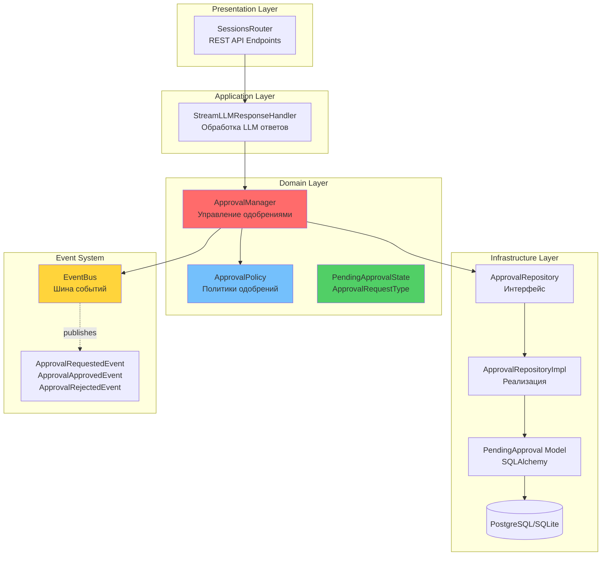
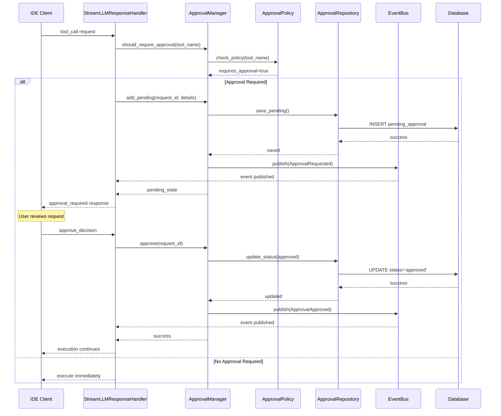

# Approval Manager

Централизованная система управления одобрениями для всех типов запросов в Agent Runtime.

## Обзор

**Approval Manager** — это унифицированная система управления одобрениями (approvals), которая заменяет legacy `HITLService` и предоставляет единый интерфейс для управления одобрениями инструментов, планов и других операций, требующих подтверждения пользователя.

### Основные возможности

- ✅ **Централизованное управление** - единая точка для всех типов одобрений
- ✅ **Гибкая политика** - настраиваемые правила через [`ApprovalPolicy`](#approvalpolicy)
- ✅ **Clean Architecture** - четкое разделение слоев (Domain, Application, Infrastructure)
- ✅ **Event-Driven** - интеграция с [`EventBus`](./agent-runtime.md#события-одобрений) для мониторинга
- ✅ **Repository Pattern** - Domain слой не зависит от Infrastructure
- ✅ **Персистентность** - сохранение состояния в PostgreSQL/SQLite
- ✅ **Расширяемость** - легко добавлять новые типы запросов

### Зачем нужна эта система?

Approval Manager обеспечивает безопасность и контроль над критичными операциями:

- **Безопасность** - предотвращение опасных операций без подтверждения
- **Аудит** - полная история всех решений пользователя
- **Гибкость** - настраиваемые правила для разных типов операций
- **Надежность** - восстановление состояния после перезапуска

---

## Архитектура

Approval Manager построен по принципам Clean Architecture с четким разделением ответственностей.

### Слои системы



### Компоненты системы

#### 1. Presentation Layer (API)

- **SessionsRouter** - REST API endpoints для управления одобрениями
- Endpoints: `/sessions/{session_id}/hitl-decision`, `/sessions/{session_id}/pending-approvals`

#### 2. Application Layer

- **StreamLLMResponseHandler** - обрабатывает ответы LLM и запрашивает одобрения при необходимости

#### 3. Domain Layer

- **ApprovalManager** - центральный сервис управления одобрениями
- **ApprovalPolicy** - конфигурация политик одобрений
- **Entities** - доменные сущности ([`PendingApprovalState`](#pendingapprovalstate), [`ApprovalRequestType`](#approvalrequesttype))

#### 4. Infrastructure Layer

- **ApprovalRepository** - интерфейс репозитория (Domain)
- **ApprovalRepositoryImpl** - реализация репозитория (Infrastructure)
- **PendingApproval Model** - ORM модель SQLAlchemy

#### 5. Events

- **EventBus** - публикация событий одобрений
- **ApprovalEvents** - типизированные события ([`ApprovalRequestedEvent`](#approvalrequestedevent), [`ApprovalApprovedEvent`](#approvalapprovedevent), [`ApprovalRejectedEvent`](#approvalrejectedevent))

---

## Типы запросов

Approval Manager поддерживает различные типы запросов на одобрение.

### ApprovalRequestType

```python
class ApprovalRequestType(str, Enum):
    TOOL = "tool"    # Одобрение выполнения инструментов
    PLAN = "plan"    # Одобрение сложных планов
```

### TOOL - Одобрение инструментов

Используется для операций, требующих подтверждения пользователя:

- `write_file` - запись файлов
- `execute_command` - выполнение команд
- `delete_file` - удаление файлов
- `move_file` - перемещение файлов
- `create_directory` - создание директорий

**Пример:**

```python
requires, reason = await approval_manager.should_require_approval(
    request_type="tool",
    subject="write_file",
    details={"path": "src/main.py", "content": "..."}
)
# requires=True, reason="File modification requires approval"
```

### PLAN - Одобрение планов

Используется для сложных планов выполнения, требующих подтверждения:

- Планы с множественными подзадачами
- Длительные операции
- Критичные изменения архитектуры

**Пример:**

```python
requires, reason = await approval_manager.should_require_approval(
    request_type="plan",
    subject="Migration to Riverpod",
    details={
        "total_subtasks": 5,
        "estimated_duration": "15 min"
    }
)
# requires=True, reason="Complex plan requires approval"
```

### Расширяемость для новых типов

Система легко расширяется для новых типов запросов. См. [Расширение системы](#расширение-системы).

---

## API Reference

### ApprovalManager

Центральный сервис управления одобрениями.

#### Инициализация

```python
from app.domain.services.approval_management import ApprovalManager
from app.domain.entities.approval import ApprovalPolicy

manager = ApprovalManager(
    approval_repository=approval_repository,
    approval_policy=ApprovalPolicy.default()
)
```

#### Методы

##### should_require_approval()

Проверяет, требуется ли одобрение для запроса на основе политики.

```python
async def should_require_approval(
    self,
    request_type: str,
    subject: str,
    details: Dict[str, Any]
) -> Tuple[bool, Optional[str]]
```

**Параметры:**
- `request_type` - тип запроса ("tool", "plan")
- `subject` - идентификатор субъекта (имя инструмента, название плана)
- `details` - детали запроса для проверки условий

**Возвращает:**
- `(requires_approval: bool, reason: Optional[str])`

**Пример:**

```python
requires, reason = await manager.should_require_approval(
    request_type="tool",
    subject="write_file",
    details={"path": "test.py", "size": 1024}
)

if requires:
    print(f"Approval required: {reason}")
```

##### add_pending()

Добавляет запрос в очередь ожидающих одобрения.

```python
async def add_pending(
    self,
    request_id: str,
    request_type: str,
    subject: str,
    session_id: str,
    details: Dict[str, Any],
    reason: Optional[str] = None
) -> None
```

**Параметры:**
- `request_id` - уникальный идентификатор запроса
- `request_type` - тип запроса
- `subject` - субъект запроса
- `session_id` - идентификатор сессии
- `details` - детали запроса
- `reason` - причина требования одобрения

**Пример:**

```python
await manager.add_pending(
    request_id="call_123",
    request_type="tool",
    subject="write_file",
    session_id="session-abc",
    details={"path": "src/main.py", "content": "..."},
    reason="File modification requires approval"
)
```

##### get_pending()

Получает конкретный запрос на одобрение по ID.

```python
async def get_pending(
    self,
    request_id: str
) -> Optional[PendingApprovalState]
```

**Пример:**

```python
approval = await manager.get_pending("call_123")
if approval:
    print(f"Tool: {approval.subject}, Status: {approval.status}")
```

##### get_all_pending()

Получает все ожидающие одобрения для сессии.

```python
async def get_all_pending(
    self,
    session_id: str,
    request_type: Optional[str] = None
) -> List[PendingApprovalState]
```

**Пример:**

```python
# Все pending approvals
all_approvals = await manager.get_all_pending("session-abc")

# Только tool approvals
tool_approvals = await manager.get_all_pending(
    "session-abc",
    request_type="tool"
)
```

##### approve()

Одобряет запрос на выполнение.

```python
async def approve(self, request_id: str) -> None
```

**Пример:**

```python
await manager.approve("call_123")
```

##### reject()

Отклоняет запрос на выполнение.

```python
async def reject(
    self,
    request_id: str,
    reason: Optional[str] = None
) -> None
```

**Пример:**

```python
await manager.reject(
    "call_123",
    reason="Operation too risky"
)
```

##### update_policy()

Обновляет текущую политику одобрений.

```python
def update_policy(self, policy: ApprovalPolicy) -> None
```

**Пример:**

```python
custom_policy = ApprovalPolicy(
    enabled=True,
    rules=[...],
    default_requires_approval=False
)
manager.update_policy(custom_policy)
```

##### get_policy()

Получает текущую политику одобрений.

```python
def get_policy(self) -> ApprovalPolicy
```

##### is_enabled()

Проверяет, включена ли система одобрений глобально.

```python
def is_enabled(self) -> bool
```

---

### ApprovalRepository

Интерфейс репозитория для работы с запросами на одобрение.

#### Методы

##### save_pending()

```python
async def save_pending(
    self,
    request_id: str,
    request_type: str,
    subject: str,
    session_id: str,
    details: dict,
    reason: Optional[str] = None
) -> None
```

Сохраняет pending approval request в базе данных.

##### get_pending()

```python
async def get_pending(
    self,
    request_id: str
) -> Optional[PendingApprovalState]
```

Получает pending approval по request_id.

##### get_all_pending()

```python
async def get_all_pending(
    self,
    session_id: str,
    request_type: Optional[str] = None
) -> List[PendingApprovalState]
```

Получает все pending approvals для сессии.

##### update_status()

```python
async def update_status(
    self,
    request_id: str,
    status: str,
    decision_at: datetime,
    decision_reason: Optional[str] = None
) -> bool
```

Обновляет статус approval request ("approved", "rejected").

##### delete_pending()

```python
async def delete_pending(self, request_id: str) -> bool
```

Удаляет pending approval request.

##### count_pending()

```python
async def count_pending(self, session_id: str) -> int
```

Подсчитывает количество pending approvals для сессии.

---

## Доменные сущности

### ApprovalPolicy

Политика определяет, какие запросы требуют одобрения.

```python
class ApprovalPolicy(BaseModel):
    enabled: bool = True
    rules: List[ApprovalPolicyRule] = []
    default_requires_approval: bool = False
```

**Пример политики:**

```python
policy = ApprovalPolicy(
    enabled=True,
    rules=[
        ApprovalPolicyRule(
            request_type="tool",
            subject_pattern="write_file|execute_command",
            requires_approval=True,
            reason="Dangerous operation"
        ),
        ApprovalPolicyRule(
            request_type="tool",
            subject_pattern="read_file",
            requires_approval=False
        )
    ],
    default_requires_approval=False
)
```

**Политика по умолчанию:**

```python
policy = ApprovalPolicy.default()
# Включает правила для:
# - write_file, execute_command, delete_file (требуют одобрения)
# - read_file, list_files, search_files (не требуют одобрения)
# - Все планы (требуют одобрения)
```

### ApprovalPolicyRule

Правило для определения необходимости одобрения.

```python
class ApprovalPolicyRule(BaseModel):
    request_type: ApprovalRequestType
    subject_pattern: str  # Regex pattern
    conditions: Optional[Dict[str, Any]] = None
    requires_approval: bool
    reason: Optional[str] = None
```

**Примеры правил:**

```python
# Простое правило
rule = ApprovalPolicyRule(
    request_type="tool",
    subject_pattern="write_file",
    requires_approval=True,
    reason="File modification requires approval"
)

# Правило с условиями
rule = ApprovalPolicyRule(
    request_type="plan",
    subject_pattern=".*",
    conditions={
        "total_subtasks_gt": 5,
        "estimated_duration_gt_minutes": 10
    },
    requires_approval=True,
    reason="Complex plan requires approval"
)
```

### PendingApprovalState

Состояние ожидающего одобрения запроса.

```python
class PendingApprovalState(BaseModel):
    request_id: str
    request_type: str  # "tool", "plan"
    subject: str       # tool name, plan title
    session_id: str
    details: Dict[str, Any]
    reason: Optional[str]
    created_at: datetime
    status: Literal['pending', 'approved', 'rejected']
```

**Пример:**

```python
approval = PendingApprovalState(
    request_id="call_123",
    request_type="tool",
    subject="write_file",
    session_id="session-abc",
    details={
        "path": "src/main.py",
        "content": "...",
        "size_bytes": 2048
    },
    reason="File modification requires approval",
    created_at=datetime.now(timezone.utc),
    status="pending"
)
```

### ApprovalRequestType

Типы запросов на одобрение.

```python
class ApprovalRequestType(str, Enum):
    TOOL = "tool"
    PLAN = "plan"
```

---

## События одобрений

Approval Manager публикует события через [`EventBus`](./agent-runtime.md#unified-approval-system) для интеграции и мониторинга.

### ApprovalRequestedEvent

Публикуется когда запрошено одобрение.

```python
from app.events.approval_events import ApprovalRequestedEvent

event = ApprovalRequestedEvent(
    aggregate_id="call_123",
    session_id="session-abc",
    request_id="call_123",
    request_type="tool",
    subject="write_file",
    reason="File modification requires approval"
)

await event_bus.publish(event)
```

**Поля события:**
- `request_id` - идентификатор запроса
- `request_type` - тип запроса
- `subject` - субъект запроса
- `reason` - причина требования одобрения

### ApprovalApprovedEvent

Публикуется когда одобрение подтверждено.

```python
from app.events.approval_events import ApprovalApprovedEvent

event = ApprovalApprovedEvent(
    aggregate_id="call_123",
    session_id="session-abc",
    request_id="call_123",
    request_type="tool"
)

await event_bus.publish(event)
```

### ApprovalRejectedEvent

Публикуется когда одобрение отклонено.

```python
from app.events.approval_events import ApprovalRejectedEvent

event = ApprovalRejectedEvent(
    aggregate_id="call_123",
    session_id="session-abc",
    request_id="call_123",
    request_type="tool",
    reason="User cancelled operation"
)

await event_bus.publish(event)
```

### Подписка на события

```python
from app.events.event_bus import event_bus
from app.events.event_types import EventType

@event_bus.subscribe(event_type=EventType.APPROVAL_REQUESTED)
async def on_approval_requested(event):
    print(f"Approval requested: {event.data['subject']}")

@event_bus.subscribe(event_type=EventType.APPROVAL_APPROVED)
async def on_approval_approved(event):
    print(f"Approval approved: {event.data['request_id']}")

@event_bus.subscribe(event_type=EventType.APPROVAL_REJECTED)
async def on_approval_rejected(event):
    print(f"Approval rejected: {event.data['request_id']}")
```

---

## Примеры использования

### Создание запроса на одобрение

```python
from app.domain.services.approval_management import ApprovalManager

# 1. Проверка необходимости одобрения
requires, reason = await approval_manager.should_require_approval(
    request_type="tool",
    subject="write_file",
    details={"path": "src/main.py", "content": "..."}
)

if requires:
    # 2. Добавление в pending queue
    await approval_manager.add_pending(
        request_id="call_123",
        request_type="tool",
        subject="write_file",
        session_id="session-abc",
        details={"path": "src/main.py", "content": "..."},
        reason=reason
    )
    
    # 3. Отправка клиенту
    return {"type": "approval_required", "call_id": "call_123"}
```

### Обработка решения пользователя

```python
# Пользователь одобряет
await approval_manager.approve("call_123")

# Получение одобренного запроса
approval = await approval_manager.get_pending("call_123")
if approval and approval.status == "approved":
    # Выполнение операции
    result = await execute_tool(approval.details)

# Пользователь отклоняет
await approval_manager.reject(
    "call_123",
    reason="Operation too risky"
)
```

### Получение всех pending approvals

```python
# Получить все pending approvals для сессии
pending_approvals = await approval_manager.get_all_pending("session-abc")

for approval in pending_approvals:
    print(f"Pending: {approval.subject} ({approval.request_type})")
    print(f"  Reason: {approval.reason}")
    print(f"  Created: {approval.created_at}")
```

### Подписка на события одобрений

```python
from app.events.event_bus import event_bus
from app.events.event_types import EventCategory

# Подписка на все события одобрений
@event_bus.subscribe(event_category=EventCategory.APPROVAL)
async def on_approval_event(event):
    print(f"Approval event: {event.event_type}")
    print(f"  Request ID: {event.data['request_id']}")
    print(f"  Type: {event.data['request_type']}")
    
    # Сохранение метрик
    await save_approval_metric(event)
```

### Полный пример: Tool Execution с одобрением

```python
async def execute_tool_with_approval(
    tool_name: str,
    arguments: dict,
    session_id: str,
    call_id: str
):
    # 1. Проверка политики
    requires, reason = await approval_manager.should_require_approval(
        request_type="tool",
        subject=tool_name,
        details=arguments
    )
    
    if not requires:
        # Выполнить сразу
        return await execute_tool(tool_name, arguments)
    
    # 2. Добавить в pending
    await approval_manager.add_pending(
        request_id=call_id,
        request_type="tool",
        subject=tool_name,
        session_id=session_id,
        details=arguments,
        reason=reason
    )
    
    # 3. Отправить клиенту
    yield {
        "type": "tool_approval_required",
        "call_id": call_id,
        "tool_name": tool_name,
        "arguments": arguments,
        "reason": reason
    }
    
    # 4. Ждать решения пользователя
    # (обрабатывается через endpoint /hitl-decision)
```

---

## Расширение системы

### Добавление нового типа запроса

**Шаг 1: Добавить тип в enum**

```python
# app/domain/entities/approval.py
class ApprovalRequestType(str, Enum):
    TOOL = "tool"
    PLAN = "plan"
    DEPLOYMENT = "deployment"  # NEW
```

**Шаг 2: Добавить правила в политику**

```python
policy = ApprovalPolicy(
    enabled=True,
    rules=[
        # Существующие правила...
        
        # Новое правило для deployments
        ApprovalPolicyRule(
            request_type="deployment",
            subject_pattern="production",
            requires_approval=True,
            reason="Production deployment requires approval"
        ),
        ApprovalPolicyRule(
            request_type="deployment",
            subject_pattern="staging|dev",
            requires_approval=False
        )
    ]
)
```

**Шаг 3: Использовать ApprovalManager**

```python
# Проверка необходимости одобрения
requires, reason = await approval_manager.should_require_approval(
    request_type="deployment",
    subject="production",
    details={
        "environment": "prod",
        "version": "1.2.3",
        "services": ["api", "worker"]
    }
)

if requires:
    # Добавить в pending
    await approval_manager.add_pending(
        request_id="deploy-123",
        request_type="deployment",
        subject="production",
        session_id=session_id,
        details={
            "environment": "prod",
            "version": "1.2.3",
            "services": ["api", "worker"]
        },
        reason=reason
    )
```

### Создание пользовательских ApprovalPolicy

```python
from app.domain.entities.approval import ApprovalPolicy, ApprovalPolicyRule

# Строгая политика - все требует одобрения
strict_policy = ApprovalPolicy(
    enabled=True,
    rules=[],
    default_requires_approval=True  # По умолчанию требуется одобрение
)

# Политика с условиями
conditional_policy = ApprovalPolicy(
    enabled=True,
    rules=[
        # Большие файлы требуют одобрения
        ApprovalPolicyRule(
            request_type="tool",
            subject_pattern="write_file",
            conditions={"size_bytes_gt": 1000000},  # > 1MB
            requires_approval=True,
            reason="Large file modification"
        ),
        # Маленькие файлы не требуют
        ApprovalPolicyRule(
            request_type="tool",
            subject_pattern="write_file",
            requires_approval=False
        )
    ]
)

# Применить политику
approval_manager.update_policy(conditional_policy)
```

### Best Practices

#### 1. Используйте Dependency Injection

```python
# FastAPI endpoint
from fastapi import Depends
from app.core.dependencies import get_approval_manager

@router.post("/execute-tool")
async def execute_tool(
    tool_name: str,
    manager: ApprovalManager = Depends(get_approval_manager)
):
    requires, reason = await manager.should_require_approval(...)
```

#### 2. Обрабатывайте ошибки

```python
try:
    await approval_manager.approve(request_id)
except ValueError as e:
    logger.error(f"Approval not found: {e}")
    return {"error": "Approval request not found"}
except Exception as e:
    logger.error(f"Failed to approve: {e}")
    return {"error": "Internal server error"}
```

#### 3. Используйте события для мониторинга

```python
@event_bus.subscribe(event_category=EventCategory.APPROVAL)
async def track_approval_metrics(event):
    # Отправка метрик в Prometheus/Grafana
    approval_counter.labels(
        type=event.data['request_type'],
        decision=event.event_type
    ).inc()
```

#### 4. Очищайте expired approvals

```python
# Периодическая задача
async def cleanup_expired_approvals():
    # Удалить approvals старше 5 минут
    cutoff = datetime.now(timezone.utc) - timedelta(minutes=5)
    # Реализация зависит от вашего репозитория
```

#### 5. Тестируйте политики

```python
import pytest

@pytest.mark.asyncio
async def test_approval_policy():
    policy = ApprovalPolicy.default()
    manager = ApprovalManager(mock_repo, policy)
    
    # Опасная операция требует одобрения
    requires, reason = await manager.should_require_approval(
        request_type="tool",
        subject="write_file",
        details={}
    )
    assert requires is True
    
    # Безопасная операция не требует
    requires, reason = await manager.should_require_approval(
        request_type="tool",
        subject="read_file",
        details={}
    )
    assert requires is False
```

---

## Диаграмма потока одобрения



---

## Ссылки

### Исходный код

- [`ApprovalManager`](https://github.com/your-org/codelab/blob/main/codelab-ai-service/agent-runtime/app/domain/services/approval_management.py)
- [`ApprovalRepository`](https://github.com/your-org/codelab/blob/main/codelab-ai-service/agent-runtime/app/domain/repositories/approval_repository.py)
- [`ApprovalRepositoryImpl`](https://github.com/your-org/codelab/blob/main/codelab-ai-service/agent-runtime/app/infrastructure/persistence/repositories/approval_repository_impl.py)
- [`ApprovalPolicy`](https://github.com/your-org/codelab/blob/main/codelab-ai-service/agent-runtime/app/domain/entities/approval.py)
- [`ApprovalEvents`](https://github.com/your-org/codelab/blob/main/codelab-ai-service/agent-runtime/app/events/approval_events.py)

### Документация

- [Agent Runtime API](./agent-runtime.md) - Основная документация Agent Runtime
- [UNIFIED_APPROVAL_SYSTEM.md](https://github.com/your-org/codelab/blob/main/codelab-ai-service/agent-runtime/doc/UNIFIED_APPROVAL_SYSTEM.md) - Детальная техническая документация
- [EVENT_DRIVEN_ARCHITECTURE.md](https://github.com/your-org/codelab/blob/main/codelab-ai-service/agent-runtime/doc/EVENT_DRIVEN_ARCHITECTURE.md) - Руководство по событийной архитектуре
- [HITL_IMPLEMENTATION.md](https://github.com/your-org/codelab/blob/main/codelab-ai-service/doc/HITL_IMPLEMENTATION.md) - Legacy HITL документация

---

© 2026 Codelab Contributors  
MIT License
