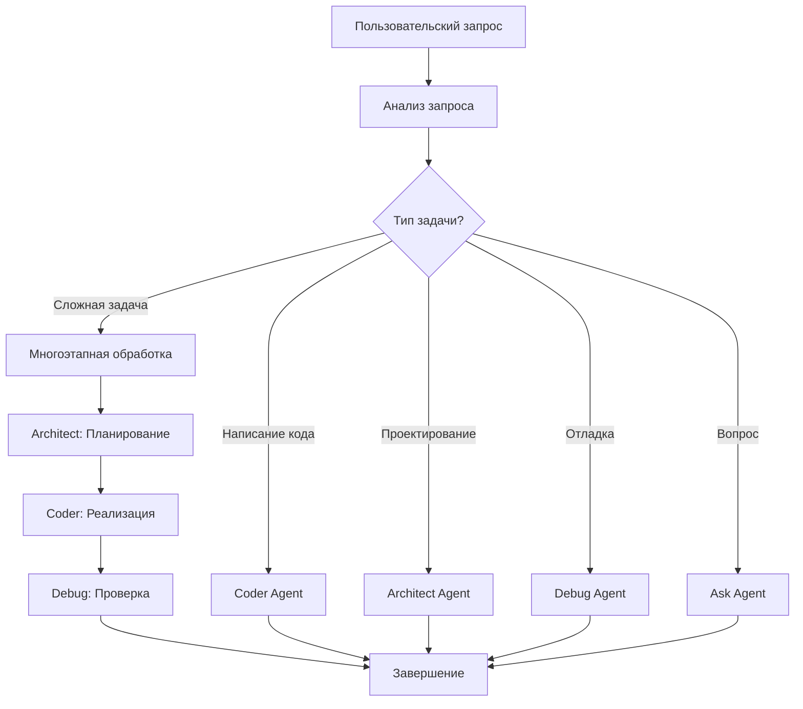

# Multi-Agent System API

Документация по API мультиагентной системы CodeLab.

## Обзор

Мультиагентная система CodeLab состоит из 5 специализированных агентов, каждый из которых оптимизирован для выполнения определенных задач разработки.

## Агенты

### 🎭 Orchestrator Agent

**Назначение**: Координация и маршрутизация задач между агентами.

**Возможности**:
- Анализ входящих запросов пользователя
- Определение подходящего агента для задачи
- Переключение между агентами
- Координация сложных многоэтапных задач

**Когда используется**:
- Первичная обработка всех запросов
- Сложные задачи, требующие участия нескольких агентов
- Неоднозначные запросы, требующие анализа

### 💻 Coder Agent

**Назначение**: Написание и модификация кода.

**Возможности**:
- Создание новых файлов
- Редактирование существующего кода
- Рефакторинг
- Реализация функций и классов
- Написание тестов

**Инструменты**:
- `write_file` - создание/перезапись файлов
- `apply_diff` - точечные изменения в файлах
- `read_file` - чтение файлов
- `execute_command` - выполнение команд
- `list_files` - просмотр структуры проекта

### 🏗️ Architect Agent

**Назначение**: Проектирование архитектуры и документации.

**Возможности**:
- Проектирование архитектуры системы
- Создание технических спецификаций
- Написание документации
- Планирование структуры проекта
- Code review и анализ

**Инструменты**:
- `write_file` - создание документации
- `read_file` - анализ кода
- `search_files` - поиск по проекту
- `list_files` - изучение структуры

### 🐛 Debug Agent

**Назначение**: Поиск и исправление ошибок.

**Возможности**:
- Анализ ошибок и stack traces
- Отладка кода
- Исправление багов
- Добавление логирования
- Диагностика проблем

**Инструменты**:
- `read_file` - анализ кода
- `apply_diff` - исправление ошибок
- `execute_command` - запуск тестов
- `search_files` - поиск проблемных участков

### 💬 Ask Agent

**Назначение**: Ответы на вопросы и консультации.

**Возможности**:
- Объяснение концепций
- Ответы на технические вопросы
- Рекомендации по best practices
- Обучение и консультирование
- Анализ кода без изменений

**Инструменты**:
- `read_file` - чтение для анализа
- `search_files` - поиск информации
- `list_files` - изучение проекта

## API Endpoints

### GET /api/v1/agents

Получение списка всех доступных агентов.

**Request**:

```bash
curl http://localhost/api/v1/agents \
  -H "Authorization: Bearer YOUR_ACCESS_TOKEN"
```

**Response**:

```json
{
  "agents": [
    {
      "type": "orchestrator",
      "name": "Orchestrator Agent",
      "emoji": "🎭",
      "description": "Координатор и маршрутизатор задач",
      "capabilities": [
        "task_routing",
        "agent_coordination",
        "complex_task_management"
      ]
    },
    {
      "type": "coder",
      "name": "Coder Agent",
      "emoji": "💻",
      "description": "Разработчик кода",
      "capabilities": [
        "code_writing",
        "code_editing",
        "refactoring",
        "testing"
      ]
    },
    {
      "type": "architect",
      "name": "Architect Agent",
      "emoji": "🏗️",
      "description": "Архитектор и документалист",
      "capabilities": [
        "architecture_design",
        "documentation",
        "code_review",
        "planning"
      ]
    },
    {
      "type": "debug",
      "name": "Debug Agent",
      "emoji": "🐛",
      "description": "Отладчик и исправитель ошибок",
      "capabilities": [
        "bug_fixing",
        "debugging",
        "error_analysis",
        "diagnostics"
      ]
    },
    {
      "type": "ask",
      "name": "Ask Agent",
      "emoji": "💬",
      "description": "Консультант и учитель",
      "capabilities": [
        "answering_questions",
        "explaining_concepts",
        "recommendations",
        "code_analysis"
      ]
    }
  ]
}
```

### GET /api/v1/agents/\{session_id\}/current

Получение текущего активного агента для сессии.

**Request**:

```bash
curl http://localhost/api/v1/agents/session-123/current \
  -H "Authorization: Bearer YOUR_ACCESS_TOKEN"
```

**Response**:

```json
{
  "session_id": "session-123",
  "current_agent": {
    "type": "coder",
    "name": "Coder Agent",
    "emoji": "💻",
    "switched_at": "2026-01-21T10:15:00Z"
  },
  "previous_agent": {
    "type": "orchestrator",
    "name": "Orchestrator Agent",
    "emoji": "🎭"
  }
}
```

### POST /api/v1/agents/\{session_id\}/switch

Принудительное переключение агента (для продвинутых пользователей).

**Request**:

```bash
curl -X POST http://localhost/api/v1/agents/session-123/switch \
  -H "Authorization: Bearer YOUR_ACCESS_TOKEN" \
  -H "Content-Type: application/json" \
  -d '{
    "agent_type": "architect",
    "reason": "Need architecture planning"
  }'
```

**Response**:

```json
{
  "session_id": "session-123",
  "switched_from": "coder",
  "switched_to": "architect",
  "timestamp": "2026-01-21T10:20:00Z"
}
```

## Agent Selection Logic

Orchestrator использует следующую логику для выбора агента:



## Примеры использования

### Пример 1: Создание нового компонента

**Запрос пользователя**: "Создай новый виджет UserCard"

**Маршрутизация**:
1. **Orchestrator** анализирует запрос
2. Определяет, что нужно написать код
3. Переключается на **Coder Agent**
4. Coder создает файл с компонентом

### Пример 2: Исправление бага

**Запрос пользователя**: "Исправь ошибку NullPointerException в UserService"

**Маршрутизация**:
1. **Orchestrator** видит упоминание ошибки
2. Переключается на **Debug Agent**
3. Debug анализирует код и находит проблему
4. Применяет исправление

### Пример 3: Сложная задача

**Запрос пользователя**: "Спроектируй и реализуй систему аутентификации"

**Маршрутизация**:
1. **Orchestrator** определяет сложную задачу
2. Переключается на **Architect** для проектирования
3. Architect создает архитектуру и спецификацию
4. Переключение на **Coder** для реализации
5. Coder пишет код по спецификации
6. Переключение на **Debug** для проверки
7. Debug тестирует и исправляет проблемы

## WebSocket Events

При переключении агентов отправляются события через WebSocket:

```json
{
  "type": "agent_switched",
  "data": {
    "from_agent": "orchestrator",
    "to_agent": "coder",
    "reason": "Code implementation required",
    "timestamp": "2026-01-21T10:15:00Z"
  }
}
```

## См. также

- [AI Assistant Overview](/docs/ai-assistant/overview)
- [Multi-Agent System](/docs/ai-assistant/multi-agent-system)
- [Tools Specification](/docs/api/tools-specification)
- [WebSocket Protocol](/docs/api/websocket-protocol)
