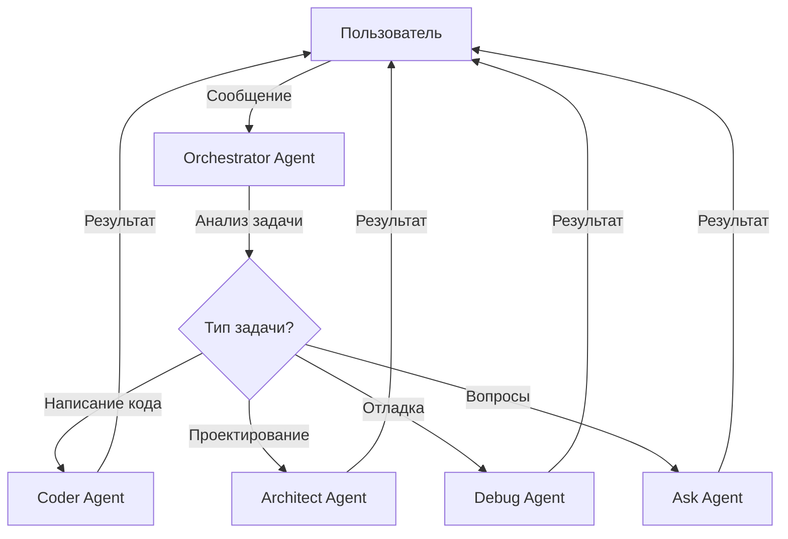
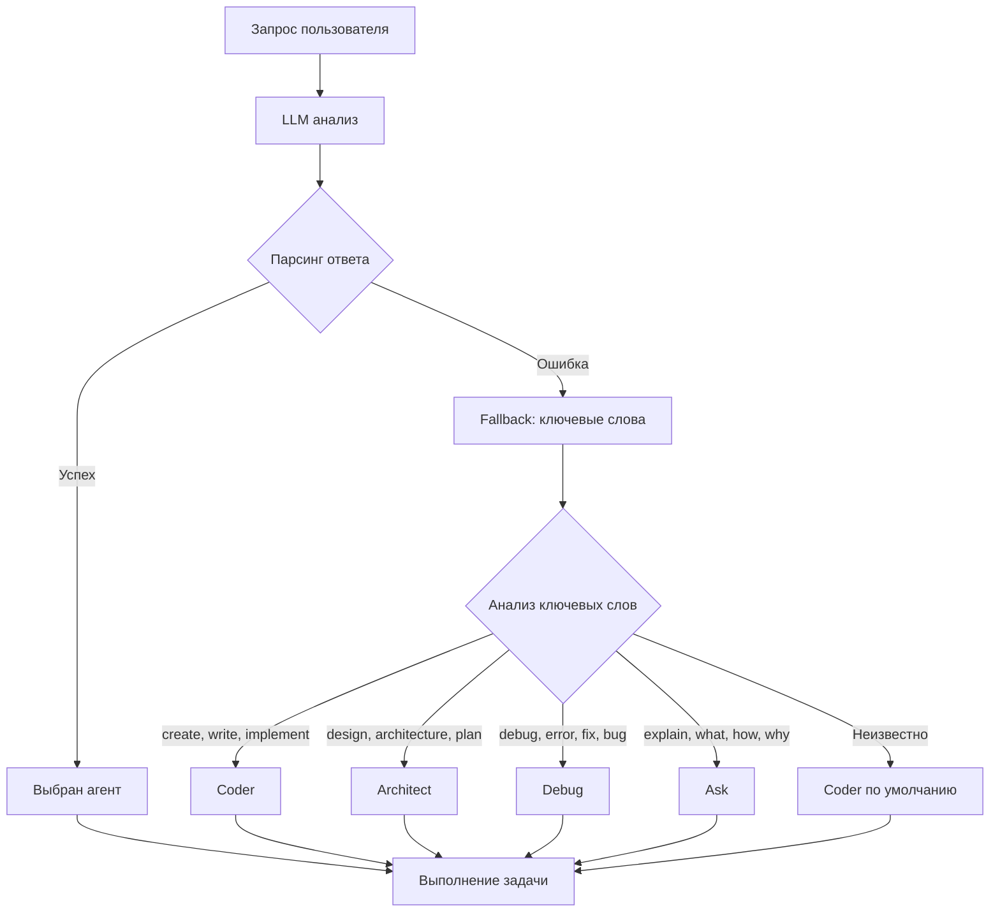
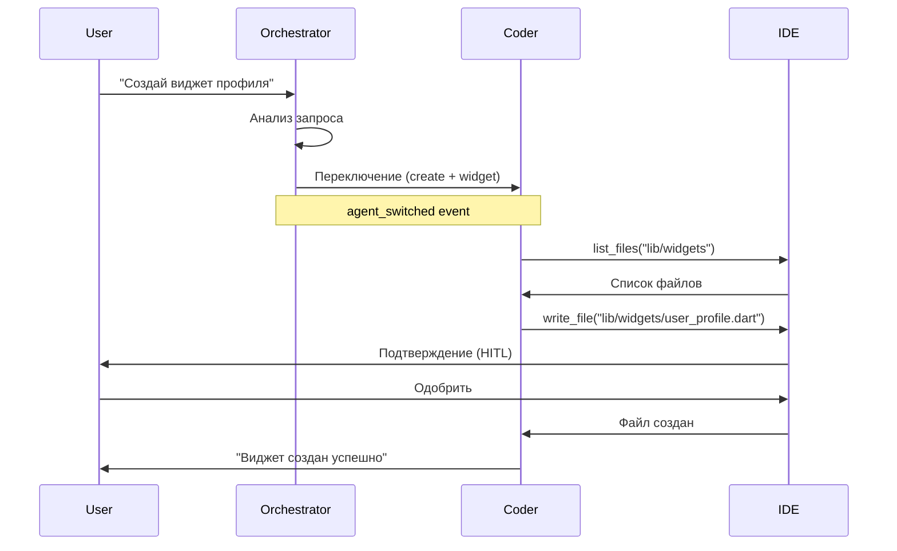
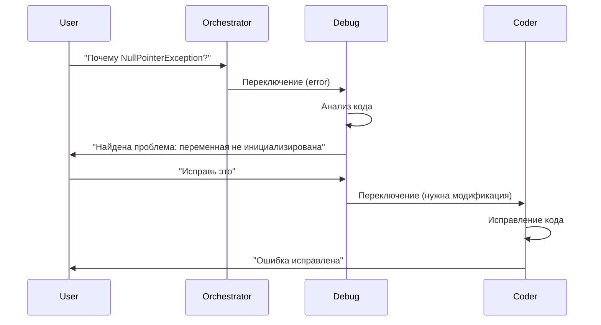
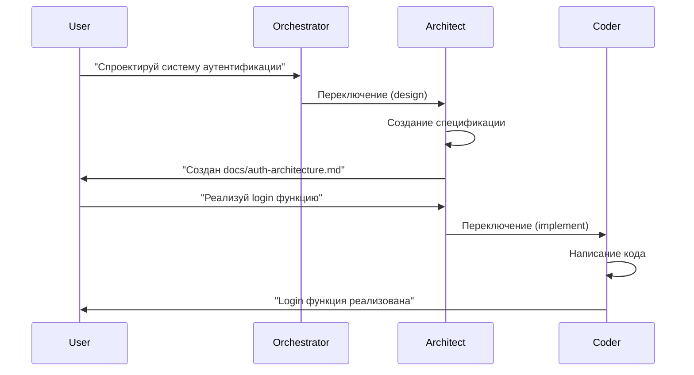
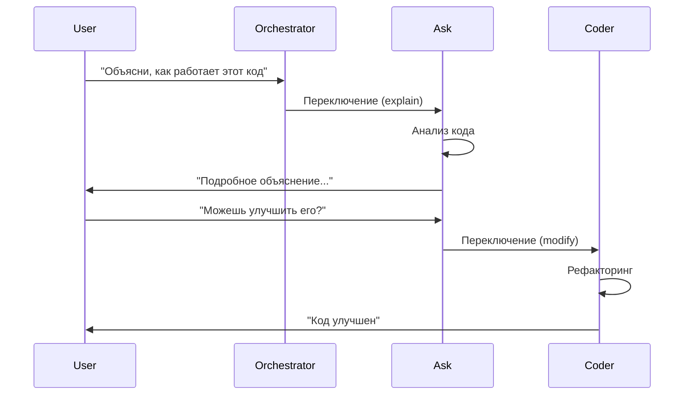

# Мультиагентная система

Полная документация мультиагентной системы CodeLab с 5 специализированными агентами для различных задач разработки.

## Обзор

CodeLab использует мультиагентную архитектуру, где каждый агент является экспертом в своей области. Система автоматически выбирает подходящего агента на основе типа задачи или позволяет явно переключаться между агентами.



## Агенты системы

### 1. Orchestrator Agent 🎭

**Роль**: Главный координатор и маршрутизатор задач.

**Возможности**:
- LLM-based классификация запросов пользователя
- Автоматический выбор подходящего агента
- Fallback механизм на основе ключевых слов
- Анализ контекста и истории диалога
- ⭐ **Маршрутизация сложных задач** - автоматическое определение сложных задач и передача их Architect для планирования

**Доступные инструменты**:
- `read_file` - чтение файлов для анализа
- `list_files` - просмотр структуры проекта
- `search_in_code` - поиск в коде

**Ограничения**:
- Не может модифицировать файлы
- Не может выполнять команды
- Только анализ и маршрутизация

**Обработка сложных задач** ⭐ NEW:

Orchestrator анализирует задачи и определяет их сложность:

**Критерии сложности**:
- Многофайловые изменения
- Системный рефакторинг
- Миграции между фреймворками
- Задачи с множественными зависимостями

При обнаружении сложной задачи Orchestrator автоматически переключается на Architect Agent для создания плана выполнения.

**Пример использования**:
```json
{
  "type": "user_message",
  "content": "Создай новый виджет для профиля пользователя"
}
```

Orchestrator анализирует запрос и автоматически переключается на Coder Agent.

### 2. Coder Agent 💻

**Роль**: Разработчик кода, основной исполнитель задач по написанию и модификации кода.

**Возможности**:
- Написание нового кода
- Модификация существующих файлов
- Рефакторинг
- Создание и удаление файлов
- Выполнение команд
- Git операции

**Доступные инструменты**:
- `read_file` - чтение файлов
- `write_file` - запись файлов
- `list_files` - просмотр структуры
- `search_in_code` - поиск в коде
- `execute_command` - выполнение команд
- `git_diff` - просмотр изменений
- `git_commit` - создание коммитов
- `delete_file` - удаление файлов

**Ограничения**:
- Нет ограничений на типы файлов
- Опасные операции требуют подтверждения (HITL)

**Пример использования**:
```dart
// Dart/Flutter
final message = {
  'type': 'user_message',
  'content': 'Создай файл lib/widgets/user_profile.dart с виджетом профиля'
};

channel.sink.add(jsonEncode(message));
```

### 3. Architect Agent 🏗️

**Роль**: Проектировщик архитектуры, документации и планирования сложных задач.

**Возможности**:
- Проектирование архитектуры системы
- Создание технических спецификаций
- Написание документации
- Планирование структуры проекта
- ⭐ **Система планирования** - создание детальных планов выполнения для сложных задач

**Доступные инструменты**:
- `read_file` - чтение файлов
- `write_file` - запись файлов (только .md)
- `list_files` - просмотр структуры
- `search_in_code` - поиск в коде
- ⭐ `create_plan` - создание плана выполнения с подзадачами

**Ограничения**:
- Может редактировать только `.md` файлы
- Не может выполнять команды
- Не может модифицировать код

**Система планирования** ⭐ NEW:

Architect Agent отвечает за создание детальных планов выполнения сложных задач:

**Процесс планирования**:
1. Получает сложную задачу от Orchestrator
2. Анализирует требования и зависимости
3. Создает план с подзадачами
4. Назначает агентов для каждой подзадачи
5. Определяет зависимости между подзадачами
6. Отправляет план на подтверждение пользователю (опционально)
7. Координирует выполнение плана

**Пример плана**:
```json
{
  "plan_id": "plan-abc123",
  "original_task": "Migrate from Provider to Riverpod",
  "subtasks": [
    {
      "id": "subtask_1",
      "description": "Add riverpod dependency to pubspec.yaml",
      "agent": "coder",
      "estimated_time": "2 min",
      "status": "pending",
      "dependencies": []
    },
    {
      "id": "subtask_2",
      "description": "Create provider definitions using Riverpod",
      "agent": "coder",
      "estimated_time": "5 min",
      "status": "pending",
      "dependencies": ["subtask_1"]
    },
    {
      "id": "subtask_3",
      "description": "Update main.dart to use ProviderScope",
      "agent": "coder",
      "estimated_time": "3 min",
      "status": "pending",
      "dependencies": ["subtask_2"]
    },
    {
      "id": "subtask_4",
      "description": "Migrate widgets to use Riverpod hooks",
      "agent": "coder",
      "estimated_time": "10 min",
      "status": "pending",
      "dependencies": ["subtask_3"]
    },
    {
      "id": "subtask_5",
      "description": "Update tests for Riverpod",
      "agent": "coder",
      "estimated_time": "5 min",
      "status": "pending",
      "dependencies": ["subtask_4"]
    }
  ]
}
```

**Преимущества системы планирования**:
- ✅ Лучшая организация сложных задач
- ✅ Видимый прогресс выполнения
- ✅ Меньше timeout на длинных задачах
- ✅ Автоматическое переключение между агентами
- ✅ Поддержка зависимостей между подзадачами
- ✅ Возможность подтверждения плана пользователем (HITL)

**Состояния сессии**:
- `PLAN_PENDING_CONFIRMATION` - план создан, ожидается подтверждение
- `PLAN_EXECUTING` - план выполняется

**Документация**:
- [Planning System Guide](https://github.com/pese-git/codelab-workspace/blob/main/codelab-ai-service/agent-runtime/PLANNING_SYSTEM_GUIDE.md)
- [Planning Implementation Report](https://github.com/pese-git/codelab-workspace/blob/main/codelab-ai-service/agent-runtime/PLANNING_IMPLEMENTATION_REPORT.md)
- [Agent Runtime Algorithm](https://github.com/pese-git/codelab-workspace/blob/main/codelab-ai-service/agent-runtime/AGENT_RUNTIME_ALGORITHM.md)

**Пример использования**:
```python
# Python
message = {
    "type": "user_message",
    "content": "Спроектируй архитектуру системы аутентификации"
}

response = requests.post(
    "http://localhost:8001/agent/message/stream",
    json={"session_id": "session_123", "message": message}
)
```

### 4. Debug Agent 🐛

**Роль**: Отладчик и диагност проблем.

**Возможности**:
- Анализ ошибок и исключений
- Поиск багов в коде
- Диагностика проблем
- Анализ логов
- Выполнение диагностических команд

**Доступные инструменты**:
- `read_file` - чтение файлов
- `list_files` - просмотр структуры
- `search_in_code` - поиск в коде
- `execute_command` - выполнение команд (только для диагностики)

**Ограничения**:
- Не может модифицировать файлы (read-only)
- Может выполнять только безопасные команды
- Для исправления ошибок переключается на Coder

**Пример использования**:
```dart
// Dart/Flutter
final message = {
  'type': 'user_message',
  'content': 'Почему возникает NullPointerException в main.dart?'
};

// Debug Agent анализирует проблему
// Если нужно исправить - переключается на Coder
```

### 5. Ask Agent 💬

**Роль**: Консультант и учитель, отвечает на вопросы.

**Возможности**:
- Ответы на вопросы о коде
- Объяснение концепций
- Обучение и консультации
- Анализ кода без модификации

**Доступные инструменты**:
- `read_file` - чтение файлов
- `search_in_code` - поиск в коде
- `list_files` - просмотр структуры

**Ограничения**:
- Только чтение, без модификации
- Не может выполнять команды
- Для изменений переключается на Coder

**Пример использования**:
```python
# Python
message = {
    "type": "user_message",
    "content": "Объясни, как работает этот код в main.dart"
}
```

## Сравнение агентов

| Агент | Чтение | Запись | Команды | Git | Планирование | Ограничения |
|-------|--------|--------|---------|-----|--------------|-------------|
| **Orchestrator** 🎭 | ✅ | ❌ | ❌ | ❌ | ❌ | Только анализ и маршрутизация |
| **Coder** 💻 | ✅ | ✅ | ✅ | ✅ | ❌ | Нет |
| **Architect** 🏗️ | ✅ | ✅ | ❌ | ❌ | ✅ | Только .md файлы, планирование |
| **Debug** 🐛 | ✅ | ❌ | ✅ | ❌ | ❌ | Read-only |
| **Ask** 💬 | ✅ | ❌ | ❌ | ❌ | ❌ | Только чтение |

## Механизм переключения агентов

### Автоматическое переключение

Orchestrator Agent использует LLM для анализа запроса и автоматического выбора подходящего агента.

**Алгоритм классификации**:



**Ключевые слова для fallback**:

- **Coder**: create, write, implement, add, modify, update, refactor, delete
- **Architect**: design, architecture, plan, structure, organize, document
- **Debug**: debug, error, exception, bug, issue, problem, crash, fix
- **Ask**: explain, what, how, why, tell, show, describe, understand

### Ручное переключение

Пользователь может явно указать агента через специальное сообщение.

**Формат запроса**:
```json
{
  "type": "switch_agent",
  "agent_type": "architect",
  "content": "Спроектируй систему аутентификации"
}
```

**Доступные типы агентов**:
- `orchestrator`
- `coder`
- `architect`
- `debug`
- `ask`

**Пример (Dart)**:
```dart
final switchMessage = {
  'type': 'switch_agent',
  'agent_type': 'architect',
  'content': 'Создай архитектурную документацию'
};

channel.sink.add(jsonEncode(switchMessage));
```

**Пример (Python)**:
```python
switch_message = {
    "type": "switch_agent",
    "agent_type": "debug",
    "content": "Найди причину ошибки"
}

requests.post(
    "http://localhost:8001/agent/message/stream",
    json={"session_id": "session_123", "message": switch_message}
)
```

## Agent Context Management

### Сохранение контекста

При переключении агентов контекст сессии сохраняется:

- История сообщений
- Текущий агент
- Предыдущий агент
- Причина переключения
- Timestamp переключения

**Структура контекста**:
```python
{
    "session_id": "session_123",
    "current_agent": "coder",
    "previous_agent": "orchestrator",
    "switch_reason": "User requested code implementation",
    "switch_count": 2,
    "messages": [...],
    "created_at": "2024-01-09T10:00:00Z",
    "last_activity": "2024-01-09T10:05:00Z"
}
```

### История переключений

Система ведет полную историю переключений агентов в базе данных.

**Схема таблицы**:
```sql
CREATE TABLE agent_switches (
    id UUID PRIMARY KEY,
    session_id UUID REFERENCES sessions(id),
    from_agent VARCHAR(50),
    to_agent VARCHAR(50),
    reason TEXT,
    user_requested BOOLEAN,
    created_at TIMESTAMP DEFAULT NOW()
);

CREATE INDEX idx_agent_switches_session ON agent_switches(session_id);
```

## API Endpoints

### Получить список агентов

```http
GET /agents
```

**Response**:
```json
{
  "agents": [
    {
      "type": "orchestrator",
      "name": "Orchestrator Agent",
      "description": "Координатор и маршрутизатор задач",
      "emoji": "🎭",
      "tools": ["read_file", "list_files", "search_in_code"]
    },
    {
      "type": "coder",
      "name": "Coder Agent",
      "description": "Разработчик кода",
      "emoji": "💻",
      "tools": ["read_file", "write_file", "list_files", "search_in_code", "execute_command", "git_diff", "git_commit", "delete_file"]
    },
    {
      "type": "architect",
      "name": "Architect Agent",
      "description": "Проектировщик архитектуры",
      "emoji": "🏗️",
      "tools": ["read_file", "write_file", "list_files", "search_in_code"],
      "restrictions": ["Only .md files"]
    },
    {
      "type": "debug",
      "name": "Debug Agent",
      "description": "Отладчик и диагност",
      "emoji": "🐛",
      "tools": ["read_file", "list_files", "search_in_code", "execute_command"],
      "restrictions": ["Read-only mode"]
    },
    {
      "type": "ask",
      "name": "Ask Agent",
      "description": "Консультант и учитель",
      "emoji": "💬",
      "tools": ["read_file", "search_in_code", "list_files"],
      "restrictions": ["Read-only mode"]
    }
  ]
}
```

### Получить текущего агента сессии

```http
GET /agents/{session_id}/current
```

**Response**:
```json
{
  "session_id": "session_123",
  "current_agent": {
    "type": "coder",
    "name": "Coder Agent",
    "emoji": "💻",
    "switched_at": "2024-01-09T10:05:00Z"
  },
  "previous_agent": {
    "type": "orchestrator",
    "name": "Orchestrator Agent",
    "emoji": "🎭"
  },
  "switch_count": 2
}
```

## WebSocket Protocol

### Сообщение agent_switched

Когда происходит переключение агента, Gateway отправляет уведомление в IDE.

**Формат сообщения**:
```json
{
  "type": "agent_switched",
  "from_agent": "orchestrator",
  "to_agent": "coder",
  "reason": "User requested code implementation",
  "timestamp": "2024-01-09T10:05:00Z"
}
```

**Поля**:
- `type` (string): `"agent_switched"`
- `from_agent` (string): Предыдущий агент
- `to_agent` (string): Новый агент
- `reason` (string): Причина переключения
- `timestamp` (string): Время переключения (ISO 8601)

**Пример обработки (Dart)**:
```dart
channel.stream.listen((message) {
  final data = jsonDecode(message);
  
  if (data['type'] == 'agent_switched') {
    print('Переключение: ${data['from_agent']} → ${data['to_agent']}');
    print('Причина: ${data['reason']}');
    
    // Обновить UI индикатор агента
    updateAgentIndicator(data['to_agent']);
  }
});
```

**Пример обработки (Python)**:
```python
async def handle_message(message):
    data = json.loads(message)
    
    if data['type'] == 'agent_switched':
        print(f"Переключение: {data['from_agent']} → {data['to_agent']}")
        print(f"Причина: {data['reason']}")
        
        # Обновить состояние
        current_agent = data['to_agent']
```

## Сценарии использования

### Сценарий 1: Создание нового компонента



### Сценарий 2: Отладка и исправление



### Сценарий 3: Проектирование и реализация



### Сценарий 4: Обучение и консультация



## Примеры кода

### Dart/Flutter - Полный пример

```dart
import 'dart:convert';
import 'package:web_socket_channel/web_socket_channel.dart';

class MultiAgentClient {
  final WebSocketChannel channel;
  String currentAgent = 'orchestrator';
  
  MultiAgentClient(String sessionId, String accessToken)
      : channel = WebSocketChannel.connect(
          Uri.parse('ws://localhost:8000/ws/$sessionId'),
          headers: {'Authorization': 'Bearer $accessToken'},
        ) {
    _listen();
  }
  
  void _listen() {
    channel.stream.listen((message) {
      final data = jsonDecode(message);
      
      switch (data['type']) {
        case 'agent_switched':
          _handleAgentSwitch(data);
          break;
        case 'assistant_message':
          _handleAssistantMessage(data);
          break;
        case 'tool_call':
          _handleToolCall(data);
          break;
      }
    });
  }
  
  void _handleAgentSwitch(Map<String, dynamic> data) {
    currentAgent = data['to_agent'];
    print('🔄 Переключение на ${_getAgentEmoji(currentAgent)} $currentAgent');
    print('   Причина: ${data['reason']}');
  }
  
  void _handleAssistantMessage(Map<String, dynamic> data) {
    print('${_getAgentEmoji(currentAgent)} ${data['token']}');
  }
  
  void _handleToolCall(Map<String, dynamic> data) {
    print('🔧 Tool: ${data['tool_name']}');
    // Выполнить инструмент...
  }
  
  String _getAgentEmoji(String agent) {
    const emojis = {
      'orchestrator': '🎭',
      'coder': '💻',
      'architect': '🏗️',
      'debug': '🐛',
      'ask': '💬',
    };
    return emojis[agent] ?? '🤖';
  }
  
  // Отправка обычного сообщения
  void sendMessage(String content) {
    channel.sink.add(jsonEncode({
      'type': 'user_message',
      'content': content,
      'role': 'user',
    }));
  }
  
  // Явное переключение агента
  void switchAgent(String agentType, String content) {
    channel.sink.add(jsonEncode({
      'type': 'switch_agent',
      'agent_type': agentType,
      'content': content,
    }));
  }
  
  void dispose() {
    channel.sink.close();
  }
}

// Использование
void main() async {
  final client = MultiAgentClient('session_123', 'your_jwt_token');
  
  // Автоматическое определение агента
  client.sendMessage('Создай новый виджет');
  
  await Future.delayed(Duration(seconds: 2));
  
  // Явное переключение на Architect
  client.switchAgent('architect', 'Спроектируй архитектуру');
  
  await Future.delayed(Duration(seconds: 5));
  
  client.dispose();
}
```

### Python - Полный пример

```python
import asyncio
import json
import websockets
from typing import Callable, Dict, Any

class MultiAgentClient:
    def __init__(self, session_id: str, access_token: str):
        self.session_id = session_id
        self.access_token = access_token
        self.ws_url = f"ws://localhost:8000/ws/{session_id}"
        self.current_agent = "orchestrator"
        self.websocket = None
        
    async def connect(self):
        """Подключение к WebSocket"""
        self.websocket = await websockets.connect(
            self.ws_url,
            extra_headers={"Authorization": f"Bearer {self.access_token}"}
        )
        
    async def listen(self, handlers: Dict[str, Callable]):
        """Прослушивание сообщений"""
        async for message in self.websocket:
            data = json.loads(message)
            message_type = data.get('type')
            
            if message_type in handlers:
                await handlers[message_type](data)
                
    async def send_message(self, content: str):
        """Отправка обычного сообщения"""
        await self.websocket.send(json.dumps({
            'type': 'user_message',
            'content': content,
            'role': 'user'
        }))
        
    async def switch_agent(self, agent_type: str, content: str):
        """Явное переключение агента"""
        await self.websocket.send(json.dumps({
            'type': 'switch_agent',
            'agent_type': agent_type,
            'content': content
        }))
        
    async def close(self):
        """Закрытие соединения"""
        if self.websocket:
            await self.websocket.close()

# Обработчики событий
async def handle_agent_switch(data: Dict[str, Any]):
    emoji_map = {
        'orchestrator': '🎭',
        'coder': '💻',
        'architect': '🏗️',
        'debug': '🐛',
        'ask': '💬'
    }
    
    from_agent = data['from_agent']
    to_agent = data['to_agent']
    reason = data['reason']
    
    print(f"🔄 Переключение: {emoji_map.get(from_agent, '🤖')} → {emoji_map.get(to_agent, '🤖')}")
    print(f"   Причина: {reason}")

async def handle_assistant_message(data: Dict[str, Any]):
    print(data['token'], end='', flush=True)
    if data.get('is_final'):
        print()  # Новая строка в конце

async def handle_tool_call(data: Dict[str, Any]):
    print(f"\n🔧 Tool: {data['tool_name']}")
    print(f"   Args: {data['arguments']}")

# Использование
async def main():
    client = MultiAgentClient('session_123', 'your_jwt_token')
    
    try:
        await client.connect()
        print("✅ Подключено к мультиагентной системе")
        
        # Настройка обработчиков
        handlers = {
            'agent_switched': handle_agent_switch,
            'assistant_message': handle_assistant_message,
            'tool_call': handle_tool_call
        }
        
        # Запуск прослушивания в фоне
        listen_task = asyncio.create_task(client.listen(handlers))
        
        # Отправка сообщений
        await client.send_message('Создай новый виджет профиля')
        await asyncio.sleep(3)
        
        await client.switch_agent('architect', 'Спроектируй архитектуру')
        await asyncio.sleep(3)
        
        await client.send_message('Объясни этот код')
        await asyncio.sleep(3)
        
        # Отмена прослушивания
        listen_task.cancel()
        
    finally:
        await client.close()
        print("\n👋 Отключено")

if __name__ == '__main__':
    asyncio.run(main())
```

## Конфигурация

### Переменные окружения

```bash
# Agent Runtime (.env)

# Включение мультиагентной системы
AGENT_RUNTIME__MULTI_AGENT_ENABLED=true

# Агент по умолчанию
AGENT_RUNTIME__DEFAULT_AGENT=orchestrator

# Автоматическое переключение агентов
AGENT_RUNTIME__AUTO_AGENT_SWITCHING=true

# Максимальное количество переключений в сессии
AGENT_RUNTIME__MAX_AGENT_SWITCHES=10

# Логирование переключений
AGENT_RUNTIME__LOG_AGENT_SWITCHES=true
```

## Ограничения и best practices

### Ограничения

1. **Максимум переключений**: По умолчанию 10 переключений на сессию
2. **Валидация файлов**: Architect может редактировать только .md файлы
3. **Read-only агенты**: Debug и Ask не могут модифицировать файлы
4. **HITL для опасных операций**: Coder требует подтверждения для write_file, delete_file, execute_command

### Best Practices

1. **Используйте автоматическую маршрутизацию**: Orchestrator обычно выбирает правильного агента
2. **Явное переключение для специфических задач**: Используйте `switch_agent` когда точно знаете нужного агента
3. **Следите за контекстом**: Агенты сохраняют историю, используйте это для сложных задач
4. **Обрабатывайте agent_switched**: Обновляйте UI при переключении агентов
5. **Логируйте переключения**: Полезно для отладки и аналитики

## Метрики и мониторинг

Система собирает следующие метрики:

- Количество запросов к каждому агенту
- Время обработки по агентам
- Точность классификации Orchestrator
- Количество переключений агентов
- Использование инструментов по агентам
- Успешность выполнения задач

## Следующие шаги

- [Agent Protocol](/docs/api/agent-protocol) - Расширенный протокол агента
- [Agent Runtime API](/docs/api/agent-runtime) - API документация
- [WebSocket Protocol](/docs/api/websocket-protocol) - WebSocket протокол
- [AI Service Architecture](/docs/architecture/ai-service-architecture) - Архитектура системы
