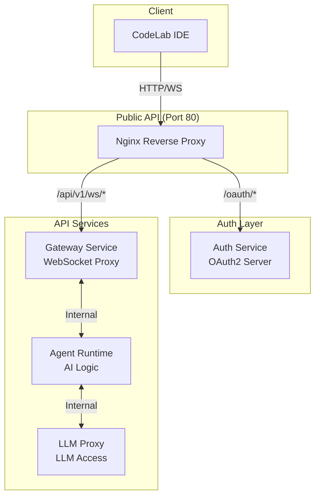
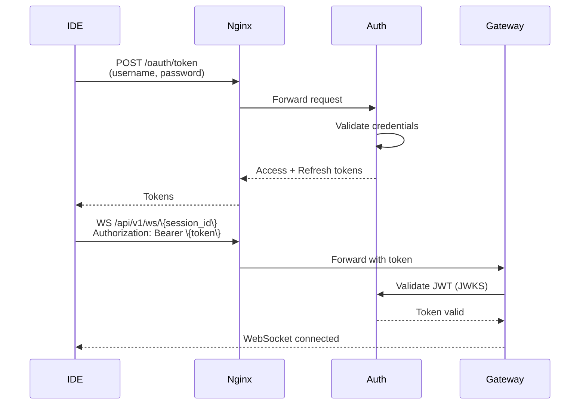

# API Overview

Обзор всех API сервисов CodeLab, их endpoints, аутентификации и примеров использования.

## Архитектура API



## Сервисы и порты

| Сервис | Внутренний порт | Публичный доступ | Назначение |
|--------|----------------|------------------|------------|
| **Nginx** | - | 80 (HTTP), 443 (HTTPS) | Reverse proxy, единая точка входа |
| **Auth Service** | 8003 | Через Nginx `/oauth/*` | OAuth2 аутентификация |
| **Gateway** | 8000 | Через Nginx `/api/v1/*` | WebSocket proxy |
| **Agent Runtime** | 8001 | Внутренний | AI логика, мультиагентная система |
| **LLM Proxy** | 8002 | Внутренний | Доступ к LLM провайдерам |
| **PostgreSQL** | 5432 | Внутренний | База данных |
| **Redis** | 6379 | Внутренний | Кэш, rate limiting |

## Маршрутизация Nginx

### OAuth2 endpoints

```nginx
# Auth Service
location /oauth/ {
    proxy_pass http://auth-service:8003/oauth/;
}

location /.well-known/ {
    proxy_pass http://auth-service:8003/.well-known/;
}
```

**Endpoints**:
- `POST /oauth/token` - получение токенов
- `GET /.well-known/jwks.json` - публичные ключи

### API endpoints

```nginx
# Gateway Service
location /api/v1/ {
    proxy_pass http://gateway:8000/api/v1/;
}

# WebSocket
location /api/v1/ws/ {
    proxy_pass http://gateway:8000/api/v1/ws/;
    proxy_http_version 1.1;
    proxy_set_header Upgrade $http_upgrade;
    proxy_set_header Connection "upgrade";
}
```

**Endpoints**:
- `GET /api/v1/health` - health check
- `WS /api/v1/ws/\{session_id\}` - WebSocket соединение
- `POST /api/v1/sessions` - создание сессии
- `GET /api/v1/sessions/\{session_id\}` - получение сессии

## Аутентификация

### OAuth2 Flow



### Получение токенов

**Request**:

```bash
curl -X POST http://localhost/oauth/token \
  -H "Content-Type: application/x-www-form-urlencoded" \
  -d "grant_type=password" \
  -d "username=user@example.com" \
  -d "password=SecurePass123!" \
  -d "client_id=codelab-flutter-app" \
  -d "scope=api:read api:write"
```

**Response**:

```json
{
  "access_token": "eyJhbGciOiJSUzI1NiIsInR5cCI6IkpXVCJ9...",
  "refresh_token": "eyJhbGciOiJSUzI1NiIsInR5cCI6IkpXVCJ9...",
  "token_type": "bearer",
  "expires_in": 900,
  "scope": "api:read api:write"
}
```

### Использование токенов

**HTTP запросы**:

```bash
curl http://localhost/api/v1/sessions \
  -H "Authorization: Bearer YOUR_ACCESS_TOKEN"
```

**WebSocket**:

```javascript
const ws = new WebSocket(
  'ws://localhost/api/v1/ws/session-123',
  {
    headers: {
      'Authorization': 'Bearer YOUR_ACCESS_TOKEN'
    }
  }
);
```

## Auth Service API

**Base URL**: `http://localhost/oauth`

### Endpoints

#### POST /oauth/token

Получение access и refresh токенов.

**Grant Types**:
- `password` - аутентификация по username/password
- `refresh_token` - обновление токенов

**Rate Limits**:
- IP-based: 5 req/min
- Username-based: 10 req/hour

**Подробнее**: [Auth Service API](/docs/api/auth-service)

#### GET /.well-known/jwks.json

Публичные ключи для валидации JWT токенов.

**Response**:

```json
{
  "keys": [
    {
      "kty": "RSA",
      "use": "sig",
      "kid": "2024-01-key-1",
      "alg": "RS256",
      "n": "0vx7agoebGcQSuuPiLJXZptN9nndrQmbXEps2aiAFbWhM78LhWx...",
      "e": "AQAB"
    }
  ]
}
```

## Gateway Service API

**Base URL**: `http://localhost/api/v1`

**Аутентификация**: JWT Bearer token

### Endpoints

#### GET /api/v1/health

Health check endpoint.

**Request**:

```bash
curl http://localhost/api/v1/health
```

**Response**:

```json
{
  "status": "healthy",
  "version": "1.0.0",
  "services": {
    "agent_runtime": "healthy",
    "database": "connected"
  }
}
```

#### WS /api/v1/ws/\{session_id\}

WebSocket соединение для real-time коммуникации.

**Connection**:

```javascript
const ws = new WebSocket(
  'ws://localhost/api/v1/ws/session-123',
  {
    headers: {
      'Authorization': 'Bearer YOUR_ACCESS_TOKEN'
    }
  }
);

ws.onopen = () => {
  console.log('Connected');
};

ws.onmessage = (event) => {
  const message = JSON.parse(event.data);
  console.log('Received:', message);
};

ws.send(JSON.stringify({
  type: 'user_message',
  content: 'Создай новый виджет'
}));
```

**Подробнее**: [WebSocket Protocol](/docs/api/websocket-protocol)

#### POST /api/v1/sessions

Создание новой сессии.

**Request**:

```bash
curl -X POST http://localhost/api/v1/sessions \
  -H "Authorization: Bearer YOUR_ACCESS_TOKEN" \
  -H "Content-Type: application/json" \
  -d '{
    "system_prompt": "You are a helpful coding assistant"
  }'
```

**Response**:

```json
{
  "session_id": "uuid",
  "created_at": "2026-01-21T10:00:00Z",
  "current_agent": "orchestrator"
}
```

#### GET /api/v1/sessions/\{session_id\}

Получение информации о сессии.

**Request**:

```bash
curl http://localhost/api/v1/sessions/session-123 \
  -H "Authorization: Bearer YOUR_ACCESS_TOKEN"
```

**Response**:

```json
{
  "session_id": "session-123",
  "created_at": "2026-01-21T10:00:00Z",
  "last_activity": "2026-01-21T10:15:00Z",
  "current_agent": "coder",
  "message_count": 25
}
```

#### GET /api/v1/sessions/\{session_id\}/history

Получение истории сообщений сессии.

**Request**:

```bash
curl http://localhost/api/v1/sessions/session-123/history \
  -H "Authorization: Bearer YOUR_ACCESS_TOKEN"
```

**Response**:

```json
{
  "session_id": "session-123",
  "messages": [
    {
      "id": "msg-1",
      "role": "user",
      "content": "Создай виджет",
      "timestamp": "2026-01-21T10:00:00Z"
    },
    {
      "id": "msg-2",
      "role": "assistant",
      "content": "Создаю виджет...",
      "agent_name": "coder",
      "timestamp": "2026-01-21T10:00:05Z"
    }
  ]
}
```

#### GET /api/v1/agents

Получение списка доступных агентов.

**Request**:

```bash
curl http://localhost/api/v1/agents \
  -H "Authorization: Bearer YOUR_ACCESS_TOKEN"
```

**Response**:

```json
{
  "agents": [
    {
      "type": "orchestrator",
      "name": "Orchestrator Agent",
      "emoji": "🎭",
      "description": "Координатор и маршрутизатор задач"
    },
    {
      "type": "coder",
      "name": "Coder Agent",
      "emoji": "💻",
      "description": "Разработчик кода"
    }
  ]
}
```

**Подробнее**: [Gateway API](/docs/api/gateway)

## Agent Runtime API (Internal)

**Base URL**: `http://agent-runtime:8001`

**Аутентификация**: Internal API key (`X-Internal-Auth` header)

**Примечание**: Этот API доступен только внутри Docker сети.

### Endpoints

#### POST /agent/message/stream

Обработка сообщения с streaming ответом.

**Request**:

```bash
curl -X POST http://agent-runtime:8001/agent/message/stream \
  -H "X-Internal-Auth: INTERNAL_API_KEY" \
  -H "Content-Type: application/json" \
  -d '{
    "session_id": "session-123",
    "message": {
      "type": "user_message",
      "content": "Создай новый виджет"
    }
  }'
```

**Response** (Server-Sent Events):

```
data: {"type":"agent_switched","from_agent":"orchestrator","to_agent":"coder"}

data: {"type":"assistant_message","token":"Создаю"}

data: {"type":"assistant_message","token":" виджет"}

data: {"type":"tool_call","tool_name":"write_file","arguments":{...}}

data: {"type":"done"}
```

#### GET /agents

Список агентов с их возможностями.

#### GET /agents/\{session_id\}/current

Текущий агент сессии.

**Подробнее**: [Agent Runtime API](/docs/api/agent-runtime)

## LLM Proxy API (Internal)

**Base URL**: `http://llm-proxy:8002`

**Аутентификация**: Internal API key

**Примечание**: Этот API доступен только внутри Docker сети.

### Endpoints

#### POST /v1/chat/completions

Унифицированный endpoint для всех LLM провайдеров.

**Request**:

```bash
curl -X POST http://llm-proxy:8002/v1/chat/completions \
  -H "X-Internal-Auth: INTERNAL_API_KEY" \
  -H "Content-Type: application/json" \
  -d '{
    "model": "gpt-4",
    "messages": [
      {"role": "user", "content": "Hello"}
    ],
    "stream": true
  }'
```

**Поддерживаемые провайдеры**:
- OpenAI (GPT-4, GPT-3.5)
- Anthropic (Claude)
- Ollama (Local models)

**Подробнее**: [LLM Proxy API](/docs/api/llm-proxy)

## Rate Limiting

### Auth Service

| Endpoint | Limit | Window |
|----------|-------|--------|
| `/oauth/token` (IP) | 5 requests | 1 minute |
| `/oauth/token` (Username) | 10 requests | 1 hour |

### Gateway Service

| Endpoint | Limit | Window |
|----------|-------|--------|
| `/api/v1/*` (IP) | 100 requests | 1 minute |
| `/api/v1/ws/*` | 10 connections | Per user |

**Response при превышении**:

```json
{
  "error": "rate_limit_exceeded",
  "message": "Too many requests",
  "retry_after": 60
}
```

## Коды ошибок

### HTTP Status Codes

| Code | Значение | Описание |
|------|----------|----------|
| 200 | OK | Успешный запрос |
| 201 | Created | Ресурс создан |
| 400 | Bad Request | Некорректный запрос |
| 401 | Unauthorized | Требуется аутентификация |
| 403 | Forbidden | Доступ запрещен |
| 404 | Not Found | Ресурс не найден |
| 429 | Too Many Requests | Превышен rate limit |
| 500 | Internal Server Error | Внутренняя ошибка сервера |
| 503 | Service Unavailable | Сервис недоступен |

### Error Response Format

```json
{
  "error": "error_code",
  "message": "Human readable error message",
  "details": {
    "field": "Additional error details"
  }
}
```

## Примеры использования

### Python

```python
import httpx
import asyncio

class CodeLabClient:
    def __init__(self, base_url: str = "http://localhost"):
        self.base_url = base_url
        self.client = httpx.AsyncClient()
        self.access_token = None
    
    async def login(self, username: str, password: str):
        """Аутентификация."""
        response = await self.client.post(
            f"{self.base_url}/oauth/token",
            data={
                "grant_type": "password",
                "username": username,
                "password": password,
                "client_id": "codelab-flutter-app"
            }
        )
        response.raise_for_status()
        data = response.json()
        self.access_token = data["access_token"]
        return data
    
    async def create_session(self):
        """Создание сессии."""
        response = await self.client.post(
            f"{self.base_url}/api/v1/sessions",
            headers={"Authorization": f"Bearer {self.access_token}"}
        )
        response.raise_for_status()
        return response.json()
    
    async def get_agents(self):
        """Получение списка агентов."""
        response = await self.client.get(
            f"{self.base_url}/api/v1/agents",
            headers={"Authorization": f"Bearer {self.access_token}"}
        )
        response.raise_for_status()
        return response.json()

# Использование
async def main():
    client = CodeLabClient()
    
    # Аутентификация
    tokens = await client.login("user@example.com", "password")
    print(f"Access token: {tokens['access_token'][:20]}...")
    
    # Создание сессии
    session = await client.create_session()
    print(f"Session ID: {session['session_id']}")
    
    # Получение агентов
    agents = await client.get_agents()
    print(f"Available agents: {len(agents['agents'])}")

asyncio.run(main())
```

### Dart/Flutter

```dart
import 'package:http/http.dart' as http;
import 'dart:convert';

class CodeLabClient {
  final String baseUrl;
  String? accessToken;
  
  CodeLabClient({this.baseUrl = 'http://localhost'});
  
  Future<Map<String, dynamic>> login(String username, String password) async {
    final response = await http.post(
      Uri.parse('$baseUrl/oauth/token'),
      headers: {'Content-Type': 'application/x-www-form-urlencoded'},
      body: {
        'grant_type': 'password',
        'username': username,
        'password': password,
        'client_id': 'codelab-flutter-app',
      },
    );
    
    if (response.statusCode == 200) {
      final data = jsonDecode(response.body);
      accessToken = data['access_token'];
      return data;
    } else {
      throw Exception('Login failed: ${response.body}');
    }
  }
  
  Future<Map<String, dynamic>> createSession() async {
    final response = await http.post(
      Uri.parse('$baseUrl/api/v1/sessions'),
      headers: {
        'Authorization': 'Bearer $accessToken',
        'Content-Type': 'application/json',
      },
    );
    
    if (response.statusCode == 201) {
      return jsonDecode(response.body);
    } else {
      throw Exception('Session creation failed');
    }
  }
  
  Future<List<dynamic>> getAgents() async {
    final response = await http.get(
      Uri.parse('$baseUrl/api/v1/agents'),
      headers: {'Authorization': 'Bearer $accessToken'},
    );
    
    if (response.statusCode == 200) {
      final data = jsonDecode(response.body);
      return data['agents'];
    } else {
      throw Exception('Failed to get agents');
    }
  }
}

// Использование
void main() async {
  final client = CodeLabClient();
  
  // Аутентификация
  final tokens = await client.login('user@example.com', 'password');
  print('Logged in: ${tokens['access_token'].substring(0, 20)}...');
  
  // Создание сессии
  final session = await client.createSession();
  print('Session created: ${session['session_id']}');
  
  // Получение агентов
  final agents = await client.getAgents();
  print('Available agents: ${agents.length}');
}
```

## Health Checks

Все сервисы предоставляют health check endpoints для мониторинга.

```bash
# Nginx
curl http://localhost/nginx-health

# Auth Service
curl http://localhost/auth-health

# Gateway
curl http://localhost/gateway-health

# Agent Runtime (internal)
curl http://agent-runtime:8001/health

# LLM Proxy (internal)
curl http://llm-proxy:8002/health
```

## Дополнительные ресурсы

- [Auth Service API](/docs/api/auth-service) - OAuth2 аутентификация
- [Gateway API](/docs/api/gateway) - WebSocket proxy
- [Agent Runtime API](/docs/api/agent-runtime) - AI логика
- [LLM Proxy API](/docs/api/llm-proxy) - LLM доступ
- [WebSocket Protocol](/docs/api/websocket-protocol) - WebSocket протокол
- [Agent Protocol](/docs/api/agent-protocol) - Расширенный протокол агента

---

**Версия**: 1.0  
**Дата**: 21 января 2026  
**Статус**: ✅ Production Ready
