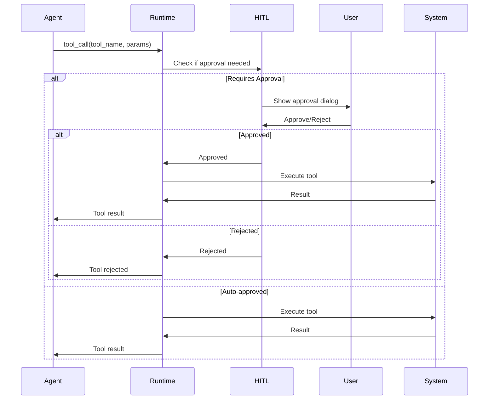

# Tools Specification

Спецификация инструментов (tools), доступных AI агентам для взаимодействия с проектом.

## Обзор

Агенты CodeLab используют набор инструментов для выполнения операций с файлами, командами и проектом. Все инструменты требуют подтверждения пользователя через механизм HITL (Human-in-the-Loop).

## Категории инструментов

### 📁 Файловые операции

#### write_to_file

Создание нового файла или полная перезапись существующего.

**Параметры**:
- `path` (string, required) - путь к файлу относительно workspace
- `content` (string, required) - полное содержимое файла

**Пример**:

```json
{
  "tool": "write_to_file",
  "parameters": {
    "path": "lib/widgets/user_card.dart",
    "content": "import 'package:flutter/material.dart';\n\nclass UserCard extends StatelessWidget {\n  @override\n  Widget build(BuildContext context) {\n    return Card(child: Text('User'));\n  }\n}"
  }
}
```

**HITL**: Требуется подтверждение для всех операций записи.

#### apply_diff

Точечные изменения в существующем файле с использованием diff-патчей.

**Параметры**:
- `path` (string, required) - путь к файлу
- `diff` (string, required) - diff в формате SEARCH/REPLACE

**Формат diff**:

```
<<<<<<< SEARCH
:start_line:[номер_строки]
-------
[точный текст для поиска]
=======
[новый текст для замены]
>>>>>>> REPLACE
```

**Пример**:

```json
{
  "tool": "apply_diff",
  "parameters": {
    "path": "lib/main.dart",
    "diff": "<<<<<<< SEARCH\n:start_line:10\n-------\nfinal title = 'Old Title';\n=======\nfinal title = 'New Title';\n>>>>>>> REPLACE"
  }
}
```

**HITL**: Требуется подтверждение, показывается предпросмотр изменений.

#### read_file

Чтение содержимого файлов.

**Параметры**:
- `files` (array, required) - список файлов для чтения (максимум 5)
  - `path` (string, required) - путь к файлу

**Пример**:

```json
{
  "tool": "read_file",
  "parameters": {
    "files": [
      {"path": "lib/main.dart"},
      {"path": "pubspec.yaml"}
    ]
  }
}
```

**HITL**: Не требуется (операция чтения безопасна).

#### list_files

Просмотр структуры директорий и файлов.

**Параметры**:
- `path` (string, required) - путь к директории
- `recursive` (boolean, required) - рекурсивный обход

**Пример**:

```json
{
  "tool": "list_files",
  "parameters": {
    "path": "lib",
    "recursive": true
  }
}
```

**HITL**: Не требуется.

#### search_files

Поиск по содержимому файлов с использованием regex.

**Параметры**:
- `path` (string, required) - директория для поиска
- `regex` (string, required) - регулярное выражение (Rust syntax)
- `file_pattern` (string, optional) - glob паттерн для фильтрации файлов

**Пример**:

```json
{
  "tool": "search_files",
  "parameters": {
    "path": "lib",
    "regex": "class\\s+\\w+\\s+extends\\s+StatelessWidget",
    "file_pattern": "*.dart"
  }
}
```

**HITL**: Не требуется.

### 💻 Выполнение команд

#### execute_command

Выполнение CLI команд в терминале.

**Параметры**:
- `command` (string, required) - команда для выполнения
- `cwd` (string, optional) - рабочая директория

**Пример**:

```json
{
  "tool": "execute_command",
  "parameters": {
    "command": "flutter pub get",
    "cwd": null
  }
}
```

**HITL**: Требуется подтверждение для потенциально опасных команд:
- Команды с `rm`, `del`, `format`
- Команды изменяющие систему
- Команды с sudo/admin правами

**Безопасные команды** (автоматическое одобрение):
- `ls`, `dir`, `pwd`, `echo`
- `git status`, `git log`, `git diff`
- `npm list`, `flutter doctor`

### 🔍 Анализ и навигация

#### ask_followup_question

Запрос дополнительной информации у пользователя.

**Параметры**:
- `question` (string, required) - вопрос пользователю
- `follow_up` (array, required) - варианты ответов (2-4 шт)
  - `text` (string, required) - текст варианта
  - `mode` (string, optional) - переключение режима

**Пример**:

```json
{
  "tool": "ask_followup_question",
  "parameters": {
    "question": "Какой UI framework использовать?",
    "follow_up": [
      {"text": "Material Design", "mode": null},
      {"text": "Cupertino (iOS style)", "mode": null},
      {"text": "Custom design", "mode": null}
    ]
  }
}
```

**HITL**: Не требуется (это сам механизм взаимодействия).

### 🌐 Браузер

#### browser_action

Взаимодействие с браузером для тестирования и отладки.

**Параметры**:
- `action` (enum, required) - действие: launch, click, type, scroll_down, scroll_up, screenshot, close
- `url` (string) - URL для launch
- `coordinate` (string) - координаты для click/hover в формате "x,y@WIDTHxHEIGHT"
- `text` (string) - текст для type
- `path` (string) - путь для screenshot

**Пример**:

```json
{
  "tool": "browser_action",
  "parameters": {
    "action": "launch",
    "url": "http://localhost:3000",
    "coordinate": "",
    "size": "1920x1080",
    "text": "",
    "path": ""
  }
}
```

**HITL**: Требуется для launch, не требуется для остальных действий.

## Tool Call Flow



## Tool Response Format

### Success Response

```json
{
  "status": "success",
  "tool": "write_to_file",
  "result": {
    "path": "lib/widgets/user_card.dart",
    "operation": "created",
    "size": 256
  }
}
```

### Error Response

```json
{
  "status": "error",
  "tool": "write_to_file",
  "error": {
    "code": "FILE_ACCESS_DENIED",
    "message": "Permission denied: lib/widgets/user_card.dart",
    "details": {
      "path": "lib/widgets/user_card.dart",
      "reason": "Read-only file system"
    }
  }
}
```

### Rejection Response

```json
{
  "status": "rejected",
  "tool": "execute_command",
  "rejection": {
    "reason": "User rejected the operation",
    "command": "rm -rf node_modules",
    "timestamp": "2026-01-21T10:15:00Z"
  }
}
```

## HITL Configuration

Пользователь может настроить уровень автономности агентов:

### Уровни автономности

**Paranoid** (Параноидальный):
- Требуется подтверждение для ВСЕХ операций
- Включая чтение файлов и безопасные команды

**Cautious** (Осторожный) - по умолчанию:
- Подтверждение для записи файлов
- Подтверждение для выполнения команд
- Автоматическое одобрение чтения

**Balanced** (Сбалансированный):
- Автоматическое одобрение безопасных операций
- Подтверждение для потенциально опасных
- Запоминание решений для повторяющихся операций

**Autonomous** (Автономный):
- Автоматическое одобрение большинства операций
- Подтверждение только для критических (удаление, форматирование)

## Tool Restrictions by Mode

Некоторые режимы имеют ограничения на редактирование файлов:

### Architect Mode

**Разрешено редактировать**:
- `*.md` - markdown файлы
- `*.txt` - текстовые файлы
- Файлы документации

**Запрещено**:
- Исходный код (`.dart`, `.js`, `.py`, etc.)
- Конфигурационные файлы

### Ask Mode

**Разрешено**:
- Только чтение файлов
- Поиск и анализ

**Запрещено**:
- Любые операции записи
- Выполнение команд

## Rate Limiting

Для предотвращения злоупотреблений применяются лимиты:

| Tool | Limit | Window |
|------|-------|--------|
| `write_to_file` | 100 calls | 1 minute |
| `execute_command` | 50 calls | 1 minute |
| `read_file` | 200 calls | 1 minute |
| `browser_action` | 30 calls | 1 minute |

## Best Practices

### Для разработчиков агентов

1. **Минимизируйте tool calls** - читайте несколько файлов за раз
2. **Используйте apply_diff** вместо write_to_file для небольших изменений
3. **Проверяйте результаты** - обрабатывайте ошибки tool calls
4. **Объясняйте действия** - пользователь должен понимать, что делает агент

### Для пользователей

1. **Проверяйте изменения** - всегда просматривайте diff перед одобрением
2. **Используйте Git** - коммитьте изменения для возможности отката
3. **Настройте автономность** - выберите комфортный уровень контроля
4. **Создавайте бэкапы** - перед большими изменениями

## Примеры использования

### Создание компонента

```json
[
  {
    "tool": "write_to_file",
    "parameters": {
      "path": "lib/widgets/user_card.dart",
      "content": "// Component code here"
    }
  },
  {
    "tool": "execute_command",
    "parameters": {
      "command": "flutter analyze lib/widgets/user_card.dart"
    }
  }
]
```

### Рефакторинг

```json
[
  {
    "tool": "search_files",
    "parameters": {
      "path": "lib",
      "regex": "oldFunctionName",
      "file_pattern": "*.dart"
    }
  },
  {
    "tool": "apply_diff",
    "parameters": {
      "path": "lib/services/user_service.dart",
      "diff": "<<<<<<< SEARCH\n...\n=======\n...\n>>>>>>> REPLACE"
    }
  }
]
```

## См. также

- [Multi-Agent System](/docs/api/multi-agent-system)
- [HITL Mechanism](/docs/ai-assistant/hitl)
- [Agent Protocol](/docs/api/agent-protocol)
- [WebSocket Protocol](/docs/api/websocket-protocol)
