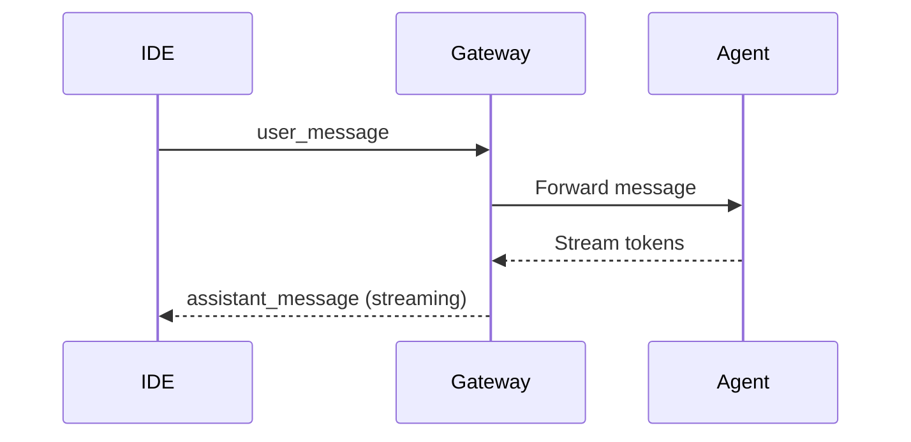
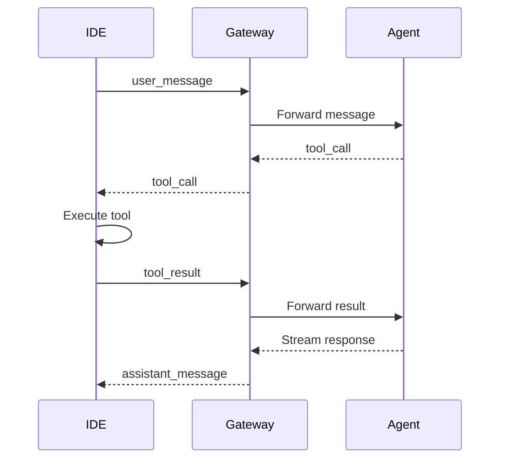
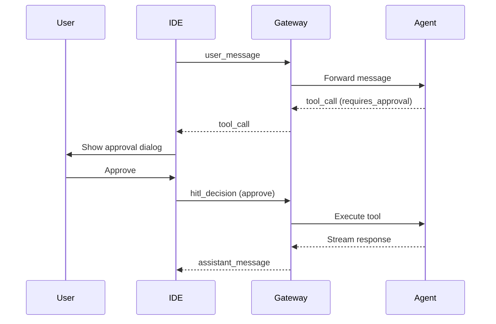

# WebSocket Protocol

Протокол WebSocket используется для взаимодействия между CodeLab IDE и Gateway Service. Он обеспечивает двунаправленную связь в реальном времени с поддержкой streaming токенов и tool-calls.

## Эндпоинт подключения

```
ws://<gateway_host>/ws/{session_id}
```

**Параметры:**
- `gateway_host` - адрес Gateway сервиса (по умолчанию `localhost:8000`)
- `session_id` - уникальный идентификатор сессии пользователя

**Пример:**
```
ws://localhost:8000/ws/user_session_123
```

## Типы сообщений

### 1. User Message (IDE → Gateway)

Сообщение от пользователя к AI ассистенту.

```json
{
  "type": "user_message",
  "content": "Напиши функцию для сортировки массива",
  "role": "user"
}
```

**Поля:**
- `type` (string, обязательно): `"user_message"`
- `content` (string, обязательно): Текст сообщения пользователя
- `role` (string, опционально): Роль отправителя (`"user"`, `"assistant"`, `"system"`, `"tool"`)

### 2. Assistant Message (Gateway → IDE)

Ответ AI ассистента. Передается в streaming режиме (токен за токеном).

```json
{
  "type": "assistant_message",
  "token": "Вот функция",
  "is_final": false
}
```

```json
{
  "type": "assistant_message",
  "token": " для сортировки.",
  "is_final": true
}
```

**Поля:**
- `type` (string): `"assistant_message"`
- `token` (string): Часть ответа (токен)
- `is_final` (boolean): `true` если это последний токен в ответе

### 3. Tool Call (Gateway → IDE)

Запрос на выполнение инструмента в IDE.

```json
{
  "type": "tool_call",
  "call_id": "call_abc123",
  "tool_name": "read_file",
  "arguments": {
    "path": "/src/main.dart"
  },
  "requires_approval": false
}
```

**Поля:**
- `type` (string): `"tool_call"`
- `call_id` (string): Уникальный идентификатор вызова (для корреляции с результатом)
- `tool_name` (string): Имя инструмента (`read_file`, `write_file`, `git.diff`, и т.д.)
- `arguments` (object): Параметры вызова (структура зависит от инструмента)
- `requires_approval` (boolean): Требуется ли подтверждение пользователя (HITL)

### 4. Tool Result (IDE → Gateway)

Результат выполнения инструмента.

**Успешное выполнение:**
```json
{
  "type": "tool_result",
  "call_id": "call_abc123",
  "result": {
    "content": "// содержимое файла"
  }
}
```

**Ошибка выполнения:**
```json
{
  "type": "tool_result",
  "call_id": "call_abc123",
  "error": "File not found: /src/main.dart"
}
```

**Поля:**
- `type` (string): `"tool_result"`
- `call_id` (string): ID вызова (должен совпадать с `call_id` из `tool_call`)
- `result` (object, опционально): Результат выполнения
- `error` (string, опционально): Сообщение об ошибке

### 5. Error Message (Gateway → IDE)

Сообщение об ошибке.

```json
{
  "type": "error",
  "content": "Invalid message format"
}
```

**Поля:**
- `type` (string): `"error"`
- `content` (string): Описание ошибки

## HITL (Human-in-the-Loop)

Механизм подтверждения опасных операций пользователем.

### Tool Call с требованием одобрения

Когда AI хочет выполнить потенциально опасную операцию (запись файла, выполнение команды), он отправляет `tool_call` с флагом `requires_approval: true`:

```json
{
  "type": "tool_call",
  "call_id": "call_xyz789",
  "tool_name": "write_file",
  "arguments": {
    "path": "/src/config.json",
    "content": "{\"debug\": true}"
  },
  "requires_approval": true
}
```

### HITL Decision (IDE → Gateway)

IDE должна показать пользователю запрос на одобрение и отправить решение.

**Одобрить (approve):**
```json
{
  "type": "hitl_decision",
  "call_id": "call_xyz789",
  "decision": "approve"
}
```

**Редактировать и одобрить (edit):**
```json
{
  "type": "hitl_decision",
  "call_id": "call_xyz789",
  "decision": "edit",
  "modified_arguments": {
    "path": "/src/config_new.json",
    "content": "{\"debug\": false}"
  }
}
```

**Отклонить (reject):**
```json
{
  "type": "hitl_decision",
  "call_id": "call_xyz789",
  "decision": "reject",
  "feedback": "This operation is too risky"
}
```

**Поля:**
- `type` (string): `"hitl_decision"`
- `call_id` (string): ID вызова инструмента
- `decision` (string): Решение пользователя (`"approve"`, `"edit"`, `"reject"`)
- `modified_arguments` (object, опционально): Измененные параметры (для `"edit"`)
- `feedback` (string, опционально): Комментарий пользователя (для `"reject"`)

## Сценарии использования

### Сценарий 1: Простой диалог



**Пример:**

1. IDE → Gateway:
```json
{
  "type": "user_message",
  "content": "Привет!",
  "role": "user"
}
```

2. Gateway → IDE (streaming):
```json
{"type": "assistant_message", "token": "Привет", "is_final": false}
{"type": "assistant_message", "token": "!", "is_final": false}
{"type": "assistant_message", "token": " Чем могу помочь?", "is_final": true}
```

### Сценарий 2: Выполнение tool-call



**Пример:**

1. IDE → Gateway:
```json
{
  "type": "user_message",
  "content": "Прочитай файл main.dart"
}
```

2. Gateway → IDE:
```json
{
  "type": "assistant_message",
  "token": "Читаю файл...",
  "is_final": true
}
```

3. Gateway → IDE:
```json
{
  "type": "tool_call",
  "call_id": "call_001",
  "tool_name": "read_file",
  "arguments": {"path": "main.dart"},
  "requires_approval": false
}
```

4. IDE → Gateway:
```json
{
  "type": "tool_result",
  "call_id": "call_001",
  "result": {
    "content": "void main() { ... }"
  }
}
```

5. Gateway → IDE:
```json
{
  "type": "assistant_message",
  "token": "Файл прочитан. Вот его содержимое...",
  "is_final": true
}
```

### Сценарий 3: HITL - Пользователь одобрил



**Пример:**

1. IDE → Gateway:
```json
{
  "type": "user_message",
  "content": "Создай файл test.py"
}
```

2. Gateway → IDE:
```json
{
  "type": "tool_call",
  "call_id": "call_002",
  "tool_name": "write_file",
  "arguments": {
    "path": "test.py",
    "content": "print('hello')"
  },
  "requires_approval": true
}
```

3. IDE показывает диалог пользователю

4. IDE → Gateway (пользователь одобрил):
```json
{
  "type": "hitl_decision",
  "call_id": "call_002",
  "decision": "approve"
}
```

5. Gateway → IDE:
```json
{
  "type": "assistant_message",
  "token": "Файл test.py создан успешно",
  "is_final": true
}
```

### Сценарий 4: HITL - Пользователь отредактировал

1-2. (аналогично сценарию 3)

3. IDE → Gateway (пользователь изменил параметры):
```json
{
  "type": "hitl_decision",
  "call_id": "call_002",
  "decision": "edit",
  "modified_arguments": {
    "path": "test_modified.py",
    "content": "print('hello world')"
  }
}
```

4. Gateway → IDE:
```json
{
  "type": "assistant_message",
  "token": "Файл test_modified.py создан с вашими изменениями",
  "is_final": true
}
```

### Сценарий 5: HITL - Пользователь отклонил

1-2. (аналогично сценарию 3)

3. IDE → Gateway (пользователь отклонил):
```json
{
  "type": "hitl_decision",
  "call_id": "call_002",
  "decision": "reject",
  "feedback": "Не хочу создавать этот файл"
}
```

4. Gateway → IDE:
```json
{
  "type": "assistant_message",
  "token": "Понял, не буду создавать файл. Что-то еще?",
  "is_final": true
}
```

## Требования к реализации

### Обязательные требования

1. **Формат сообщений**: Все сообщения должны быть в формате JSON
2. **Поле type**: Обязательно для всех сообщений
3. **Валидация**: Сообщения должны соответствовать Pydantic схемам
4. **Корреляция**: `call_id` в `tool_result` должен совпадать с `call_id` в `tool_call`
5. **Обработка ошибок**: Некорректные сообщения должны возвращать `error` тип

### Рекомендации

1. **Reconnection**: Реализуйте автоматическое переподключение при разрыве соединения
2. **Buffering**: Буферизуйте сообщения при временной недоступности соединения
3. **Timeout**: Устанавливайте таймауты для tool-calls
4. **Logging**: Логируйте все сообщения для отладки
5. **Error Handling**: Обрабатывайте все возможные ошибки gracefully

## Pydantic схемы

Все схемы определены в `gateway/app/models/websocket.py`:

- `WSUserMessage` - Сообщение пользователя
- `WSAssistantMessage` - Ответ ассистента
- `WSToolCall` - Вызов инструмента
- `WSToolResult` - Результат инструмента
- `WSHITLDecision` - Решение HITL
- `WSErrorResponse` - Сообщение об ошибке
- `WSAgentSwitched` - Уведомление о переключении агента
- `WSSwitchAgent` - Запрос на переключение агента

## Коды ошибок

| Код | Описание |
|---|---|
| `INVALID_FORMAT` | Некорректный формат JSON |
| `INVALID_TYPE` | Неизвестный тип сообщения |
| `MISSING_FIELD` | Отсутствует обязательное поле |
| `INVALID_CALL_ID` | Некорректный call_id |
| `TOOL_NOT_FOUND` | Инструмент не найден |
| `TOOL_EXECUTION_ERROR` | Ошибка выполнения инструмента |
| `SESSION_EXPIRED` | Сессия истекла |
| `UNAUTHORIZED` | Не авторизован |

## Примеры реализации

### JavaScript/TypeScript

```typescript
const ws = new WebSocket('ws://localhost:8000/ws/session_123');

// Отправка сообщения
ws.send(JSON.stringify({
  type: 'user_message',
  content: 'Привет!',
  role: 'user'
}));

// Получение сообщений
ws.onmessage = (event) => {
  const message = JSON.parse(event.data);
  
  switch (message.type) {
    case 'assistant_message':
      console.log('Token:', message.token);
      break;
    case 'tool_call':
      handleToolCall(message);
      break;
    case 'error':
      console.error('Error:', message.content);
      break;
  }
};
```

### Dart/Flutter

```dart
final channel = WebSocketChannel.connect(
  Uri.parse('ws://localhost:8000/ws/session_123'),
);

// Отправка сообщения
channel.sink.add(jsonEncode({
  'type': 'user_message',
  'content': 'Привет!',
  'role': 'user',
}));

// Получение сообщений
channel.stream.listen((message) {
  final data = jsonDecode(message);
  
  switch (data['type']) {
    case 'assistant_message':
      print('Token: ${data['token']}');
      break;
    case 'tool_call':
      handleToolCall(data);
      break;
    case 'error':
      print('Error: ${data['content']}');
      break;
  }
});
```

## Дополнительные ресурсы

- [Tools Specification](/docs/api/tools-specification) - Спецификация инструментов
- [Agent Protocol](/docs/api/agent-protocol) - Расширенный протокол агента
- [Gateway API](/docs/api/gateway) - Документация Gateway Service
- [GitHub Repository](https://github.com/openidealab/codelab-workspace)
