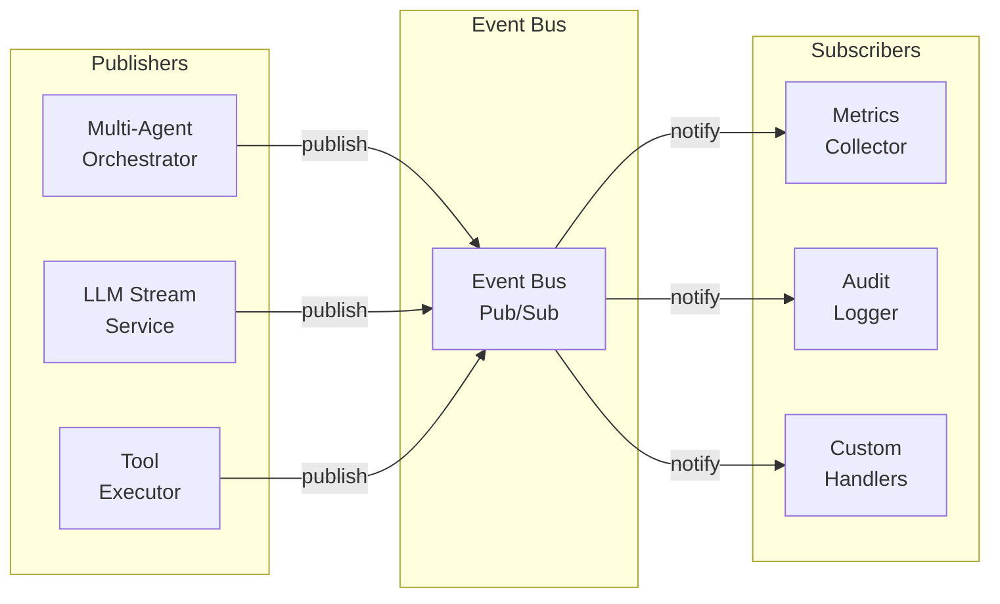
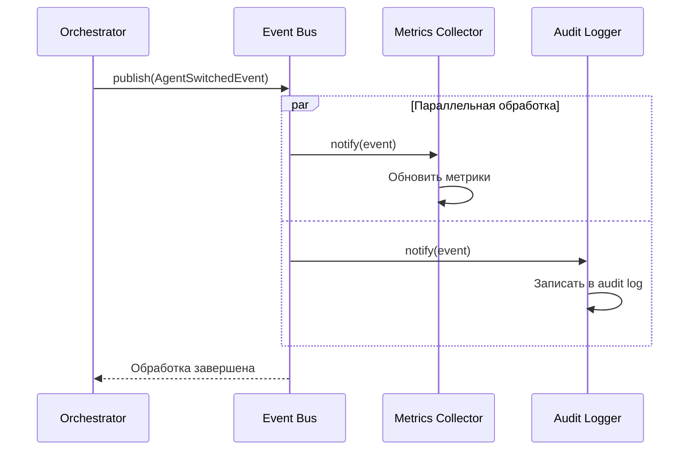
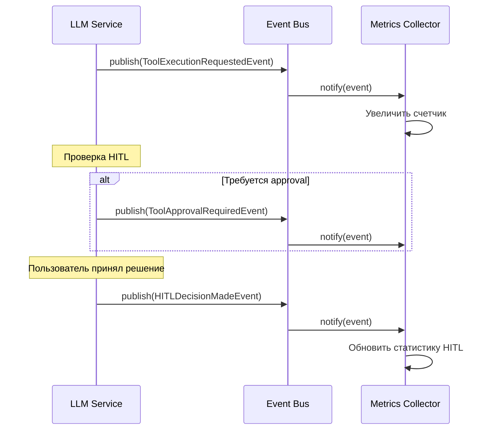

# Event-Driven Architecture

Event-Driven Architecture (EDA) в Agent Runtime обеспечивает слабую связанность компонентов, улучшенную observability и готовность к масштабированию.

## Обзор

Event-Driven Architecture позволяет компонентам взаимодействовать через события вместо прямых вызовов методов.

**Преимущества**:
- ✅ **Слабая связанность** - компоненты не знают друг о друге
- ✅ **Расширяемость** - новые подписчики добавляются без изменения кода
- ✅ **Observability** - полная история всех действий
- ✅ **Масштабируемость** - поддержка distributed events через Redis Pub/Sub
- ✅ **Тестируемость** - легко мокировать события

## Архитектура



## Компоненты

### Event Bus

Централизованная шина событий с поддержкой pub/sub паттерна.

**Возможности**:
- Подписка по типу события
- Подписка по категории событий
- Wildcard подписки (все события)
- Приоритеты обработчиков
- Middleware для обработки событий
- Thread-safe операции

**Пример использования**:

```python
from app.events.event_bus import event_bus
from app.events.event_types import EventType

# Подписка на конкретный тип события
@event_bus.subscribe(event_type=EventType.AGENT_SWITCHED)
async def on_agent_switched(event):
    print(f"Агент переключен: {event.data}")

# Подписка на категорию событий
@event_bus.subscribe(event_category=EventCategory.AGENT)
async def on_any_agent_event(event):
    print(f"Событие агента: {event.event_type}")

# Публикация события
await event_bus.publish(
    AgentSwitchedEvent(
        session_id="session-123",
        from_agent="orchestrator",
        to_agent="coder",
        reason="Требуется модификация кода"
    )
)
```

### Base Event

Базовый класс для всех событий с общими полями.

**Структура события**:

```python
{
    "event_id": "uuid",              # Уникальный ID события
    "event_type": "agent_switched",  # Тип события
    "event_category": "agent",       # Категория
    "timestamp": "2026-01-21T10:00:00Z",
    "session_id": "session-123",     # ID сессии
    "correlation_id": "corr-456",    # Для трейсинга
    "causation_id": "event-789",     # ID события-причины
    "data": {...},                   # Данные события
    "source": "multi_agent_orchestrator",
    "version": "1.0"
}
```

## Типы событий

### События агентов

События, связанные с операциями агентов.

#### AgentSwitchedEvent

Публикуется при переключении агента.

```python
from app.events.agent_events import AgentSwitchedEvent

event = AgentSwitchedEvent(
    session_id="session-123",
    from_agent="orchestrator",
    to_agent="coder",
    reason="Требуется написание кода",
    confidence="high"
)
await event_bus.publish(event)
```

**Данные события**:
- `from_agent` - предыдущий агент
- `to_agent` - новый агент
- `reason` - причина переключения
- `confidence` - уверенность в выборе (high/medium/low)

#### AgentProcessingStartedEvent

Публикуется когда агент начинает обработку сообщения.

```python
event = AgentProcessingStartedEvent(
    session_id="session-123",
    agent_type="coder",
    message="Создай функцию сортировки"
)
```

#### AgentProcessingCompletedEvent

Публикуется когда агент завершает обработку.

```python
event = AgentProcessingCompletedEvent(
    session_id="session-123",
    agent_type="coder",
    duration_ms=1500.5,
    success=True
)
```

#### AgentErrorOccurredEvent

Публикуется при ошибке в агенте.

```python
event = AgentErrorOccurredEvent(
    session_id="session-123",
    agent_type="coder",
    error_message="File not found",
    error_type="FileNotFoundError"
)
```

### События инструментов

События, связанные с выполнением инструментов.

#### ToolExecutionRequestedEvent

Запрос на выполнение инструмента.

```python
from app.events.tool_events import ToolExecutionRequestedEvent

event = ToolExecutionRequestedEvent(
    session_id="session-123",
    tool_name="write_file",
    arguments={"path": "test.py", "content": "..."},
    call_id="call-456",
    agent="coder"
)
```

#### ToolApprovalRequiredEvent

Инструмент требует подтверждения пользователя (HITL).

```python
event = ToolApprovalRequiredEvent(
    session_id="session-123",
    tool_name="execute_command",
    arguments={"command": "rm -rf /tmp"},
    call_id="call-456",
    reason="Опасная команда"
)
```

#### HITLDecisionMadeEvent

Пользователь принял решение по HITL approval.

```python
event = HITLDecisionMadeEvent(
    session_id="session-123",
    call_id="call-456",
    decision="APPROVE",  # APPROVE, EDIT, REJECT
    tool_name="write_file",
    original_args={"path": "test.py"},
    modified_args=None
)
```

### События сессий

События, связанные с управлением сессиями.

#### SessionCreatedEvent

Создание новой сессии.

```python
from app.events.session_events import SessionCreatedEvent

event = SessionCreatedEvent(
    session_id="session-123",
    system_prompt="You are a helpful assistant"
)
```

#### MessageAddedEvent

Добавление сообщения в сессию.

```python
event = MessageAddedEvent(
    session_id="session-123",
    role="user",
    content_length=100,
    agent_name="coder"
)
```

## Категории событий

События организованы по категориям для удобной подписки:

```python
from app.events.event_types import EventCategory

EventCategory.AGENT    # События агентов
EventCategory.SESSION  # События сессий
EventCategory.TOOL     # События инструментов
EventCategory.HITL     # HITL события
EventCategory.SYSTEM   # Системные события
EventCategory.METRICS  # События метрик
```

## Подписчики

### Metrics Collector

Автоматически собирает метрики из событий.

```python
from app.events.subscribers import metrics_collector

# Получить все метрики
metrics = metrics_collector.get_metrics()

# Структура метрик
{
    "agent_switches": {
        "orchestrator_to_coder": 15,
        "coder_to_debug": 3
    },
    "agent_processing": {
        "coder": {
            "count": 20,
            "total_duration_ms": 30000,
            "success_count": 18,
            "failure_count": 2
        }
    },
    "tool_executions": {
        "write_file": {
            "requested": 10,
            "completed": 8,
            "failed": 2
        }
    },
    "hitl_decisions": {
        "write_file": {
            "APPROVE": 7,
            "EDIT": 2,
            "REJECT": 1
        }
    }
}
```

**Методы**:
- `get_metrics()` - все метрики
- `get_agent_switch_count(from_agent, to_agent)` - количество переключений
- `get_agent_avg_duration(agent)` - средняя длительность обработки
- `get_tool_success_rate(tool_name)` - процент успешных выполнений

### Audit Logger

Логирует критичные события для аудита.

```python
from app.events.subscribers import audit_logger

# Получить audit log
log = audit_logger.get_audit_log(
    session_id="session-123",
    event_type="agent_switched",
    limit=10
)
```

**Логируемые события**:
- Переключения агентов
- HITL решения
- Ошибки агентов
- Ошибки выполнения инструментов
- Требования approval

## Поток событий

### Пример: Переключение агента



### Пример: Выполнение инструмента



## Создание пользовательских подписчиков

```python
from app.events.event_bus import event_bus
from app.events.event_types import EventType, EventCategory

class CustomSubscriber:
    """Пользовательский подписчик."""
    
    def __init__(self):
        self._setup_subscriptions()
    
    def _setup_subscriptions(self):
        """Настройка подписок."""
        event_bus.subscribe(
            event_type=EventType.AGENT_SWITCHED,
            handler=self._on_agent_switched,
            priority=5
        )
        
        event_bus.subscribe(
            event_category=EventCategory.TOOL,
            handler=self._on_tool_event,
            priority=3
        )
    
    async def _on_agent_switched(self, event):
        """Обработчик переключения агента."""
        print(f"Агент переключен: {event.data['from_agent']} → {event.data['to_agent']}")
        # Ваша логика здесь
    
    async def _on_tool_event(self, event):
        """Обработчик событий инструментов."""
        print(f"Событие инструмента: {event.event_type}")
        # Ваша логика здесь

# Инициализация
custom_subscriber = CustomSubscriber()
```

## Middleware

Middleware позволяет обрабатывать события перед их доставкой подписчикам.

```python
from app.events.event_bus import event_bus
from datetime import datetime

# Middleware для валидации событий
async def validate_event_middleware(event):
    if not event.session_id:
        logger.warning(f"Событие {event.event_type} без session_id")
    return event

# Middleware для обогащения событий
async def enrich_event_middleware(event):
    event.data["enriched_at"] = datetime.utcnow().isoformat()
    return event

# Middleware для фильтрации событий
async def filter_test_events_middleware(event):
    if event.session_id and event.session_id.startswith("test-"):
        return None  # Отменить тестовые события
    return event

# Добавление middleware
event_bus.add_middleware(validate_event_middleware)
event_bus.add_middleware(enrich_event_middleware)
event_bus.add_middleware(filter_test_events_middleware)
```

## Correlation ID для трейсинга

Используйте correlation_id для отслеживания связанных событий.

```python
import uuid

correlation_id = str(uuid.uuid4())

# Первое событие
await event_bus.publish(
    AgentSwitchedEvent(..., correlation_id=correlation_id)
)

# Связанное событие
await event_bus.publish(
    ToolExecutionRequestedEvent(..., correlation_id=correlation_id)
)

# Все события с одним correlation_id можно отследить
```

## Приоритеты обработчиков

Обработчики выполняются в порядке приоритета (от большего к меньшему).

```python
# Высокий приоритет (выполнится первым)
@event_bus.subscribe(event_type=EventType.AGENT_SWITCHED, priority=10)
async def critical_handler(event):
    # Критичная логика (audit, безопасность)
    pass

# Обычный приоритет
@event_bus.subscribe(event_type=EventType.AGENT_SWITCHED, priority=5)
async def normal_handler(event):
    # Обычная логика (метрики, уведомления)
    pass

# Низкий приоритет (выполнится последним)
@event_bus.subscribe(event_type=EventType.AGENT_SWITCHED, priority=0)
async def low_priority_handler(event):
    # Некритичная логика (аналитика, кэширование)
    pass
```

## Best Practices

### 1. Используйте Correlation ID

Всегда передавайте correlation_id для трейсинга связанных событий.

### 2. Обрабатывайте ошибки в подписчиках

```python
@event_bus.subscribe(event_type=EventType.AGENT_SWITCHED)
async def my_handler(event):
    try:
        await do_something(event)
    except Exception as e:
        logger.error(f"Ошибка в обработчике: {e}")
        # Не пробрасывайте исключение
```

### 3. Выбирайте wait_for_handlers разумно

```python
# Для критичных операций
await event_bus.publish(event, wait_for_handlers=True)

# Для fire-and-forget (по умолчанию)
await event_bus.publish(event)
```

### 4. Данные событий должны быть сериализуемы

```python
# ✅ Хорошо
data = {"count": 5, "name": "test", "items": ["a", "b"]}

# ❌ Плохо
data = {"object": some_complex_object}  # Не сериализуется
```

## Мониторинг

### Статистика Event Bus

```python
from app.events.event_bus import event_bus

stats = event_bus.get_stats()
print(f"Всего опубликовано: {stats.total_published}")
print(f"Успешных обработчиков: {stats.successful_handlers}")
print(f"Неудачных обработчиков: {stats.failed_handlers}")
```

### Отладка

Включите debug логирование:

```python
import logging
logging.getLogger("app.events").setLevel(logging.DEBUG)
```

## Будущие улучшения

### Distributed Event Bus (Redis Pub/Sub)

Для горизонтального масштабирования через несколько инстансов:

```python
from app.events.distributed_event_bus import DistributedEventBus

# Инициализация с Redis
distributed_bus = DistributedEventBus(redis_url="redis://localhost:6379")
await distributed_bus.initialize()

# События распределяются между всеми инстансами
await distributed_bus.publish(event, distribute=True)
```

### Event Store (PostgreSQL)

Для event sourcing и replay:

```python
# Все события сохраняются в БД
events = await event_store.get_events(
    session_id="session-123",
    event_type=EventType.AGENT_SWITCHED
)

# Replay событий
for event in events:
    await event_bus.publish(event)
```

## Справочник API

### EventBus

**Методы**:
- `subscribe(event_type, event_category, handler, priority)` - подписаться
- `unsubscribe(event_type, event_category, handler)` - отписаться
- `publish(event, wait_for_handlers)` - опубликовать событие
- `add_middleware(middleware)` - добавить middleware
- `get_stats()` - получить статистику
- `clear()` - очистить все подписки

### BaseEvent

**Поля**:
- `event_id: str` - уникальный ID
- `event_type: EventType` - тип события
- `event_category: EventCategory` - категория
- `timestamp: datetime` - время создания
- `session_id: Optional[str]` - ID сессии
- `correlation_id: Optional[str]` - ID для трейсинга
- `causation_id: Optional[str]` - ID события-причины
- `data: Dict[str, Any]` - данные события
- `source: str` - компонент-источник
- `version: str` - версия формата

## Дополнительные ресурсы

- [Архитектура AI Service](/docs/architecture/ai-service-architecture)
- [Мультиагентная система](/docs/ai-assistant/multi-agent-system)
- [Agent Runtime API](/docs/api/agent-runtime)

---

**Версия**: 1.0  
**Дата**: 21 января 2026  
**Статус**: ✅ Реализовано
