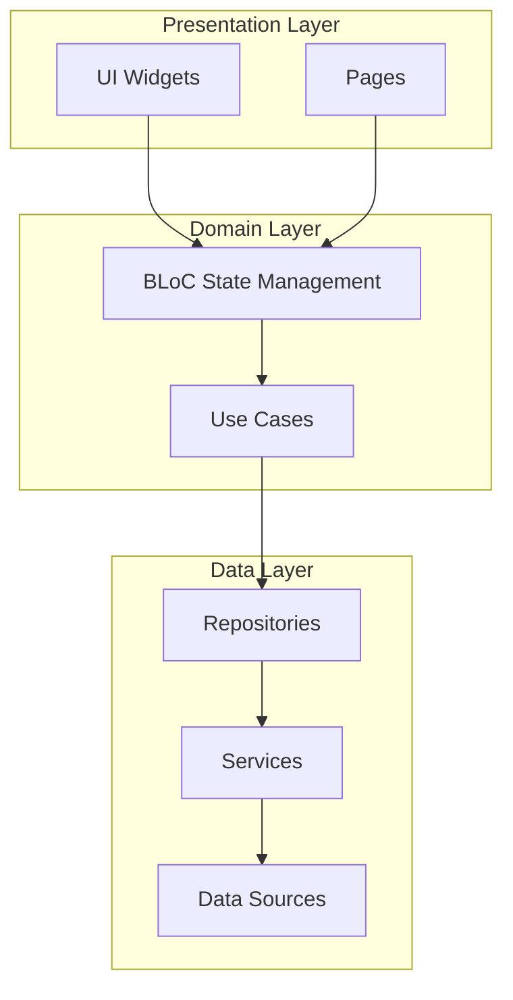

# Архитектура IDE

CodeLab IDE - это кроссплатформенное десктопное приложение, построенное на Flutter с использованием модульной архитектуры и принципов Clean Architecture.

## Обзор

CodeLab IDE представляет собой полнофункциональную среду разработки с интегрированным AI ассистентом, редактором кода, терминалом и системой управления проектами.



## Модульная структура

IDE организован как Melos monorepo с четким разделением ответственности:

```
codelab_ide/
├── apps/
│   └── codelab_ide/              # Основное приложение
│       ├── lib/
│       │   ├── main.dart         # Точка входа
│       │   ├── codelab_app.dart  # Корневой виджет
│       │   ├── di/               # Dependency Injection
│       │   ├── pages/            # Страницы приложения
│       │   └── widgets/          # UI компоненты
│       └── pubspec.yaml
│
├── packages/
│   ├── codelab_core/             # Основные сервисы
│   │   ├── lib/src/services/
│   │   │   ├── file_service.dart
│   │   │   ├── project_service.dart
│   │   │   └── global_config_service.dart
│   │   └── pubspec.yaml
│   │
│   ├── codelab_engine/           # Бизнес-логика
│   │   ├── lib/src/
│   │   │   ├── services/
│   │   │   │   ├── editor_manager_service.dart
│   │   │   │   ├── lsp_service.dart
│   │   │   │   └── file_sync_service.dart
│   │   │   └── widgets/
│   │   └── pubspec.yaml
│   │
│   ├── codelab_ai_assistant/     # AI интеграция
│   │   └── pubspec.yaml
│   │
│   ├── codelab_terminal/         # Встроенный терминал
│   │   ├── lib/src/
│   │   │   └── widgets/
│   │   │       ├── terminal_bloc.dart
│   │   │       └── terminal_widget.dart
│   │   └── pubspec.yaml
│   │
│   ├── codelab_uikit/            # UI компоненты
│   │   └── pubspec.yaml
│   │
│   └── codelab_version_control/  # Git интеграция
│       └── pubspec.yaml
│
└── melos.yaml                    # Конфигурация monorepo
```

## Основные модули

### 1. codelab_core

**Назначение**: Базовые сервисы и утилиты, используемые всеми модулями.

**Ключевые компоненты**:
- `FileService` - работа с файловой системой
- `ProjectService` - управление проектами
- `GlobalConfigService` - глобальные настройки
- `FileWatcherService` - отслеживание изменений файлов
- `RunService` - запуск команд и процессов

**Зависимости**: Минимальные (только Dart SDK)

### 2. codelab_engine

**Назначение**: Бизнес-логика редактора и управление состоянием.

**Ключевые компоненты**:
- `EditorManagerService` - управление открытыми файлами
- `LSPService` - Language Server Protocol интеграция
- `FileSyncService` - синхронизация файлов
- `ProjectBloc` - управление состоянием проекта
- `StartWizardBloc` - мастер создания проектов

**Зависимости**: `codelab_core`

### 3. codelab_ai_assistant

**Назначение**: Интеграция с AI сервисом через WebSocket.

**Ключевые компоненты**:
- WebSocket клиент для связи с Gateway
- Обработка tool-calls
- Streaming токенов от LLM
- HITL (Human-in-the-Loop) логика
- Управление контекстом диалогов

**Зависимости**: `codelab_core`, `web_socket_channel`

### 4. codelab_terminal

**Назначение**: Встроенный терминал с поддержкой xterm.

**Ключевые компоненты**:
- `TerminalWidget` - UI терминала
- `TerminalBloc` - управление состоянием
- Поддержка PTY (Pseudo Terminal)
- ANSI escape codes обработка

**Зависимости**: `xterm`, `flutter_pty`

### 5. codelab_uikit

**Назначение**: Переиспользуемые UI компоненты.

**Ключевые компоненты**:
- Кастомные виджеты
- Темы и стили
- Общие UI паттерны

### 6. codelab_version_control

**Назначение**: Git интеграция.

**Ключевые компоненты**:
- Git команды (commit, push, pull, diff)
- Визуализация изменений
- Управление ветками

## Архитектурные паттерны

### Clean Architecture

IDE следует принципам Clean Architecture с четким разделением слоев:

```dart
// Presentation Layer
class EditorPage extends StatelessWidget {
  @override
  Widget build(BuildContext context) {
    return BlocBuilder<EditorBloc, EditorState>(
      builder: (context, state) {
        return EditorWidget(files: state.openFiles);
      },
    );
  }
}

// Domain Layer (BLoC)
class EditorBloc extends Bloc<EditorEvent, EditorState> {
  final EditorManagerService _editorService;
  
  EditorBloc(this._editorService) : super(EditorInitial()) {
    on<OpenFileEvent>((event, emit) async {
      final file = await _editorService.openFile(event.path);
      emit(FileOpened(file));
    });
  }
}

// Data Layer
class EditorManagerService {
  final FileService _fileService;
  
  Future<FileContent> openFile(String path) async {
    return await _fileService.readFile(path);
  }
}
```

### BLoC Pattern

Для управления состоянием используется BLoC (Business Logic Component):

**Преимущества**:
- Четкое разделение UI и бизнес-логики
- Тестируемость
- Реактивность
- Предсказуемость состояния

**Пример**:
```dart
// Event
abstract class ProjectEvent {}
class LoadProjectEvent extends ProjectEvent {
  final String path;
  LoadProjectEvent(this.path);
}

// State
abstract class ProjectState {}
class ProjectLoading extends ProjectState {}
class ProjectLoaded extends ProjectState {
  final Project project;
  ProjectLoaded(this.project);
}

// BLoC
class ProjectBloc extends Bloc<ProjectEvent, ProjectState> {
  ProjectBloc() : super(ProjectInitial()) {
    on<LoadProjectEvent>(_onLoadProject);
  }
  
  Future<void> _onLoadProject(
    LoadProjectEvent event,
    Emitter<ProjectState> emit,
  ) async {
    emit(ProjectLoading());
    final project = await projectService.load(event.path);
    emit(ProjectLoaded(project));
  }
}
```

### Dependency Injection

Используется `cherrypick` для DI:

```dart
// app_di_module.dart
class AppDIModule {
  static void setup() {
    // Core services
    cherrypick.register<FileService>(() => FileServiceImpl());
    cherrypick.register<ProjectService>(() => ProjectServiceImpl());
    
    // Engine services
    cherrypick.register<EditorManagerService>(
      () => EditorManagerService(cherrypick.get<FileService>())
    );
    
    // BLoCs
    cherrypick.register<ProjectBloc>(
      () => ProjectBloc(cherrypick.get<ProjectService>())
    );
  }
}
```

### Repository Pattern

Абстракция доступа к данным:

```dart
abstract class ProjectRepository {
  Future<Project> getProject(String path);
  Future<void> saveProject(Project project);
  Future<List<Project>> getRecentProjects();
}

class ProjectRepositoryImpl implements ProjectRepository {
  final FileService _fileService;
  final GlobalConfigService _configService;
  
  @override
  Future<Project> getProject(String path) async {
    final content = await _fileService.readFile('$path/.codelab');
    return Project.fromJson(jsonDecode(content));
  }
}
```

## Ключевые функции

### 1. Редактор кода

- Подсветка синтаксиса (через LSP)
- Автодополнение
- Go to definition
- Find references
- Рефакторинг

### 2. Навигация по проекту

- Дерево файлов
- Быстрый поиск файлов (Cmd/Ctrl+P)
- Поиск по содержимому
- Навигация по символам

### 3. Встроенный терминал

- Множественные терминалы
- Split view
- Поддержка shell (bash, zsh, powershell)
- ANSI colors

### 4. AI ассистент

- Чат интерфейс
- Streaming ответов
- Tool-calls выполнение
- HITL подтверждения
- Контекст проекта

### 5. Git интеграция

- Визуализация изменений
- Commit, push, pull
- Управление ветками
- Diff viewer

## WebSocket интеграция

Связь с AI сервисом через WebSocket:

```dart
class AIAssistantService {
  late WebSocketChannel _channel;
  
  void connect(String sessionId) {
    _channel = WebSocketChannel.connect(
      Uri.parse('ws://localhost:8000/ws/$sessionId'),
    );
    
    _channel.stream.listen(_handleMessage);
  }
  
  void sendMessage(String content) {
    _channel.sink.add(jsonEncode({
      'type': 'user_message',
      'content': content,
      'role': 'user',
    }));
  }
  
  void _handleMessage(dynamic message) {
    final data = jsonDecode(message);
    
    switch (data['type']) {
      case 'assistant_message':
        _handleAssistantMessage(data);
        break;
      case 'tool_call':
        _handleToolCall(data);
        break;
      case 'error':
        _handleError(data);
        break;
    }
  }
}
```

## Tool Execution

Локальное выполнение инструментов:

```dart
class ToolExecutor {
  Future<Map<String, dynamic>> execute(ToolCall call) async {
    switch (call.toolName) {
      case 'read_file':
        return await _readFile(call.arguments);
      case 'write_file':
        return await _writeFile(call.arguments);
      case 'git.diff':
        return await _gitDiff(call.arguments);
      case 'apply_patch':
        return await _applyPatch(call.arguments);
      default:
        throw UnsupportedToolException(call.toolName);
    }
  }
  
  Future<Map<String, dynamic>> _readFile(Map<String, dynamic> args) async {
    final path = args['path'] as String;
    final content = await File(path).readAsString();
    return {'content': content};
  }
}
```

## Платформенная поддержка

### macOS

- Нативные меню
- Keyboard shortcuts
- File system access
- Notarization ready

### Linux

- GTK integration
- Desktop file
- AppImage packaging

### Windows

- Native windows
- Registry integration
- MSI installer

## Производительность

### Оптимизации

1. **Lazy loading** - загрузка файлов по требованию
2. **Virtualization** - виртуализация больших списков
3. **Debouncing** - отложенная обработка событий
4. **Caching** - кеширование часто используемых данных
5. **Isolates** - тяжелые операции в отдельных потоках

### Пример использования Isolate

```dart
Future<String> parseHugeFile(String path) async {
  return await compute(_parseFileInIsolate, path);
}

String _parseFileInIsolate(String path) {
  // Тяжелая обработка в отдельном потоке
  final content = File(path).readAsStringSync();
  return processContent(content);
}
```

## Тестирование

### Unit тесты

```dart
void main() {
  group('FileService', () {
    late FileService fileService;
    
    setUp(() {
      fileService = FileServiceImpl();
    });
    
    test('should read file content', () async {
      final content = await fileService.readFile('test.txt');
      expect(content, isNotEmpty);
    });
  });
}
```

### Widget тесты

```dart
void main() {
  testWidgets('EditorWidget displays file content', (tester) async {
    await tester.pumpWidget(
      MaterialApp(
        home: EditorWidget(
          file: FileContent(path: 'test.dart', content: 'void main() {}'),
        ),
      ),
    );
    
    expect(find.text('void main() {}'), findsOneWidget);
  });
}
```

### Integration тесты

```dart
void main() {
  IntegrationTestWidgetsFlutterBinding.ensureInitialized();
  
  testWidgets('Full workflow test', (tester) async {
    app.main();
    await tester.pumpAndSettle();
    
    // Открыть проект
    await tester.tap(find.text('Open Project'));
    await tester.pumpAndSettle();
    
    // Открыть файл
    await tester.tap(find.text('main.dart'));
    await tester.pumpAndSettle();
    
    expect(find.byType(EditorWidget), findsOneWidget);
  });
}
```

## Логирование

Структурированное логирование с ротацией файлов:

```dart
class DateAndSizeRotatingFileLogOutput extends LogOutput {
  @override
  void output(OutputEvent event) {
    final logFile = _getLogFile();
    logFile.writeAsStringSync(
      '${event.level.name}: ${event.lines.join('\n')}\n',
      mode: FileMode.append,
    );
  }
  
  File _getLogFile() {
    final date = DateTime.now().toIso8601String().split('T')[0];
    return File('logs/codelab_$date.log');
  }
}
```

## Конфигурация

Глобальные настройки хранятся в JSON:

```json
{
  "theme": "dark",
  "fontSize": 14,
  "fontFamily": "JetBrains Mono",
  "aiService": {
    "gatewayUrl": "ws://localhost:8000",
    "autoApprove": false
  },
  "editor": {
    "tabSize": 2,
    "insertSpaces": true,
    "wordWrap": true
  }
}
```

## Следующие шаги

- [Архитектура AI Service](/docs/architecture/ai-service-architecture)
- [Интеграция компонентов](/docs/architecture/integration)
- [Разработка IDE](/docs/development/ide)
- [WebSocket Protocol](/docs/api/websocket-protocol)
