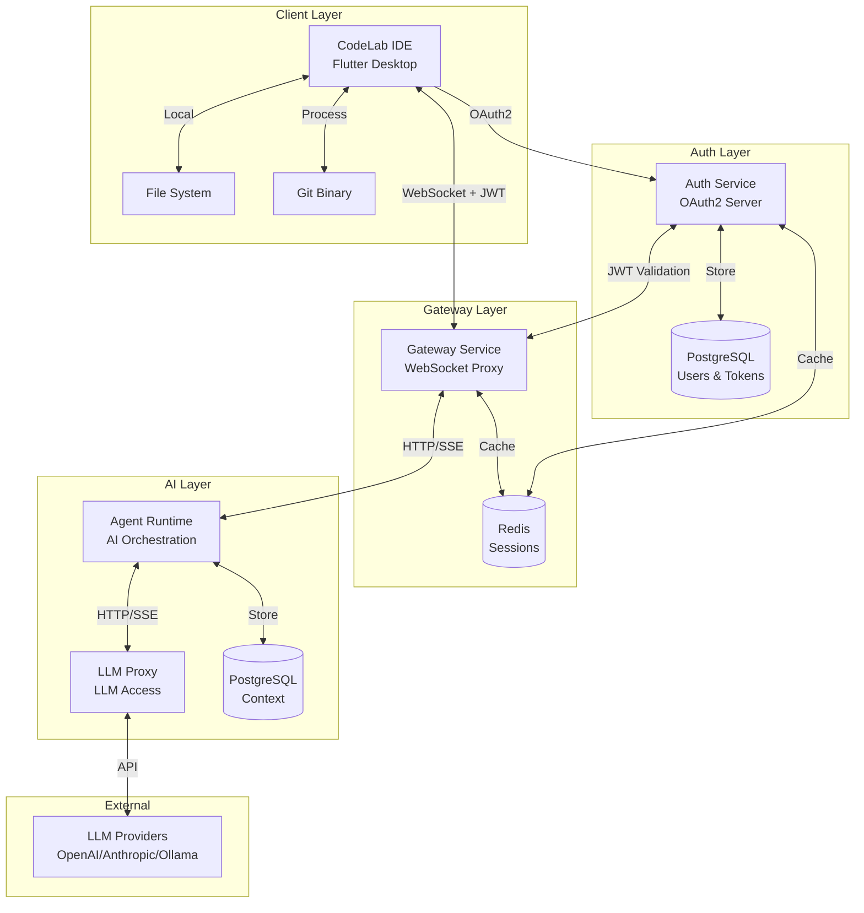
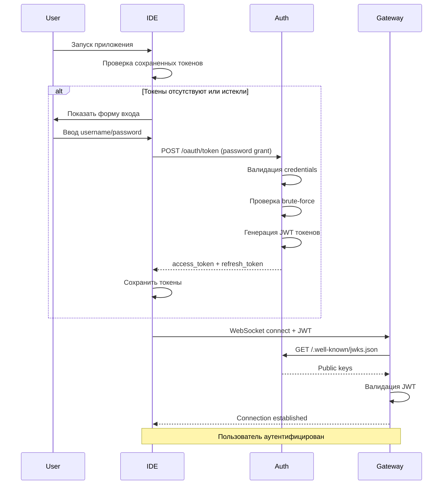
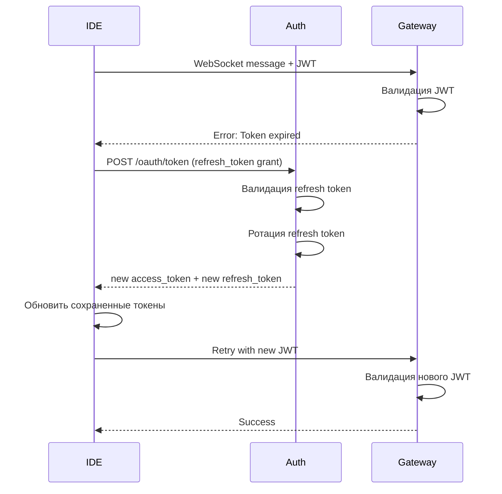
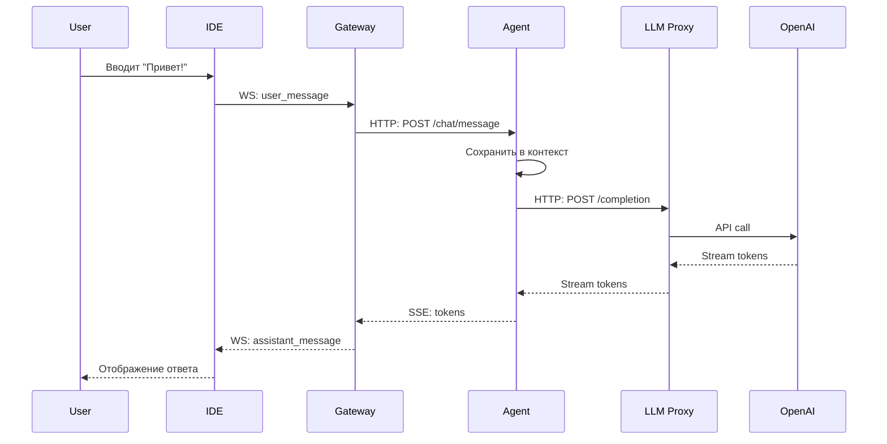
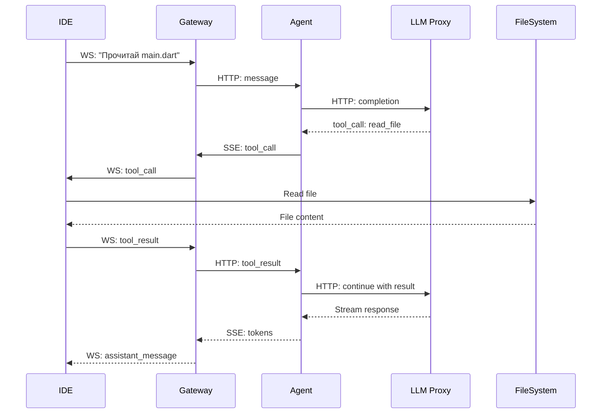
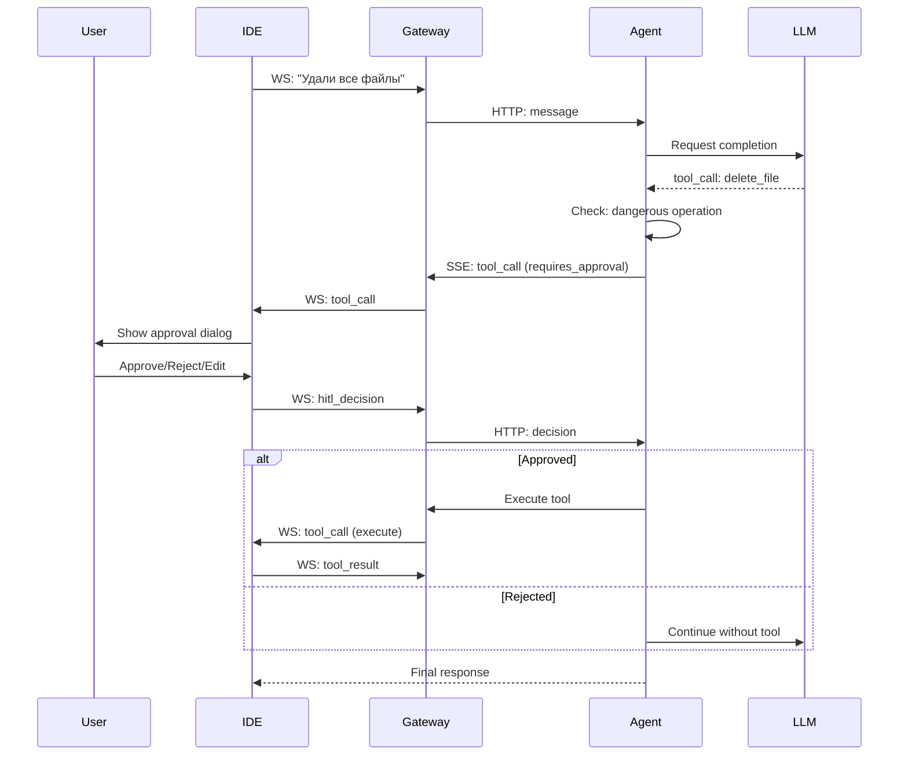

# Интеграция компонентов

Этот документ описывает, как различные компоненты CodeLab взаимодействуют друг с другом для обеспечения бесшовной работы AI-powered IDE.

## Обзор интеграции



## Протоколы взаимодействия

### 1. IDE ↔ Gateway (WebSocket)

**Протокол**: WebSocket с JSON сообщениями

**Эндпоинт**: `ws://localhost:8000/ws/{session_id}`

**Типы сообщений**:
- `user_message` - сообщение от пользователя
- `assistant_message` - ответ AI (streaming)
- `tool_call` - запрос на выполнение инструмента
- `tool_result` - результат выполнения
- `hitl_decision` - решение пользователя (HITL)
- `error` - сообщение об ошибке

**Пример потока**:
```dart
// IDE отправляет сообщение
final channel = WebSocketChannel.connect(
  Uri.parse('ws://localhost:8000/ws/session_123'),
);

channel.sink.add(jsonEncode({
  'type': 'user_message',
  'content': 'Создай файл main.dart',
  'role': 'user',
}));

// IDE получает streaming ответ
channel.stream.listen((message) {
  final data = jsonDecode(message);
  
  if (data['type'] == 'assistant_message') {
    displayToken(data['token']);
  } else if (data['type'] == 'tool_call') {
    executeToolLocally(data);
  }
});
```

**Подробнее**: [WebSocket Protocol](/docs/api/websocket-protocol)

### 2. Gateway ↔ Agent Runtime (HTTP/SSE)

**Протокол**: HTTP с Server-Sent Events для streaming

**Эндпоинты**:
- `POST /api/v1/chat/message` - отправка сообщения
- `GET /api/v1/chat/stream/{session_id}` - получение streaming ответа
- `POST /api/v1/tools/execute` - выполнение tool

**Пример**:
```python
# Gateway отправляет сообщение в Agent Runtime
async with httpx.AsyncClient() as client:
    response = await client.post(
        f"{AGENT_RUNTIME_URL}/api/v1/chat/message",
        json={
            "session_id": session_id,
            "message": message_content,
            "role": "user",
        },
        headers={"Authorization": f"Bearer {internal_token}"},
    )
    
    # Получение streaming ответа
    async with client.stream(
        "GET",
        f"{AGENT_RUNTIME_URL}/api/v1/chat/stream/{session_id}",
    ) as stream:
        async for line in stream.aiter_lines():
            if line.startswith("data: "):
                data = json.loads(line[6:])
                await websocket.send_json(data)
```

### 3. Agent Runtime ↔ LLM Proxy (HTTP/SSE)

**Протокол**: HTTP с Server-Sent Events

**Эндпоинты**:
- `POST /api/v1/completion` - запрос completion
- `GET /api/v1/models` - список доступных моделей
- `POST /api/v1/embeddings` - генерация embeddings

**Пример**:
```python
# Agent Runtime запрашивает completion
async with httpx.AsyncClient() as client:
    async with client.stream(
        "POST",
        f"{LLM_PROXY_URL}/api/v1/completion",
        json={
            "model": "gpt-4",
            "messages": conversation_history,
            "tools": tool_definitions,
            "stream": True,
        },
    ) as response:
        async for line in response.aiter_lines():
            if line.startswith("data: "):
                chunk = json.loads(line[6:])
                yield chunk
```

### 4. LLM Proxy ↔ LLM Providers (HTTP)

**Протокол**: HTTP REST API (специфичный для каждого провайдера)

**Провайдеры**:
- OpenAI API
- Anthropic API
- Ollama API

**Унификация через LiteLLM**:
```python
from litellm import acompletion

# Единый интерфейс для всех провайдеров
response = await acompletion(
    model="gpt-4",  # или "claude-3-opus", "ollama/llama2"
    messages=messages,
    stream=True,
)
```

## Сценарии интеграции

### Сценарий 1: Аутентификация пользователя



**Шаги**:
1. Пользователь запускает IDE
2. IDE проверяет наличие сохраненных токенов
3. Если токены отсутствуют - показывается форма входа
4. IDE отправляет credentials в Auth Service (OAuth2 Password Grant)
5. Auth Service валидирует пользователя и генерирует JWT токены
6. IDE сохраняет токены и подключается к Gateway с JWT
7. Gateway валидирует JWT через JWKS endpoint
8. Соединение установлено

### Сценарий 2: Обновление токена



**Шаги**:
1. IDE отправляет сообщение с истекшим access token
2. Gateway возвращает ошибку "Token expired"
3. IDE использует refresh token для получения новых токенов
4. Auth Service валидирует refresh token и выполняет ротацию
5. IDE получает новые access и refresh токены
6. IDE повторяет запрос с новым access token
7. Запрос успешно обработан

### Сценарий 3: Простой диалог



**Шаги**:
1. Пользователь вводит сообщение в IDE
2. IDE отправляет через WebSocket в Gateway (с JWT токеном)
3. Gateway валидирует JWT и пересылает в Agent Runtime
4. Agent добавляет в контекст и запрашивает LLM
5. LLM Proxy вызывает OpenAI API
6. Токены стримятся обратно через всю цепочку
7. IDE отображает ответ пользователю

### Сценарий 4: Выполнение tool-call



**Шаги**:
1. Пользователь просит прочитать файл
2. LLM решает использовать tool `read_file`
3. Agent отправляет `tool_call` в IDE (через Gateway)
4. IDE выполняет чтение файла локально
5. IDE отправляет `tool_result` обратно
6. Agent продолжает диалог с результатом
7. Финальный ответ стримится пользователю

### Сценарий 5: HITL (Human-in-the-Loop)



**Шаги**:
1. Пользователь запрашивает опасную операцию
2. LLM предлагает tool call
3. Agent определяет, что требуется подтверждение
4. IDE показывает диалог пользователю
5. Пользователь принимает решение
6. В зависимости от решения - выполнение или отказ
7. Диалог продолжается с учетом решения

## Управление состоянием

### Session Management

**Gateway (Redis)**:
```python
# Создание сессии
await redis.setex(
    f"session:{session_id}",
    86400,  # TTL 24 часа
    json.dumps({
        "user_id": user_id,
        "ws_connection_id": connection_id,
        "created_at": datetime.now().isoformat(),
    })
)

# Проверка активности
session = await redis.get(f"session:{session_id}")
if not session:
    raise SessionExpiredException()
```

**Agent Runtime (PostgreSQL)**:
```python
# Сохранение контекста
async with db.begin():
    conversation = Conversation(
        session_id=session_id,
        role="user",
        content=message,
        created_at=datetime.now(),
    )
    db.add(conversation)
    await db.commit()

# Получение истории
conversations = await db.execute(
    select(Conversation)
    .where(Conversation.session_id == session_id)
    .order_by(Conversation.created_at)
    .limit(50)
)
```

### Context Management

**Управление размером контекста**:
```python
class ContextManager:
    MAX_TOKENS = 8000  # Для GPT-4
    
    async def get_context(self, session_id: str) -> list[dict]:
        # Получить всю историю
        all_messages = await self.repo.get_messages(session_id)
        
        # Подсчитать токены
        total_tokens = 0
        context = []
        
        # Добавляем с конца (самые свежие)
        for msg in reversed(all_messages):
            msg_tokens = self.count_tokens(msg.content)
            if total_tokens + msg_tokens > self.MAX_TOKENS:
                break
            context.insert(0, msg.to_dict())
            total_tokens += msg_tokens
        
        return context
```

## Обработка ошибок

### Retry Logic

```python
from tenacity import retry, stop_after_attempt, wait_exponential

@retry(
    stop=stop_after_attempt(3),
    wait=wait_exponential(multiplier=1, min=2, max=10),
)
async def call_llm_with_retry(messages: list[dict]) -> str:
    try:
        response = await llm_proxy.completion(messages)
        return response
    except httpx.TimeoutException:
        logger.warning("LLM timeout, retrying...")
        raise
    except httpx.HTTPStatusError as e:
        if e.response.status_code >= 500:
            logger.warning("LLM server error, retrying...")
            raise
        else:
            logger.error("LLM client error, not retrying")
            raise
```

### Circuit Breaker

```python
from circuitbreaker import circuit

@circuit(failure_threshold=5, recovery_timeout=60)
async def call_external_service(url: str) -> dict:
    async with httpx.AsyncClient() as client:
        response = await client.get(url)
        response.raise_for_status()
        return response.json()
```

### Graceful Degradation

```python
async def get_ai_response(message: str) -> str:
    try:
        # Попытка использовать GPT-4
        return await llm_proxy.completion(model="gpt-4", messages=[message])
    except Exception as e:
        logger.warning(f"GPT-4 failed: {e}, falling back to GPT-3.5")
        try:
            # Fallback на GPT-3.5
            return await llm_proxy.completion(model="gpt-3.5-turbo", messages=[message])
        except Exception as e:
            logger.error(f"All LLM providers failed: {e}")
            return "Извините, AI сервис временно недоступен."
```

## Синхронизация данных

### File Sync Service

```dart
class FileSyncService {
  final FileWatcherService _watcher;
  final WebSocketChannel _channel;
  
  void startWatching(String projectPath) {
    _watcher.watch(projectPath).listen((event) {
      if (event.type == FileChangeType.modified) {
        _notifyAI(event.path);
      }
    });
  }
  
  void _notifyAI(String path) {
    _channel.sink.add(jsonEncode({
      'type': 'file_changed',
      'path': path,
      'timestamp': DateTime.now().toIso8601String(),
    }));
  }
}
```

### Real-time Updates

```python
# Agent Runtime отслеживает изменения
class FileChangeHandler:
    async def handle_file_change(
        self,
        session_id: str,
        file_path: str,
    ):
        # Обновить контекст
        await self.context.add_system_message(
            session_id,
            f"File {file_path} was modified by user"
        )
        
        # Уведомить активные диалоги
        await self.notify_active_conversations(session_id)
```

## Безопасность интеграции

### JWT Authentication Flow

```python
# IDE → Gateway: WebSocket с JWT
class WebSocketHandler:
    async def connect(self, websocket: WebSocket, token: str):
        # Валидация JWT через JWKS
        try:
            payload = await self.jwt_validator.validate_token(token)
            user_id = payload["sub"]
            
            # Создание сессии
            session = await self.session_manager.create_session(
                user_id=user_id,
                connection=websocket,
            )
            
            await websocket.accept()
        except InvalidTokenError:
            await websocket.close(code=4001, reason="Invalid token")
```

### Auth Service → Gateway: JWKS Validation

```python
# Gateway получает публичные ключи от Auth Service
class JWKSClient:
    def __init__(self, auth_service_url: str):
        self.jwks_url = f"{auth_service_url}/.well-known/jwks.json"
        self.cache = None
        self.cache_ttl = 3600  # 1 час
    
    async def get_public_keys(self) -> dict:
        # Проверка кеша
        if self.cache and not self._is_cache_expired():
            return self.cache
        
        # Запрос к Auth Service
        async with httpx.AsyncClient() as client:
            response = await client.get(self.jwks_url)
            self.cache = response.json()
            self.cache_time = time.time()
        
        return self.cache
```

### Internal Authentication

```python
# Gateway → Agent Runtime
headers = {
    "Authorization": f"Bearer {INTERNAL_SERVICE_TOKEN}",
    "X-Service-Name": "gateway",
}

# Agent Runtime проверяет
@app.middleware("http")
async def verify_internal_auth(request: Request, call_next):
    if request.url.path.startswith("/api/v1/"):
        token = request.headers.get("Authorization", "").replace("Bearer ", "")
        if token != INTERNAL_SERVICE_TOKEN:
            return JSONResponse(
                status_code=401,
                content={"error": "Unauthorized"}
            )
    return await call_next(request)
```

### Data Validation

```python
from pydantic import BaseModel, validator

class ToolCallRequest(BaseModel):
    call_id: str
    tool_name: str
    arguments: dict
    
    @validator('tool_name')
    def validate_tool_name(cls, v):
        allowed_tools = ['read_file', 'write_file', 'git.diff']
        if v not in allowed_tools:
            raise ValueError(f'Unknown tool: {v}')
        return v
    
    @validator('arguments')
    def validate_arguments(cls, v, values):
        tool_name = values.get('tool_name')
        if tool_name == 'read_file' and 'path' not in v:
            raise ValueError('read_file requires path argument')
        return v
```

## Мониторинг интеграции

### Distributed Tracing

```python
from opentelemetry import trace
from opentelemetry.instrumentation.fastapi import FastAPIInstrumentor

tracer = trace.get_tracer(__name__)

@app.post("/api/v1/chat/message")
async def chat_message(request: ChatRequest):
    with tracer.start_as_current_span("process_message") as span:
        span.set_attribute("session_id", request.session_id)
        span.set_attribute("message_length", len(request.message))
        
        # Обработка сообщения
        result = await process_message(request)
        
        span.set_attribute("response_length", len(result))
        return result
```

### Health Checks

```python
@app.get("/health")
async def health_check():
    checks = {
        "gateway": await check_gateway(),
        "agent_runtime": await check_agent_runtime(),
        "llm_proxy": await check_llm_proxy(),
        "postgres": await check_postgres(),
        "redis": await check_redis(),
    }
    
    all_healthy = all(checks.values())
    status_code = 200 if all_healthy else 503
    
    return JSONResponse(
        status_code=status_code,
        content={
            "status": "healthy" if all_healthy else "unhealthy",
            "checks": checks,
        }
    )
```

## Производительность

### Connection Pooling

```python
# PostgreSQL
from sqlalchemy.ext.asyncio import create_async_engine

engine = create_async_engine(
    DATABASE_URL,
    pool_size=20,
    max_overflow=10,
    pool_pre_ping=True,
)

# Redis
import aioredis

redis_pool = aioredis.ConnectionPool.from_url(
    REDIS_URL,
    max_connections=50,
)
redis = aioredis.Redis(connection_pool=redis_pool)
```

### Caching Strategy

```python
# Кеширование на разных уровнях
class CachingStrategy:
    # L1: In-memory cache (Gateway)
    async def get_from_memory(self, key: str) -> Optional[str]:
        return self.memory_cache.get(key)
    
    # L2: Redis cache (Gateway/Agent)
    async def get_from_redis(self, key: str) -> Optional[str]:
        return await redis.get(key)
    
    # L3: Database (Agent Runtime)
    async def get_from_db(self, key: str) -> Optional[str]:
        return await db.query(key)
    
    async def get(self, key: str) -> Optional[str]:
        # Проверяем кеши по порядку
        value = await self.get_from_memory(key)
        if value:
            return value
        
        value = await self.get_from_redis(key)
        if value:
            self.memory_cache.set(key, value)
            return value
        
        value = await self.get_from_db(key)
        if value:
            await redis.setex(key, 3600, value)
            self.memory_cache.set(key, value)
        
        return value
```

## Тестирование интеграции

### End-to-End тесты

```python
import pytest
from httpx import AsyncClient

@pytest.mark.asyncio
async def test_full_conversation_flow():
    # Подключение к Gateway
    async with AsyncClient() as client:
        # Отправка сообщения
        response = await client.post(
            "http://gateway:8000/api/v1/message",
            json={
                "session_id": "test_session",
                "message": "Привет!",
            }
        )
        assert response.status_code == 200
        
        # Проверка, что сообщение дошло до Agent Runtime
        agent_response = await client.get(
            "http://agent-runtime:8001/api/v1/session/test_session/messages"
        )
        messages = agent_response.json()
        assert len(messages) > 0
        assert messages[-1]["content"] == "Привет!"
```

### Contract Testing

```python
# Проверка контрактов между сервисами
def test_gateway_agent_contract():
    # Gateway отправляет сообщение в формате
    message = {
        "session_id": "test",
        "message": "test message",
        "role": "user",
    }
    
    # Agent Runtime ожидает этот формат
    validated = ChatMessageRequest(**message)
    assert validated.session_id == "test"
```

## Следующие шаги

- [Разработка IDE](/docs/development/ide)
- [Разработка AI Service](/docs/development/ai-service)
- [WebSocket Protocol](/docs/api/websocket-protocol)
- [Agent Protocol](/docs/api/agent-protocol)
- [Тестирование](/docs/development/testing)
