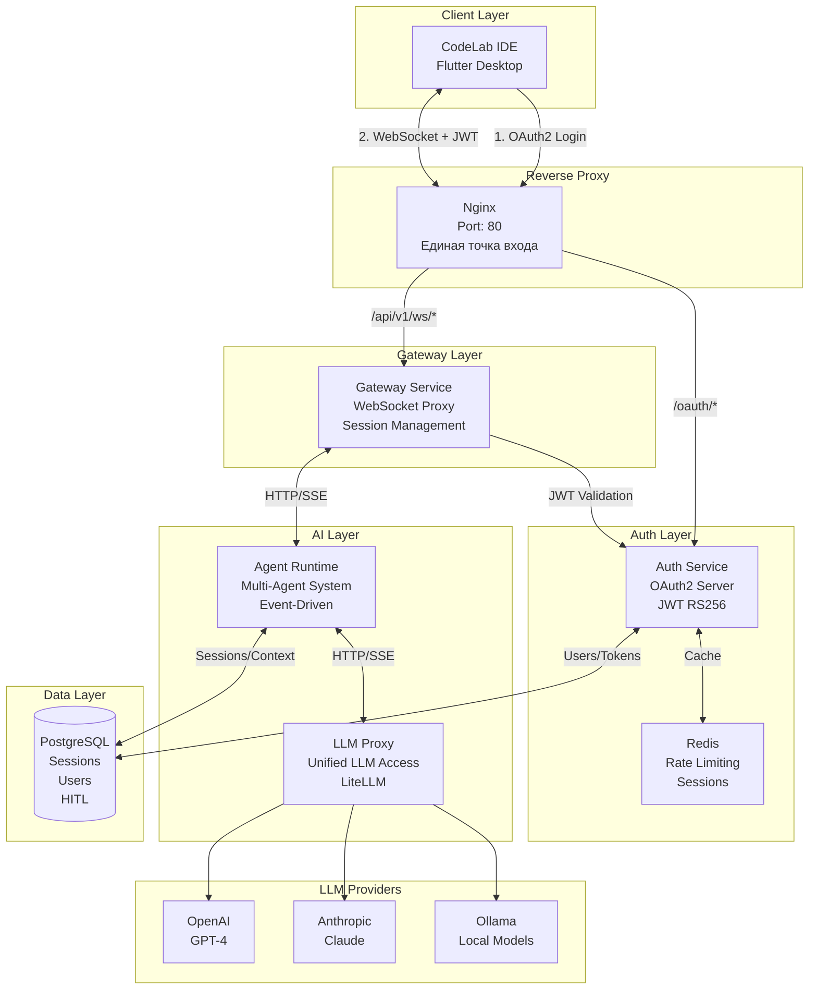
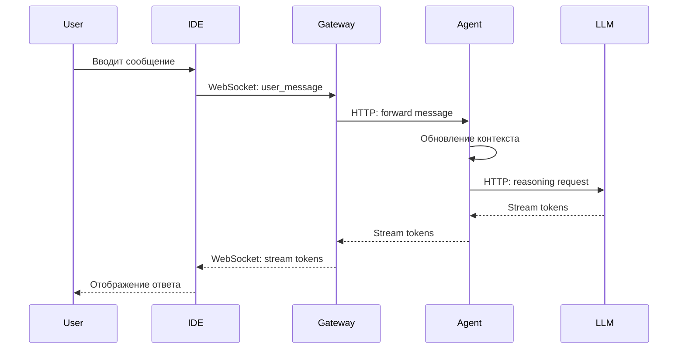
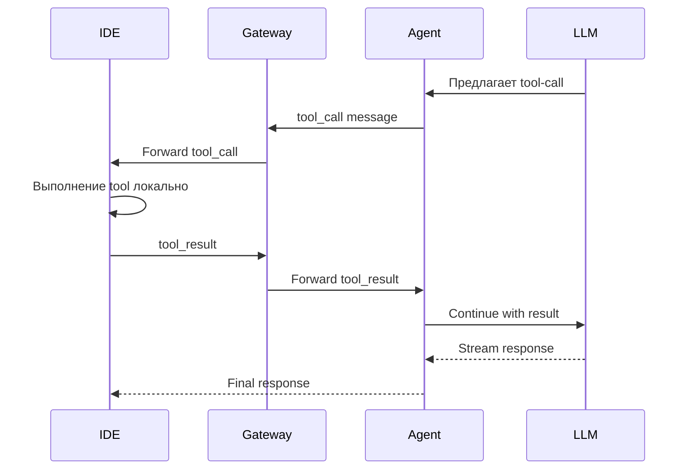

# Обзор архитектуры

CodeLab построен на современной микросервисной архитектуре, объединяющей кроссплатформенный Flutter IDE и Python-based AI сервис.

## Высокоуровневая архитектура



## Основные компоненты

### 1. CodeLab IDE (Flutter)

**Назначение**: Кроссплатформенное десктопное приложение для разработки кода.

**Технологии**:
- Flutter 3.38.5
- Dart 3.10.1+
- Модульная архитектура (Melos monorepo)

**Ключевые возможности**:
- Редактор кода с подсветкой синтаксиса
- Навигация по проекту
- Встроенный терминал
- Интеграция с AI ассистентом
- Git интеграция

**Подробнее**: [Архитектура IDE](/docs/architecture/ide-architecture)

### 2. Gateway Service

**Назначение**: WebSocket прокси для связи между IDE и AI сервисом.

**Технологии**:
- Python 3.12+
- FastAPI (ASGI)
- WebSocket

**Функции**:
- Управление WebSocket соединениями
- Маршрутизация сообщений
- Поддержка streaming токенов
- Управление сессиями

**Подробнее**: [API Gateway](/docs/api/gateway)

### 3. Agent Runtime Service

**Назначение**: Оркестрация AI логики и управление контекстом.

**Технологии**:
- Python 3.12+
- FastAPI
- PostgreSQL (для персистентности)

**Функции**:
- Управление контекстом диалогов
- Оркестрация tool-calls
- Управление сессиями
- HITL (Human-in-the-Loop) логика

**Подробнее**: [API Agent Runtime](/docs/api/agent-runtime)

### 4. LLM Proxy Service

**Назначение**: Унифицированный доступ к различным LLM провайдерам.

**Технологии**:
- Python 3.12+
- FastAPI
- LiteLLM (для унификации API)

**Функции**:
- Единый интерфейс для всех LLM
- Управление API ключами
- Rate limiting
- Кеширование запросов

**Подробнее**: [API LLM Proxy](/docs/api/llm-proxy)

### 5. Auth Service 🔐

**Назначение**: OAuth2 Authorization Server для аутентификации и авторизации всей платформы.

**Технологии**:
- Python 3.12+
- FastAPI (ASGI)
- SQLAlchemy 2.0 (async)
- PostgreSQL/SQLite
- Redis (rate limiting, sessions)
- python-jose (JWT)
- bcrypt (password hashing)

**Функции**:
- **OAuth2 Password Grant** - аутентификация по username/password
- **Refresh Token Grant** - обновление токенов с автоматической ротацией
- **JWT токены (RS256)** - access (15 мин) и refresh (30 дней)
- **JWKS endpoint** - публичные ключи для валидации токенов
- **Rate limiting** - защита от brute-force атак
- **Audit logging** - логирование всех операций
- **User management** - управление пользователями
- **Session management** - управление OAuth сессиями

**Endpoints**:
- `POST /oauth/token` - получение токенов
- `GET /.well-known/jwks.json` - публичные ключи
- `GET /health` - health check

**Безопасность**:
- RS256 подпись токенов (RSA 2048 bit)
- Bcrypt для хеширования паролей (cost factor 12)
- IP-based rate limiting (5 req/min)
- Username-based rate limiting (10 req/hour)
- Brute-force protection (5 попыток → 15 мин блокировка)
- Refresh token rotation (одноразовые токены)

**Подробнее**: [API Auth Service](/docs/api/auth-service)

### 6. Nginx Reverse Proxy

**Назначение**: Единая точка входа для всех API запросов.

**Функции**:
- Маршрутизация между сервисами
- WebSocket proxy
- SSL/TLS termination
- Load balancing (готовность)

**Маршруты**:
- `/oauth/*` → Auth Service
- `/.well-known/*` → Auth Service
- `/api/v1/*` → Gateway Service
- `/api/v1/ws/*` → Gateway (WebSocket)

## Поток данных

### 1. Отправка сообщения пользователем



### 2. Выполнение tool-call



## Протоколы взаимодействия

### WebSocket Protocol

Используется для связи между IDE и Gateway:

```json
{
  "type": "user_message",
  "message_id": "msg_123",
  "content": "Напиши функцию сортировки"
}
```

**Подробнее**: [WebSocket Protocol](/docs/api/websocket-protocol)

### Agent Protocol

Расширенный протокол для взаимодействия с AI агентом:

```json
{
  "type": "tool_call",
  "tool_name": "read_file",
  "call_id": "call_001",
  "args": {
    "path": "src/main.dart"
  }
}
```

**Подробнее**: [Agent Protocol](/docs/api/agent-protocol)

## Модульная структура IDE

CodeLab IDE построен как монорепозиторий с модульной архитектурой:

```
codelab_ide/
├── apps/
│   └── codelab_ide/          # Основное приложение
├── packages/
│   ├── codelab_core/         # Основные сервисы
│   ├── codelab_engine/       # Бизнес-логика
│   ├── codelab_ai_assistant/ # AI интеграция
│   ├── codelab_uikit/        # UI компоненты
│   └── codelab_version_control/ # Git интеграция
```

**Преимущества**:
- Четкое разделение ответственности
- Переиспользование кода
- Независимое тестирование модулей
- Упрощенная поддержка

## Микросервисная архитектура AI Service

```
codelab-ai-service/
├── gateway/              # WebSocket прокси
├── agent-runtime/        # AI логика
├── llm-proxy/           # LLM доступ
└── docker-compose.yml   # Оркестрация
```

**Преимущества**:
- Независимое масштабирование
- Изоляция ошибок
- Гибкость развертывания
- Простота обновления

## Паттерны проектирования

### Clean Architecture (IDE)

IDE следует принципам Clean Architecture:

```
Presentation Layer (UI)
    ↓
Domain Layer (Business Logic)
    ↓
Data Layer (Repositories, Data Sources)
```

**Преимущества**:
- Независимость от фреймворков
- Тестируемость
- Независимость от UI
- Независимость от БД

### Event-Driven Architecture (AI Service)

AI Service использует событийную архитектуру:

- Асинхронная обработка сообщений
- Streaming токенов в реальном времени
- Pub/Sub для масштабирования

### Repository Pattern

Используется для абстракции доступа к данным:

```dart
abstract class ProjectRepository {
  Future<Project> getProject(String path);
  Future<void> saveProject(Project project);
}
```

## Управление состоянием

### IDE (Flutter)

- **BLoC Pattern**: Для управления состоянием UI
- **Cherrypick DI**: Для dependency injection

### AI Service

- **Session Management**: Управление сессиями пользователей
- **Context Management**: Управление контекстом диалогов
- **State Persistence**: Сохранение состояния в PostgreSQL

## Безопасность

CodeLab использует многоуровневую систему безопасности для защиты данных и контроля доступа.

**Подробнее**: [Архитектура безопасности](/docs/architecture/security)

### Аутентификация

**OAuth2 через Auth Service**:
- **Password Grant** - аутентификация по username/password
- **Refresh Token Grant** - автоматическое обновление токенов
- **JWT токены (RS256)** - криптографически защищенные токены
  - Access token: 15 минут (короткоживущий)
  - Refresh token: 30 дней (одноразовый, rotation)
- **JWKS endpoint** - публичные ключи для валидации

**WebSocket Authentication**:
- JWT токены в заголовке Authorization
- Валидация через JWKS
- Автоматическое переподключение

### Авторизация

**RBAC (Role-Based Access Control)**:
- Scopes в JWT токенах (`api:read`, `api:write`)
- Разграничение прав на уровне агентов
- Валидация file patterns

**HITL (Human-in-the-Loop)**:
- Подтверждение опасных операций
- Редактирование параметров перед выполнением

### Защита данных

**Шифрование и хеширование**:
- HTTPS/TLS для внешних соединений
- Bcrypt для паролей (cost factor 12)
- Шифрование API ключей

**Rate Limiting**:
- IP-based: 5 req/min
- Username-based: 10 req/hour
- Brute-force protection: 5 попыток → 15 мин блокировка

## Масштабируемость

### Горизонтальное масштабирование

- Gateway: Множественные инстансы за load balancer
- Agent Runtime: Stateless сервис, легко масштабируется
- LLM Proxy: Кеширование и rate limiting

### Вертикальное масштабирование

- Увеличение ресурсов Docker контейнеров
- Оптимизация использования памяти
- Настройка пулов соединений

## Мониторинг и логирование

### Логирование

- Структурированные логи (JSON)
- Уровни: DEBUG, INFO, WARNING, ERROR
- Централизованное хранение логов

### Метрики

- Время ответа сервисов
- Количество активных сессий
- Использование ресурсов
- Ошибки и исключения

### Health Checks

Каждый сервис предоставляет health check endpoint:

```bash
curl http://localhost:8000/health
# {"status": "healthy"}
```

## Развертывание

### Локальная разработка

```bash
# IDE
cd codelab_ide && melos run:codelab_ide

# AI Service
cd codelab-ai-service && docker compose up -d
```

### Production

- Docker Compose для оркестрации
- Kubernetes для масштабирования (опционально)
- CI/CD через GitHub Actions

## Технологический стек

### Frontend (IDE)

| Технология | Версия | Назначение |
|---|---|---|
| Flutter | 3.38.5 | UI Framework |
| Dart | 3.10.1+ | Язык программирования |
| BLoC | 8.x | State Management |
| Melos | 6.x | Monorepo Management |

### Backend (AI Service)

| Технология | Версия | Назначение |
|---|---|---|
| Python | 3.12+ | Язык программирования |
| FastAPI | 0.100+ | Web Framework |
| PostgreSQL | 15+ | База данных |
| Redis | 7+ | Кеширование, Rate Limiting |
| Docker | 20.10+ | Контейнеризация |

## Следующие шаги

Для более детального изучения архитектуры:

1. [Архитектура IDE](/docs/architecture/ide-architecture) - Подробности о Flutter приложении
2. [Архитектура AI Service](/docs/architecture/ai-service-architecture) - Детали микросервисов
3. [Интеграция компонентов](/docs/architecture/integration) - Как компоненты взаимодействуют
4. [API документация](/docs/api/websocket-protocol) - Спецификации протоколов

## Дополнительные ресурсы

- [Руководство по разработке](/docs/development/ide)
- [Участие в проекте](/docs/development/contributing)
- [GitHub Repository](https://github.com/pese-git/codelab-workspace)
