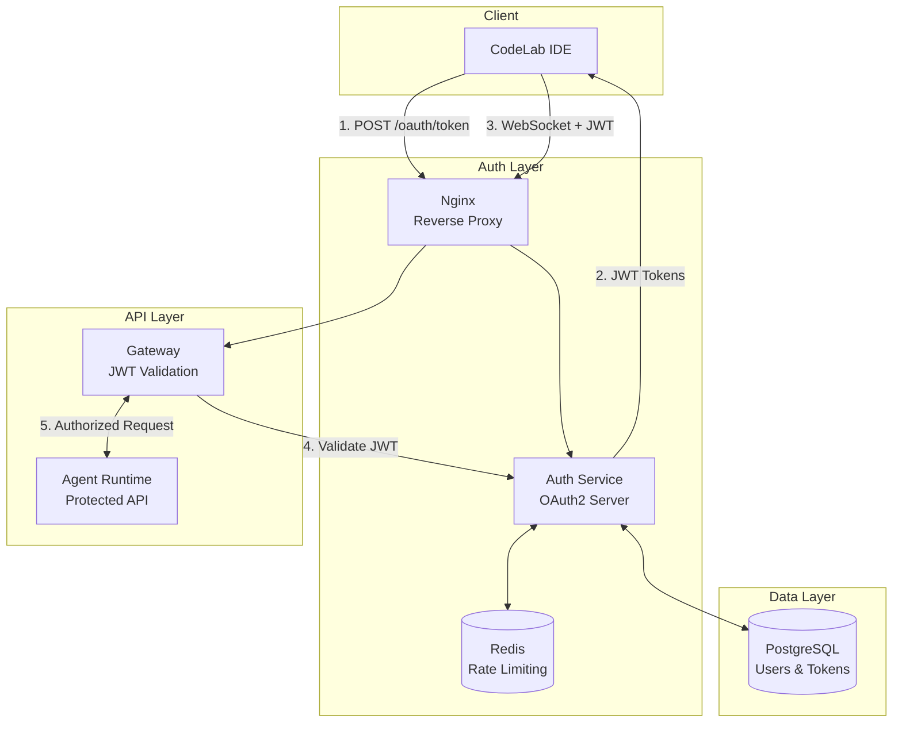
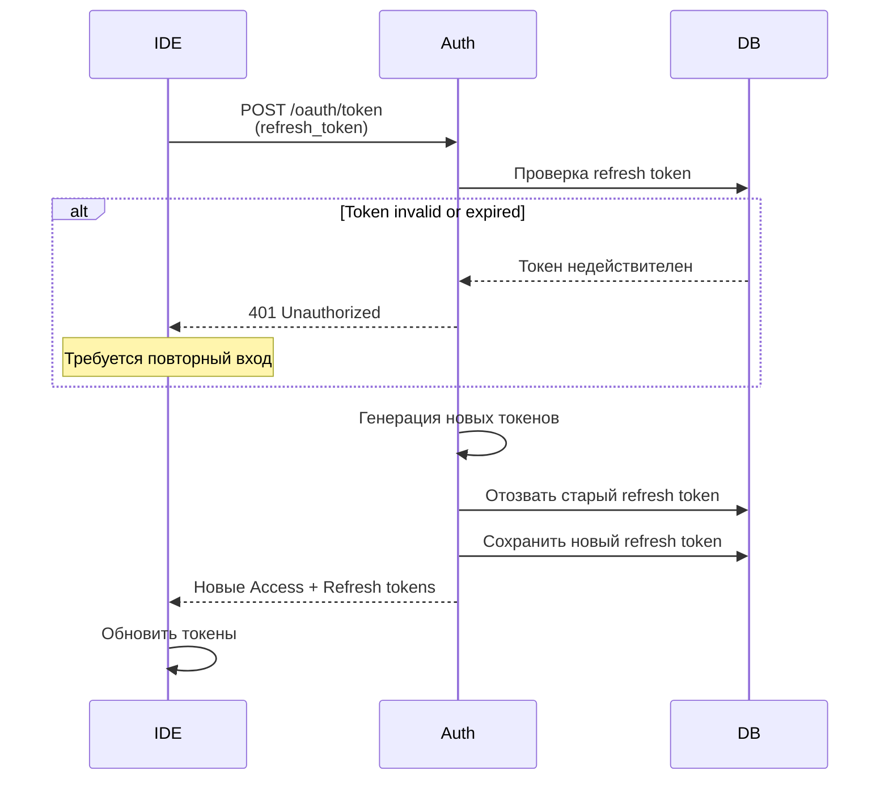
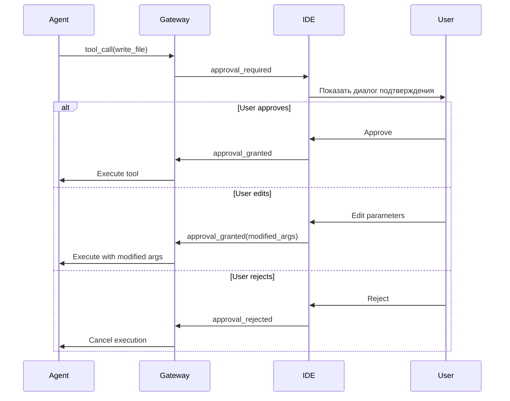

# Архитектура безопасности

Комплексная система безопасности CodeLab, включающая OAuth2 аутентификацию, JWT токены, RBAC авторизацию и защиту данных.

## Обзор

CodeLab использует многоуровневую систему безопасности для защиты данных пользователей и контроля доступа к ресурсам.

**Ключевые принципы**:
- 🔐 **Defense in Depth** - многоуровневая защита
- 🔑 **Least Privilege** - минимальные необходимые права
- 🛡️ **Zero Trust** - проверка каждого запроса
- 📝 **Audit Everything** - логирование всех операций
- 🔄 **Token Rotation** - регулярное обновление токенов

## Архитектура аутентификации



## OAuth2 аутентификация

### Поддерживаемые Grant Types

#### 1. Password Grant

Аутентификация пользователя по username и password.

**Поток аутентификации**:

```mermaid
sequenceDiagram
    participant User
    participant IDE
    participant Auth
    participant DB
    participant Redis
    
    User->>IDE: Ввод credentials
    IDE->>Auth: POST /oauth/token<br/>(username, password)
    
    Auth->>Redis: Проверка rate limit
    alt Rate limit exceeded
        Redis-->>Auth: Превышен лимит
        Auth-->>IDE: 429 Too Many Requests
    end
    
    Auth->>DB: Проверка credentials
    alt Invalid credentials
        DB-->>Auth: Неверные данные
        Auth->>Redis: Увеличить счетчик попыток
        Auth-->>IDE: 401 Unauthorized
    end
    
    Auth->>Auth: Генерация JWT токенов
    Auth->>DB: Сохранить refresh token
    Auth-->>IDE: Access + Refresh tokens
    IDE->>IDE: Сохранить токены
```



**Пример запроса**:

```bash
curl -X POST http://localhost/oauth/token \
  -H "Content-Type: application/x-www-form-urlencoded" \
  -d "grant_type=password" \
  -d "username=user@example.com" \
  -d "password=SecurePass123!" \
  -d "client_id=codelab-flutter-app" \
  -d "scope=api:read api:write"
```

**Ответ**:

```json
{
  "access_token": "eyJhbGciOiJSUzI1NiIsInR5cCI6IkpXVCJ9...",
  "refresh_token": "eyJhbGciOiJSUzI1NiIsInR5cCI6IkpXVCJ9...",
  "token_type": "bearer",
  "expires_in": 900,
  "scope": "api:read api:write"
}
```

#### 2. Refresh Token Grant

Обновление access токена с использованием refresh токена.

**Поток обновления**:



**Важно**: Старый refresh token становится недействительным (rotation).

### JWT токены

#### Access Token

**Характеристики**:
- Время жизни: **15 минут**
- Алгоритм: **RS256** (RSA 2048 bit)
- Хранение: **Не хранится в БД** (stateless)
- Использование: Bearer token в заголовке Authorization

**Структура payload**:

```json
{
  "sub": "user-uuid-123",
  "iss": "https://auth.codelab.local",
  "aud": "codelab-api",
  "exp": 1704988800,
  "iat": 1704988000,
  "scope": "api:read api:write",
  "client_id": "codelab-flutter-app"
}
```

**Claims**:
- `sub` - User ID (UUID)
- `iss` - Issuer (Auth Service URL)
- `aud` - Audience (API identifier)
- `exp` - Expiration time (Unix timestamp)
- `iat` - Issued at (Unix timestamp)
- `scope` - Granted scopes
- `client_id` - OAuth client ID

#### Refresh Token

**Характеристики**:
- Время жизни: **30 дней**
- Алгоритм: **RS256**
- Хранение: **В БД** (для отзыва)
- Использование: **Одноразовый** (rotation)

**Структура payload**:

```json
{
  "sub": "user-uuid-123",
  "iss": "https://auth.codelab.local",
  "aud": "codelab-api",
  "exp": 1707580800,
  "iat": 1704988800,
  "jti": "refresh-token-uuid",
  "client_id": "codelab-flutter-app"
}
```

**Дополнительные claims**:
- `jti` - JWT ID (уникальный идентификатор токена)

### JWKS (JSON Web Key Set)

Публичные ключи для валидации JWT токенов.

**Endpoint**: `GET /.well-known/jwks.json`

**Пример ответа**:

```json
{
  "keys": [
    {
      "kty": "RSA",
      "use": "sig",
      "kid": "2024-01-key-1",
      "alg": "RS256",
      "n": "0vx7agoebGcQSuuPiLJXZptN9nndrQmbXEps2aiAFbWhM78LhWx...",
      "e": "AQAB"
    }
  ]
}
```

**Использование**:
1. Gateway получает JWKS от Auth Service
2. Кэширует ключи на 1 час
3. Валидирует JWT токены используя публичный ключ
4. Проверяет signature, expiration, audience

## Авторизация

### RBAC (Role-Based Access Control)

#### Scopes

Права доступа определяются через scopes в JWT токенах.

**Доступные scopes**:
- `api:read` - чтение данных через API
- `api:write` - запись данных через API
- `admin` - административные операции (будущее)

**Проверка scopes**:

```python
from app.core.security import require_scopes

@router.get("/sessions")
@require_scopes(["api:read"])
async def get_sessions(current_user: User):
    # Доступ только с scope api:read
    return sessions
```

#### Agent-Level Authorization

Каждый агент имеет ограниченный набор инструментов и прав доступа.

**Матрица прав доступа**:

| Агент | Чтение | Запись | Команды | Git | Ограничения |
|-------|--------|--------|---------|-----|-------------|
| **Orchestrator** 🎭 | ✅ | ❌ | ❌ | ❌ | Только анализ |
| **Coder** 💻 | ✅ | ✅ | ✅ | ✅ | Нет |
| **Architect** 🏗️ | ✅ | ✅ | ❌ | ❌ | Только `.md` файлы |
| **Debug** 🐛 | ✅ | ❌ | ✅ | ❌ | Read-only |
| **Ask** 💬 | ✅ | ❌ | ❌ | ❌ | Только чтение |

**Валидация file patterns**:

```python
class ArchitectAgent(BaseAgent):
    """Architect может редактировать только .md файлы."""
    
    def validate_file_access(self, path: str, operation: str) -> bool:
        if operation == "write":
            if not path.endswith(".md"):
                raise PermissionError(
                    f"Architect can only write .md files, got: {path}"
                )
        return True
```

### HITL (Human-in-the-Loop)

Опасные операции требуют подтверждения пользователя.

**Операции, требующие HITL**:
- `write_file` - запись файлов
- `delete_file` - удаление файлов
- `execute_command` - выполнение команд
- `git_commit` - создание коммитов

**Поток HITL**:



## Защита от атак

### Rate Limiting

Защита от brute-force атак и DDoS.

**Лимиты**:

| Endpoint | IP-based | Username-based |
|----------|----------|----------------|
| `/oauth/token` | 5 req/min | 10 req/hour |
| `/api/v1/*` | 100 req/min | - |

**Реализация**:

```python
from app.middleware.rate_limit import rate_limit

@router.post("/oauth/token")
@rate_limit(max_requests=5, window=60, key="ip")
@rate_limit(max_requests=10, window=3600, key="username")
async def token_endpoint(request: Request):
    # Обработка запроса
    pass
```

**Ответ при превышении лимита**:

```json
{
  "error": "rate_limit_exceeded",
  "error_description": "Too many requests. Please try again later.",
  "retry_after": 60
}
```

### Brute-Force Protection

Автоматическая блокировка после множественных неудачных попыток входа.

**Параметры**:
- Порог: **5 неудачных попыток**
- Блокировка: **15 минут**
- Хранение: Redis (автоматическое истечение)

**Логика**:

```python
async def check_brute_force(username: str, redis: Redis):
    key = f"failed_login:{username}"
    attempts = await redis.get(key)
    
    if attempts and int(attempts) >= 5:
        ttl = await redis.ttl(key)
        raise AccountLockedException(
            f"Account locked for {ttl} seconds"
        )
```

**Ответ при блокировке**:

```json
{
  "error": "account_locked",
  "error_description": "Account temporarily locked due to multiple failed login attempts",
  "locked_until": "2026-01-21T10:30:00Z"
}
```

### CSRF Protection

Защита от Cross-Site Request Forgery.

**Механизмы**:
- SameSite cookies (Strict)
- CORS policy (whitelist origins)
- State parameter в OAuth2 flows

**CORS конфигурация**:

```python
from fastapi.middleware.cors import CORSMiddleware

app.add_middleware(
    CORSMiddleware,
    allow_origins=["http://localhost:3000"],  # IDE origin
    allow_credentials=True,
    allow_methods=["GET", "POST"],
    allow_headers=["Authorization", "Content-Type"],
)
```

### SQL Injection Protection

Использование ORM и параметризованных запросов.

```python
# ✅ Безопасно (SQLAlchemy ORM)
user = await session.execute(
    select(User).where(User.email == email)
)

# ✅ Безопасно (параметризованный запрос)
result = await session.execute(
    text("SELECT * FROM users WHERE email = :email"),
    {"email": email}
)

# ❌ Небезопасно (никогда не используйте)
query = f"SELECT * FROM users WHERE email = '{email}'"
```

## Защита данных

### Хеширование паролей

Использование bcrypt с высоким cost factor.

```python
from passlib.context import CryptContext

pwd_context = CryptContext(
    schemes=["bcrypt"],
    deprecated="auto",
    bcrypt__rounds=12  # Cost factor
)

# Хеширование
hashed = pwd_context.hash("SecurePassword123!")

# Проверка
is_valid = pwd_context.verify("SecurePassword123!", hashed)
```

**Параметры**:
- Алгоритм: **bcrypt**
- Cost factor: **12** (4096 итераций)
- Salt: Автоматически генерируется

### Шифрование API ключей

API ключи LLM провайдеров шифруются перед сохранением в БД.

```python
from cryptography.fernet import Fernet

class EncryptionService:
    def __init__(self, key: bytes):
        self.cipher = Fernet(key)
    
    def encrypt(self, data: str) -> str:
        return self.cipher.encrypt(data.encode()).decode()
    
    def decrypt(self, encrypted: str) -> str:
        return self.cipher.decrypt(encrypted.encode()).decode()
```

**Хранение ключа шифрования**:
- Переменная окружения `ENCRYPTION_KEY`
- Не коммитится в Git
- Ротация ключей (будущее)

### Безопасное хранение токенов

**В IDE (Client-side)**:
- Secure storage (Keychain на macOS, Credential Manager на Windows)
- Не хранить в plain text
- Автоматическое удаление при logout

**В Auth Service (Server-side)**:
- Refresh токены хешируются перед сохранением в БД
- Access токены не хранятся (stateless)
- Автоматическое удаление истекших токенов

### TLS/HTTPS

**Production требования**:
- ✅ HTTPS обязателен для всех внешних соединений
- ✅ TLS 1.2+ (рекомендуется TLS 1.3)
- ✅ Валидные SSL сертификаты (Let's Encrypt)
- ✅ HSTS (HTTP Strict Transport Security)

**Nginx конфигурация**:

```nginx
server {
    listen 443 ssl http2;
    server_name codelab.example.com;
    
    ssl_certificate /etc/letsencrypt/live/codelab.example.com/fullchain.pem;
    ssl_certificate_key /etc/letsencrypt/live/codelab.example.com/privkey.pem;
    
    ssl_protocols TLSv1.2 TLSv1.3;
    ssl_ciphers HIGH:!aNULL:!MD5;
    ssl_prefer_server_ciphers on;
    
    add_header Strict-Transport-Security "max-age=31536000" always;
}
```

## Audit Logging

Логирование всех критичных операций для аудита.

### Логируемые события

**Аутентификация**:
- Успешные входы
- Неудачные попытки входа
- Выдача токенов
- Обновление токенов
- Logout

**Авторизация**:
- Отказы в доступе
- Изменения прав доступа
- HITL решения

**Данные**:
- Модификация файлов
- Выполнение команд
- Git операции

### Формат audit log

```json
{
  "timestamp": "2026-01-21T10:00:00Z",
  "event_type": "login_success",
  "user_id": "user-uuid-123",
  "username": "user@example.com",
  "ip_address": "192.168.1.100",
  "user_agent": "CodeLab IDE/1.0",
  "session_id": "session-456",
  "metadata": {
    "client_id": "codelab-flutter-app",
    "scopes": ["api:read", "api:write"]
  }
}
```

### Хранение логов

**PostgreSQL таблица**:

```sql
CREATE TABLE audit_logs (
    id UUID PRIMARY KEY DEFAULT gen_random_uuid(),
    timestamp TIMESTAMPTZ NOT NULL DEFAULT NOW(),
    event_type VARCHAR(100) NOT NULL,
    user_id UUID REFERENCES users(id),
    username VARCHAR(255),
    ip_address INET,
    user_agent TEXT,
    session_id UUID,
    metadata JSONB,
    created_at TIMESTAMPTZ DEFAULT NOW()
);

CREATE INDEX idx_audit_logs_user ON audit_logs(user_id);
CREATE INDEX idx_audit_logs_event ON audit_logs(event_type);
CREATE INDEX idx_audit_logs_timestamp ON audit_logs(timestamp);
```

## Security Headers

Важные HTTP заголовки для безопасности.

```python
from fastapi.middleware.trustedhost import TrustedHostMiddleware
from fastapi.middleware.httpsredirect import HTTPSRedirectMiddleware

# HTTPS redirect (production)
app.add_middleware(HTTPSRedirectMiddleware)

# Trusted hosts
app.add_middleware(
    TrustedHostMiddleware,
    allowed_hosts=["codelab.example.com", "*.codelab.example.com"]
)

# Security headers
@app.middleware("http")
async def add_security_headers(request, call_next):
    response = await call_next(request)
    response.headers["X-Content-Type-Options"] = "nosniff"
    response.headers["X-Frame-Options"] = "DENY"
    response.headers["X-XSS-Protection"] = "1; mode=block"
    response.headers["Referrer-Policy"] = "strict-origin-when-cross-origin"
    return response
```

## Best Practices

### Для разработчиков

1. **Никогда не коммитьте секреты**
   - Используйте `.env` файлы
   - Добавьте `.env` в `.gitignore`
   - Используйте переменные окружения

2. **Валидируйте все входные данные**
   - Используйте Pydantic модели
   - Проверяйте типы и форматы
   - Санитизируйте пользовательский ввод

3. **Используйте HTTPS в production**
   - Никогда не передавайте токены по HTTP
   - Настройте SSL сертификаты
   - Включите HSTS

4. **Логируйте security события**
   - Неудачные попытки входа
   - Изменения прав доступа
   - Подозрительную активность

### Для пользователей

1. **Используйте сильные пароли**
   - Минимум 8 символов
   - Заглавные и строчные буквы
   - Цифры и специальные символы

2. **Не делитесь токенами**
   - Access токены личные
   - Не передавайте их другим пользователям
   - Logout при завершении работы

3. **Проверяйте HITL запросы**
   - Внимательно читайте что делает команда
   - Редактируйте опасные параметры
   - Отклоняйте подозрительные операции

## Troubleshooting

### Проблема: "Invalid token"

**Причины**:
- Токен истек
- Неверная подпись
- Токен был отозван

**Решение**:
```bash
# Обновить токен
curl -X POST http://localhost/oauth/token \
  -d "grant_type=refresh_token" \
  -d "refresh_token=YOUR_REFRESH_TOKEN"
```

### Проблема: "Rate limit exceeded"

**Причины**:
- Превышен лимит запросов

**Решение**:
- Подождите время указанное в `retry_after`
- Проверьте нет ли утечки запросов в коде

### Проблема: "Account locked"

**Причины**:
- Множественные неудачные попытки входа

**Решение**:
- Подождите 15 минут
- Проверьте правильность пароля
- Обратитесь к администратору

## Дополнительные ресурсы

- [Auth Service API](/docs/api/auth-service)
- [Архитектура обзор](/docs/architecture/overview)
- [OAuth 2.0 RFC 6749](https://tools.ietf.org/html/rfc6749)
- [JWT RFC 7519](https://tools.ietf.org/html/rfc7519)
- [OWASP Top 10](https://owasp.org/www-project-top-ten/)

---

**Версия**: 1.0  
**Дата**: 21 января 2026  
**Статус**: ✅ Production Ready
