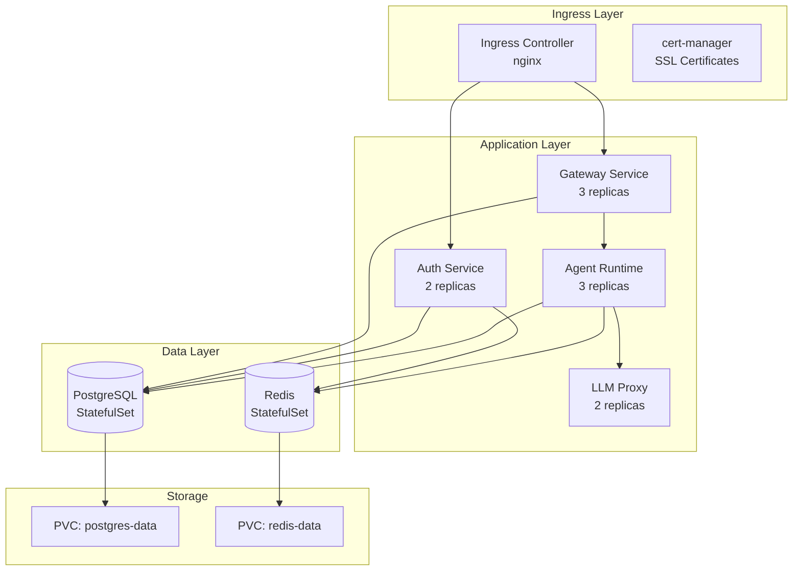

# Kubernetes Deployment

Развертывание CodeLab в Kubernetes для production окружения с высокой доступностью и масштабируемостью.

## Обзор

Kubernetes обеспечивает:
- **Масштабируемость** - автоматическое масштабирование под нагрузкой
- **Отказоустойчивость** - автоматическое восстановление при сбоях
- **Load Balancing** - распределение нагрузки между подами
- **Rolling Updates** - обновления без простоя
- **Self-Healing** - автоматическое восстановление

## Требования

### Кластер

- **Kubernetes** 1.25+
- **Минимум 3 worker nodes**
- **16GB RAM per node**
- **4 CPU cores per node**
- **100GB storage per node**

### Инструменты

- **kubectl** - CLI для Kubernetes
- **Helm** 3.x+ - package manager
- **cert-manager** - для SSL сертификатов
- **ingress-nginx** - ingress controller

## Архитектура в Kubernetes



## Установка через Helm

### 1. Подготовка кластера

```bash
# Создать namespace
kubectl create namespace codelab

# Установить cert-manager
kubectl apply -f https://github.com/cert-manager/cert-manager/releases/download/v1.13.0/cert-manager.yaml

# Установить ingress-nginx
helm repo add ingress-nginx https://kubernetes.github.io/ingress-nginx
helm install ingress-nginx ingress-nginx/ingress-nginx \
  --namespace ingress-nginx \
  --create-namespace
```

### 2. Настройка values.yaml

Создайте файл `values-prod.yaml`:

```yaml
# Global settings
global:
  domain: codelab.example.com
  environment: production
  imageRegistry: ghcr.io/codelab
  imagePullPolicy: IfNotPresent

# Ingress configuration
ingress:
  enabled: true
  className: nginx
  annotations:
    cert-manager.io/cluster-issuer: letsencrypt-prod
    nginx.ingress.kubernetes.io/proxy-body-size: "50m"
    nginx.ingress.kubernetes.io/proxy-read-timeout: "600"
  hosts:
    - host: codelab.example.com
      paths:
        - path: /
          pathType: Prefix
  tls:
    - secretName: codelab-tls
      hosts:
        - codelab.example.com

# Gateway Service
gateway:
  enabled: true
  replicaCount: 3
  image:
    repository: ghcr.io/codelab/gateway
    tag: "1.0.0"
  resources:
    requests:
      memory: "512Mi"
      cpu: "500m"
    limits:
      memory: "1Gi"
      cpu: "1000m"
  autoscaling:
    enabled: true
    minReplicas: 3
    maxReplicas: 10
    targetCPUUtilizationPercentage: 70
    targetMemoryUtilizationPercentage: 80
  env:
    - name: AGENT_RUNTIME_URL
      value: "http://agent-runtime:8001"
    - name: AUTH_SERVICE_URL
      value: "http://auth-service:8003"
  secrets:
    INTERNAL_API_KEY: "your-secret-key"

# Agent Runtime Service
agentRuntime:
  enabled: true
  replicaCount: 3
  image:
    repository: ghcr.io/codelab/agent-runtime
    tag: "1.0.0"
  resources:
    requests:
      memory: "1Gi"
      cpu: "1000m"
    limits:
      memory: "2Gi"
      cpu: "2000m"
  autoscaling:
    enabled: true
    minReplicas: 3
    maxReplicas: 20
    targetCPUUtilizationPercentage: 70
  env:
    - name: LLM_PROVIDER
      value: "openai"
    - name: DATABASE_URL
      valueFrom:
        secretKeyRef:
          name: postgres-secret
          key: connection-string
  secrets:
    OPENAI_API_KEY: "your-openai-key"
    INTERNAL_API_KEY: "your-secret-key"
  persistence:
    enabled: true
    size: 10Gi
    storageClass: "standard"

# Auth Service
authService:
  enabled: true
  replicaCount: 2
  image:
    repository: ghcr.io/codelab/auth-service
    tag: "1.0.0"
  resources:
    requests:
      memory: "512Mi"
      cpu: "500m"
    limits:
      memory: "1Gi"
      cpu: "1000m"
  autoscaling:
    enabled: true
    minReplicas: 2
    maxReplicas: 5
    targetCPUUtilizationPercentage: 70
  secrets:
    JWT_SECRET_KEY: "your-jwt-secret"
    OAUTH2_CLIENT_SECRET: "your-oauth-secret"
  persistence:
    enabled: true
    size: 5Gi

# LLM Proxy
llmProxy:
  enabled: true
  replicaCount: 2
  image:
    repository: ghcr.io/berriai/litellm
    tag: "main-latest"
  resources:
    requests:
      memory: "512Mi"
      cpu: "500m"
    limits:
      memory: "1Gi"
      cpu: "1000m"
  config:
    model_list:
      - model_name: gpt-4
        litellm_params:
          model: gpt-4
          api_key: os.environ/OPENAI_API_KEY

# PostgreSQL
postgresql:
  enabled: true
  auth:
    username: codelab
    password: "your-postgres-password"
    database: codelab
  primary:
    persistence:
      enabled: true
      size: 50Gi
      storageClass: "standard"
    resources:
      requests:
        memory: "2Gi"
        cpu: "1000m"
      limits:
        memory: "4Gi"
        cpu: "2000m"
  readReplicas:
    replicaCount: 2
    persistence:
      enabled: true
      size: 50Gi
    resources:
      requests:
        memory: "2Gi"
        cpu: "1000m"

# Redis
redis:
  enabled: true
  architecture: replication
  auth:
    enabled: true
    password: "your-redis-password"
  master:
    persistence:
      enabled: true
      size: 10Gi
    resources:
      requests:
        memory: "512Mi"
        cpu: "500m"
      limits:
        memory: "1Gi"
        cpu: "1000m"
  replica:
    replicaCount: 2
    persistence:
      enabled: true
      size: 10Gi
    resources:
      requests:
        memory: "512Mi"
        cpu: "500m"

# Monitoring
monitoring:
  enabled: true
  prometheus:
    enabled: true
  grafana:
    enabled: true
    adminPassword: "your-grafana-password"
```

### 3. Создание secrets

```bash
# Создать secret для API keys
kubectl create secret generic api-keys \
  --from-literal=openai-api-key='your-openai-key' \
  --from-literal=internal-api-key='your-internal-key' \
  --namespace codelab

# Создать secret для JWT
kubectl create secret generic jwt-secret \
  --from-literal=jwt-secret-key='your-jwt-secret' \
  --namespace codelab

# Создать secret для OAuth2
kubectl create secret generic oauth-secret \
  --from-literal=client-secret='your-oauth-secret' \
  --namespace codelab
```

### 4. Установка через Helm

```bash
# Добавить Helm repository
helm repo add codelab https://charts.codelab.io
helm repo update

# Установка
helm install codelab codelab/codelab \
  --namespace codelab \
  --values values-prod.yaml \
  --wait \
  --timeout 10m

# Проверка статуса
helm status codelab -n codelab
```

## Ручная установка (без Helm)

### 1. PostgreSQL

```yaml
# postgres-statefulset.yaml
apiVersion: apps/v1
kind: StatefulSet
metadata:
  name: postgres
  namespace: codelab
spec:
  serviceName: postgres
  replicas: 1
  selector:
    matchLabels:
      app: postgres
  template:
    metadata:
      labels:
        app: postgres
    spec:
      containers:
      - name: postgres
        image: postgres:15-alpine
        ports:
        - containerPort: 5432
        env:
        - name: POSTGRES_USER
          value: codelab
        - name: POSTGRES_PASSWORD
          valueFrom:
            secretKeyRef:
              name: postgres-secret
              key: password
        - name: POSTGRES_DB
          value: codelab
        volumeMounts:
        - name: postgres-data
          mountPath: /var/lib/postgresql/data
        resources:
          requests:
            memory: "2Gi"
            cpu: "1000m"
          limits:
            memory: "4Gi"
            cpu: "2000m"
  volumeClaimTemplates:
  - metadata:
      name: postgres-data
    spec:
      accessModes: ["ReadWriteOnce"]
      resources:
        requests:
          storage: 50Gi
---
apiVersion: v1
kind: Service
metadata:
  name: postgres
  namespace: codelab
spec:
  selector:
    app: postgres
  ports:
  - port: 5432
    targetPort: 5432
  clusterIP: None
```

### 2. Redis

```yaml
# redis-statefulset.yaml
apiVersion: apps/v1
kind: StatefulSet
metadata:
  name: redis
  namespace: codelab
spec:
  serviceName: redis
  replicas: 1
  selector:
    matchLabels:
      app: redis
  template:
    metadata:
      labels:
        app: redis
    spec:
      containers:
      - name: redis
        image: redis:7-alpine
        ports:
        - containerPort: 6379
        volumeMounts:
        - name: redis-data
          mountPath: /data
        resources:
          requests:
            memory: "512Mi"
            cpu: "500m"
          limits:
            memory: "1Gi"
            cpu: "1000m"
  volumeClaimTemplates:
  - metadata:
      name: redis-data
    spec:
      accessModes: ["ReadWriteOnce"]
      resources:
        requests:
          storage: 10Gi
---
apiVersion: v1
kind: Service
metadata:
  name: redis
  namespace: codelab
spec:
  selector:
    app: redis
  ports:
  - port: 6379
    targetPort: 6379
  clusterIP: None
```

### 3. Agent Runtime

```yaml
# agent-runtime-deployment.yaml
apiVersion: apps/v1
kind: Deployment
metadata:
  name: agent-runtime
  namespace: codelab
spec:
  replicas: 3
  selector:
    matchLabels:
      app: agent-runtime
  template:
    metadata:
      labels:
        app: agent-runtime
    spec:
      containers:
      - name: agent-runtime
        image: ghcr.io/codelab/agent-runtime:1.0.0
        ports:
        - containerPort: 8001
        env:
        - name: DATABASE_URL
          valueFrom:
            secretKeyRef:
              name: postgres-secret
              key: connection-string
        - name: REDIS_URL
          value: "redis://redis:6379/0"
        - name: OPENAI_API_KEY
          valueFrom:
            secretKeyRef:
              name: api-keys
              key: openai-api-key
        resources:
          requests:
            memory: "1Gi"
            cpu: "1000m"
          limits:
            memory: "2Gi"
            cpu: "2000m"
        livenessProbe:
          httpGet:
            path: /health
            port: 8001
          initialDelaySeconds: 30
          periodSeconds: 10
        readinessProbe:
          httpGet:
            path: /health
            port: 8001
          initialDelaySeconds: 10
          periodSeconds: 5
---
apiVersion: v1
kind: Service
metadata:
  name: agent-runtime
  namespace: codelab
spec:
  selector:
    app: agent-runtime
  ports:
  - port: 8001
    targetPort: 8001
```

### 4. Gateway

```yaml
# gateway-deployment.yaml
apiVersion: apps/v1
kind: Deployment
metadata:
  name: gateway
  namespace: codelab
spec:
  replicas: 3
  selector:
    matchLabels:
      app: gateway
  template:
    metadata:
      labels:
        app: gateway
    spec:
      containers:
      - name: gateway
        image: ghcr.io/codelab/gateway:1.0.0
        ports:
        - containerPort: 8000
        env:
        - name: AGENT_RUNTIME_URL
          value: "http://agent-runtime:8001"
        - name: AUTH_SERVICE_URL
          value: "http://auth-service:8003"
        - name: DATABASE_URL
          valueFrom:
            secretKeyRef:
              name: postgres-secret
              key: connection-string
        resources:
          requests:
            memory: "512Mi"
            cpu: "500m"
          limits:
            memory: "1Gi"
            cpu: "1000m"
---
apiVersion: v1
kind: Service
metadata:
  name: gateway
  namespace: codelab
spec:
  selector:
    app: gateway
  ports:
  - port: 8000
    targetPort: 8000
```

### 5. Ingress

```yaml
# ingress.yaml
apiVersion: networking.k8s.io/v1
kind: Ingress
metadata:
  name: codelab-ingress
  namespace: codelab
  annotations:
    cert-manager.io/cluster-issuer: letsencrypt-prod
    nginx.ingress.kubernetes.io/proxy-body-size: "50m"
spec:
  ingressClassName: nginx
  tls:
  - hosts:
    - codelab.example.com
    secretName: codelab-tls
  rules:
  - host: codelab.example.com
    http:
      paths:
      - path: /api/v1
        pathType: Prefix
        backend:
          service:
            name: gateway
            port:
              number: 8000
      - path: /oauth
        pathType: Prefix
        backend:
          service:
            name: auth-service
            port:
              number: 8003
```

## Масштабирование

### Horizontal Pod Autoscaling (HPA)

```yaml
# hpa-agent-runtime.yaml
apiVersion: autoscaling/v2
kind: HorizontalPodAutoscaler
metadata:
  name: agent-runtime-hpa
  namespace: codelab
spec:
  scaleTargetRef:
    apiVersion: apps/v1
    kind: Deployment
    name: agent-runtime
  minReplicas: 3
  maxReplicas: 20
  metrics:
  - type: Resource
    resource:
      name: cpu
      target:
        type: Utilization
        averageUtilization: 70
  - type: Resource
    resource:
      name: memory
      target:
        type: Utilization
        averageUtilization: 80
```

Применение:

```bash
kubectl apply -f hpa-agent-runtime.yaml
kubectl get hpa -n codelab
```

### Vertical Pod Autoscaling (VPA)

```yaml
# vpa-agent-runtime.yaml
apiVersion: autoscaling.k8s.io/v1
kind: VerticalPodAutoscaler
metadata:
  name: agent-runtime-vpa
  namespace: codelab
spec:
  targetRef:
    apiVersion: apps/v1
    kind: Deployment
    name: agent-runtime
  updatePolicy:
    updateMode: "Auto"
```

## Обновление

### Rolling Update

```bash
# Обновить образ
kubectl set image deployment/agent-runtime \
  agent-runtime=ghcr.io/codelab/agent-runtime:1.1.0 \
  -n codelab

# Проверить статус
kubectl rollout status deployment/agent-runtime -n codelab

# История обновлений
kubectl rollout history deployment/agent-runtime -n codelab
```

### Откат

```bash
# Откат к предыдущей версии
kubectl rollout undo deployment/agent-runtime -n codelab

# Откат к конкретной ревизии
kubectl rollout undo deployment/agent-runtime \
  --to-revision=2 \
  -n codelab
```

## Мониторинг

### Prometheus + Grafana

```bash
# Установить Prometheus Operator
helm repo add prometheus-community https://prometheus-community.github.io/helm-charts
helm install prometheus prometheus-community/kube-prometheus-stack \
  --namespace monitoring \
  --create-namespace

# Доступ к Grafana
kubectl port-forward -n monitoring \
  svc/prometheus-grafana 3000:80
```

### Метрики

```bash
# CPU и Memory
kubectl top pods -n codelab

# Детальная информация
kubectl describe pod agent-runtime-xxx -n codelab
```

## Резервное копирование

### Velero

```bash
# Установить Velero
velero install \
  --provider aws \
  --bucket codelab-backups \
  --secret-file ./credentials-velero

# Создать backup
velero backup create codelab-backup \
  --include-namespaces codelab

# Восстановление
velero restore create --from-backup codelab-backup
```

## Troubleshooting

### Проверка подов

```bash
# Статус подов
kubectl get pods -n codelab

# Логи
kubectl logs -f deployment/agent-runtime -n codelab

# Описание пода
kubectl describe pod agent-runtime-xxx -n codelab

# Подключение к поду
kubectl exec -it agent-runtime-xxx -n codelab -- bash
```

### Проверка сервисов

```bash
# Список сервисов
kubectl get svc -n codelab

# Endpoints
kubectl get endpoints -n codelab

# Тестирование связности
kubectl run test-pod --image=busybox -it --rm -- \
  wget -O- http://agent-runtime:8001/health
```

### Проверка Ingress

```bash
# Статус Ingress
kubectl get ingress -n codelab

# Описание
kubectl describe ingress codelab-ingress -n codelab

# Логи Ingress Controller
kubectl logs -n ingress-nginx \
  deployment/ingress-nginx-controller
```

## Best Practices

1. **Используйте namespaces** для изоляции
2. **Настройте resource limits** для всех подов
3. **Используйте health checks** (liveness/readiness probes)
4. **Включите autoscaling** для критичных сервисов
5. **Настройте мониторинг** и alerting
6. **Регулярно делайте backups**
7. **Используйте secrets** для чувствительных данных
8. **Настройте network policies** для безопасности
9. **Используйте rolling updates** для zero-downtime
10. **Тестируйте в staging** перед production

## См. также

- [Deployment Overview](/docs/deployment/overview)
- [Docker Compose Deployment](/docs/deployment/docker-compose)
- [Configuration Guide](/docs/deployment/configuration)
- [Monitoring](/docs/deployment/monitoring)
- [Troubleshooting](/docs/deployment/troubleshooting)
