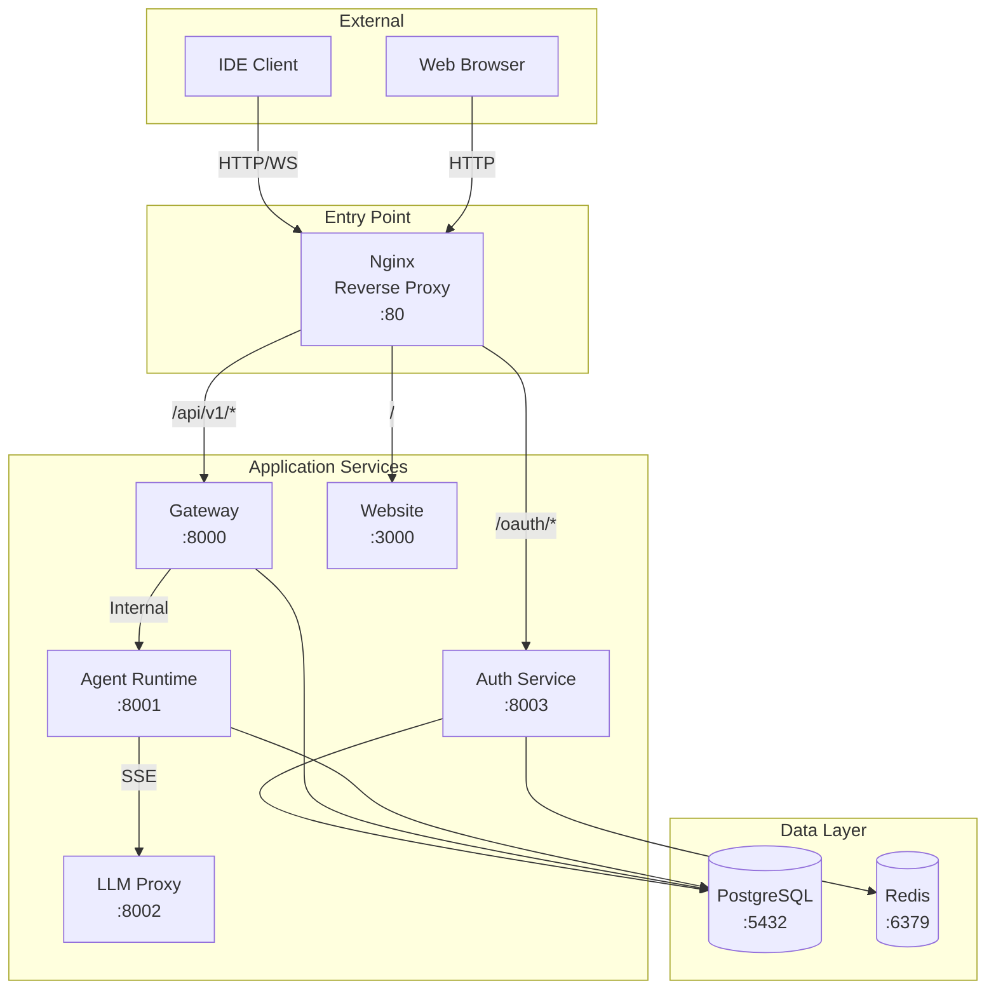

# Обзор развертывания

CodeLab AI Service поддерживает несколько вариантов развертывания в зависимости от ваших требований и инфраструктуры.

## 🚀 Варианты развертывания

### 1. Docker Compose (Рекомендуется для разработки)

**Преимущества:**
- ✅ Быстрый старт
- ✅ Все сервисы в одном месте
- ✅ Легкая настройка
- ✅ Подходит для локальной разработки

**Недостатки:**
- ❌ Не подходит для production
- ❌ Ограниченная масштабируемость
- ❌ Нет автоматического восстановления

**Использование:**
```bash
cd codelab-ai-service
docker compose up -d
```

Подробнее: [Docker Compose развертывание](docker-compose.md)

### 2. Kubernetes (Рекомендуется для production)

**Преимущества:**
- ✅ Горизонтальное масштабирование
- ✅ Автоматическое восстановление
- ✅ Load balancing
- ✅ Rolling updates
- ✅ Production-ready

**Недостатки:**
- ❌ Сложнее в настройке
- ❌ Требует знания Kubernetes
- ❌ Больше ресурсов

**Использование:**
```bash
helm install codelab ./codelab-chart -n codelab
```

Подробнее: [Kubernetes развертывание](kubernetes.md)

## 🏗️ Архитектура развертывания

### Компоненты системы



### Сетевая топология

| Сервис | Внешний порт | Внутренний порт | Протокол |
|--------|--------------|-----------------|----------|
| **Nginx** | 80, 443 | 80 | HTTP/HTTPS/WS |
| **Auth Service** | - | 8003 | HTTP |
| **Gateway** | - | 8000 | HTTP/WS |
| **Agent Runtime** | - | 8001 | HTTP |
| **LLM Proxy** | - | 8002 | HTTP/SSE |
| **PostgreSQL** | - | 5432 | TCP |
| **Redis** | - | 6379 | TCP |
| **Website** | - | 3000 | HTTP |

## 🔧 Требования к инфраструктуре

### Минимальные требования (Development)

**Для Docker Compose:**
- CPU: 4 cores
- RAM: 8 GB
- Disk: 20 GB
- OS: Linux, macOS, Windows с WSL2

**Для Kubernetes:**
- Kubernetes 1.19+
- 3 worker nodes
- CPU: 2 cores per node
- RAM: 4 GB per node
- Disk: 50 GB

### Рекомендуемые требования (Production)

**Для Kubernetes:**
- Kubernetes 1.24+
- 5+ worker nodes
- CPU: 4 cores per node
- RAM: 16 GB per node
- Disk: 100 GB SSD
- Load Balancer
- Persistent Volume provisioner

## 🌍 Окружения

### Development

**Характеристики:**
- SQLite для быстрого старта
- Минимальные ресурсы
- Отключена аутентификация (опционально)
- Локальный домен

**Конфигурация:**
```yaml
environment: development
replicaCount: 1
database:
  type: sqlite
auth:
  enabled: false
```

### Staging

**Характеристики:**
- PostgreSQL (внутренний)
- Средние ресурсы
- TLS с Let's Encrypt staging
- 2 реплики сервисов

**Конфигурация:**
```yaml
environment: staging
replicaCount: 2
database:
  type: postgresql
  internal: true
ingress:
  tls: true
  letsencrypt: staging
```

### Production

**Характеристики:**
- PostgreSQL (внешний, managed)
- Максимальные ресурсы
- TLS с Let's Encrypt production
- 3+ реплики сервисов
- Мониторинг и алертинг

**Конфигурация:**
```yaml
environment: production
replicaCount: 3
database:
  type: postgresql
  external: true
  host: postgres.example.com
ingress:
  tls: true
  letsencrypt: production
monitoring:
  enabled: true
```

## 🔐 Безопасность

### Обязательные меры безопасности

1. **Изменить все секреты**
   ```bash
   # Генерация случайных секретов
   openssl rand -base64 32
   ```

2. **Включить TLS/SSL**
   ```yaml
   ingress:
     tls: true
     certManager: true
   ```

3. **Настроить Network Policies**
   ```yaml
   networkPolicy:
     enabled: true
   ```

4. **Использовать внешнюю БД**
   - Managed PostgreSQL (AWS RDS, Google Cloud SQL)
   - Регулярные бэкапы
   - Шифрование at rest

5. **Настроить RBAC**
   ```yaml
   rbac:
     create: true
   ```

## 📊 Мониторинг

### Метрики

Рекомендуется настроить мониторинг:
- **Prometheus** - сбор метрик
- **Grafana** - визуализация
- **AlertManager** - алертинг

**Ключевые метрики:**
- Uptime сервисов
- Response time (p50, p95, p99)
- Error rate
- Request rate
- Database connections
- Memory usage
- CPU usage

### Логирование

Централизованное логирование:
- **ELK Stack** (Elasticsearch, Logstash, Kibana)
- **Loki** + Grafana
- **CloudWatch** (AWS)
- **Stackdriver** (GCP)

## 🔄 CI/CD

### Рекомендуемый pipeline

```yaml
# .github/workflows/deploy.yml
name: Deploy

on:
  push:
    branches: [main]

jobs:
  deploy:
    runs-on: ubuntu-latest
    steps:
      - uses: actions/checkout@v3
      
      - name: Build images
        run: docker compose build
      
      - name: Push to registry
        run: docker compose push
      
      - name: Deploy to Kubernetes
        run: |
          helm upgrade --install codelab ./codelab-chart \
            -f values-prod.yaml \
            -n codelab-prod
```

## 📋 Чеклист развертывания

### Перед развертыванием

- [ ] Выбран вариант развертывания
- [ ] Подготовлена инфраструктура
- [ ] Настроены DNS записи
- [ ] Получены SSL сертификаты
- [ ] Изменены все секреты
- [ ] Настроена база данных
- [ ] Настроен мониторинг

### После развертывания

- [ ] Проверены health endpoints
- [ ] Протестирована аутентификация
- [ ] Проверена работа WebSocket
- [ ] Настроены алерты
- [ ] Созданы бэкапы
- [ ] Документирована конфигурация

## 🔗 Следующие шаги

Выберите вариант развертывания:

1. [**Docker Compose**](docker-compose.md) - для локальной разработки
2. [**Kubernetes**](kubernetes.md) - для production
3. [**Конфигурация**](configuration.md) - детальная настройка
4. [**Мониторинг**](monitoring.md) - настройка мониторинга
5. [**Troubleshooting**](troubleshooting.md) - решение проблем

## 📚 Дополнительные ресурсы

- [codelab-chart README](../../codelab-chart/README.md)
- [Архитектура развертывания](../../codelab-chart/doc/ARCHITECTURE.md)
- [Руководство по развертыванию](../../codelab-chart/doc/DEPLOYMENT.md)
- [Конфигурация](../../codelab-chart/doc/CONFIGURATION.md)

---

**Нужна помощь?** Обратитесь к разделу [Troubleshooting](troubleshooting.md) или создайте issue в репозитории.
