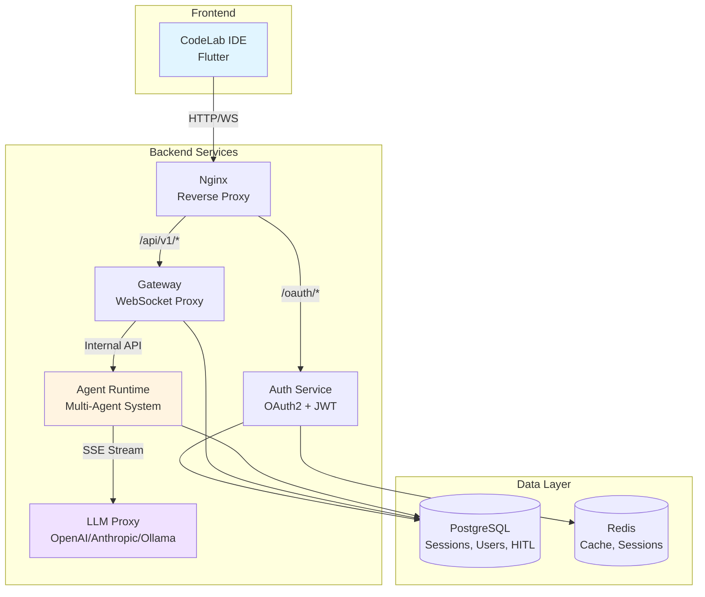

# Обзор платформы CodeLab

CodeLab — это современная AI-powered IDE платформа с мультиагентной системой, предназначенная для эффективной разработки программного обеспечения. Платформа объединяет мощь искусственного интеллекта с традиционными инструментами разработки, предоставляя разработчикам интеллектуального помощника, способного автономно выполнять сложные задачи.

## 🎯 Что такое CodeLab?

CodeLab состоит из двух основных компонентов:

### 1. CodeLab IDE (Frontend)

Кроссплатформенная IDE, построенная на Flutter:
- **Редактор кода** с подсветкой синтаксиса для 10+ языков
- **Файловый менеджер** для навигации по проекту
- **Встроенный терминал** с PTY поддержкой
- **AI ассистент** с интерактивным чатом
- **Поддержка платформ**: Windows, Linux, macOS

### 2. CodeLab AI Service (Backend)

Микросервисная архитектура с мультиагентной системой:
- **Gateway Service** - WebSocket прокси для real-time коммуникации
- **Auth Service** - OAuth2 аутентификация с JWT токенами
- **Agent Runtime** - мультиагентная система с 5 специализированными агентами
- **LLM Proxy** - унифицированный доступ к различным LLM провайдерам

## 🤖 Мультиагентная система

Ключевая особенность CodeLab — это мультиагентная система, где каждый агент специализируется на определенных задачах:

| Агент | Роль | Специализация |
|-------|------|---------------|
| **🎭 Orchestrator** | Координатор | Анализ задач и маршрутизация к специализированным агентам |
| **💻 Coder** | Разработчик | Написание и модификация кода, полный доступ ко всем инструментам |
| **🏗️ Architect** | Архитектор | Проектирование архитектуры, работа с документацией (.md файлы) |
| **🐛 Debug** | Отладчик | Поиск и исправление ошибок, анализ логов |
| **💬 Ask** | Консультант | Ответы на вопросы, объяснение кода, минимальные права |

## ✨ Ключевые возможности

### AI-Powered разработка
- **Автономное выполнение задач** - агенты могут самостоятельно выполнять сложные задачи
- **Контекстное понимание** - агенты анализируют весь проект для принятия решений
- **Streaming ответы** - token-by-token отображение ответов в реальном времени

### Human-in-the-Loop (HITL)
- **Контроль опасных операций** - подтверждение перед выполнением критичных действий
- **Предпросмотр изменений** - просмотр изменений перед применением
- **Гибкие настройки** - настройка уровня автономности агентов

### Инструменты агентов
Агенты имеют доступ к 9+ инструментам:
- `read_file` - чтение файлов
- `write_file` - создание/изменение файлов
- `list_files` - просмотр структуры проекта
- `search_files` - поиск в коде
- `execute_command` - выполнение команд в терминале
- `apply_diff` - применение изменений
- И другие...

### Event-Driven Architecture
- **Асинхронная обработка** - эффективная работа с множественными запросами
- **Масштабируемость** - горизонтальное масштабирование сервисов
- **Надежность** - персистентность сессий и восстановление после сбоев

## 🏗️ Архитектура

## 🚀 Основные преимущества

### Для разработчиков
- ⚡ **Ускорение разработки** - AI помощник берет на себя рутинные задачи
- 🎯 **Фокус на логике** - больше времени на решение бизнес-задач
- 🔍 **Быстрый анализ** - мгновенный поиск и анализ кода
- 📚 **Обучение** - AI объясняет код и предлагает улучшения

### Для команд
- 🤝 **Единый стандарт** - AI следует best practices
- 📖 **Автоматическая документация** - генерация документации из кода
- 🔄 **Консистентность** - единообразный стиль кода
- 🛡️ **Безопасность** - HITL контроль критичных операций

### Для бизнеса
- 💰 **Снижение затрат** - меньше времени на рутинные задачи
- 📈 **Повышение качества** - AI помогает избежать ошибок
- 🚀 **Быстрый time-to-market** - ускорение разработки
- 🔌 **Гибкость** - поддержка различных LLM провайдеров

## 🎓 Кому подходит CodeLab?

### Индивидуальные разработчики
- Работа над личными проектами
- Изучение новых технологий
- Прототипирование идей

### Команды разработки
- Совместная работа над проектами
- Стандартизация процессов
- Code review с AI помощником

### Enterprise
- On-premise развертывание
- Интеграция с корпоративными системами
- Кастомизация под специфические нужды

## 📊 Статус проекта

**Версия**: 1.0.0 (MVP)  
**Статус**: ✅ Production Ready  
**Дата релиза**: Январь 2026

### Реализованные функции
- ✅ Мультиагентная система (5 агентов)
- ✅ Event-Driven Architecture
- ✅ OAuth2 аутентификация
- ✅ HITL с database persistence
- ✅ Session persistence
- ✅ WebSocket + SSE streaming
- ✅ Поддержка множественных LLM провайдеров

### В разработке (Q1-Q2 2026)
- 🚧 LSP интеграция для автодополнения
- 🚧 Visual Debugger
- 🚧 Git интеграция
- 🚧 Multi-tab редактор

## 🔗 Следующие шаги

Готовы начать работу с CodeLab? Переходите к следующим разделам:

1. [**Системные требования**](system-requirements.md) - проверьте требования к системе
2. [**Установка**](installation.md) - установите CodeLab на свой компьютер
3. [**Быстрый старт**](quick-start.md) - создайте свой первый проект
4. [**Первый проект**](first-project.md) - пошаговое руководство

## 📚 Дополнительные ресурсы

- [Архитектура платформы](../architecture/overview.md)
- [AI Ассистент](../ai-assistant/overview.md)
- [API документация](../api/overview.md)
- [Руководство разработчика](../development/overview.md)

---

**Нужна помощь?** Обратитесь к [документации](../intro.md) или создайте issue в репозитории проекта.
