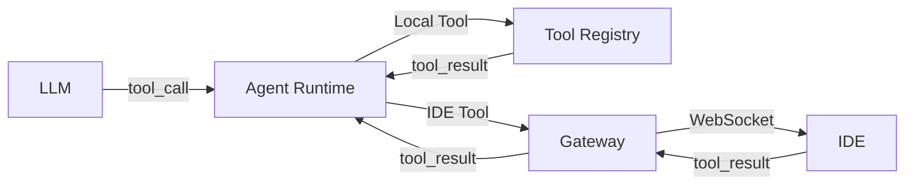

# Создание кастомных инструментов

Руководство по разработке и интеграции кастомных инструментов (tools) для AI агентов в CodeLab.

## Обзор

CodeLab поддерживает два типа инструментов:

- **Local Tools** - Выполняются в Agent Runtime (серверная сторона)
- **IDE-side Tools** - Выполняются в IDE через WebSocket (клиентская сторона)

## Архитектура инструментов



### Поток выполнения

1. **LLM генерирует tool_call** с именем инструмента и аргументами
2. **Agent Runtime** определяет тип инструмента (local или IDE-side)
3. **Выполнение:**
   - Local: выполняется в Agent Runtime
   - IDE-side: отправляется в IDE через WebSocket
4. **Результат** возвращается в Agent Runtime
5. **Agent Runtime** отправляет результат обратно в LLM

## Создание Local Tool

Local tools выполняются непосредственно в Agent Runtime и имеют доступ к серверным ресурсам.

### Шаг 1: Определение спецификации

Создайте JSON schema для вашего инструмента:

```python
# app/tools/my_custom_tool.py

TOOL_SPEC = {
    "name": "my_custom_tool",
    "description": "Описание того, что делает инструмент",
    "parameters": {
        "type": "object",
        "properties": {
            "param1": {
                "type": "string",
                "description": "Описание параметра 1"
            },
            "param2": {
                "type": "integer",
                "description": "Описание параметра 2",
                "default": 10
            }
        },
        "required": ["param1"]
    }
}
```

### Шаг 2: Реализация функции

```python
# app/tools/my_custom_tool.py

async def execute_my_custom_tool(
    param1: str,
    param2: int = 10,
    **kwargs
) -> dict:
    """
    Выполняет кастомную операцию.
    
    Args:
        param1: Первый параметр
        param2: Второй параметр (опционально)
        **kwargs: Дополнительные параметры (session_id, user_id и т.д.)
    
    Returns:
        dict: Результат выполнения
    
    Raises:
        ValueError: Если параметры некорректны
    """
    try:
        # Ваша логика здесь
        result = f"Processed {param1} with {param2}"
        
        return {
            "success": True,
            "result": result,
            "metadata": {
                "param1": param1,
                "param2": param2
            }
        }
    except Exception as e:
        return {
            "success": False,
            "error": str(e)
        }
```

### Шаг 3: Регистрация в Tool Registry

```python
# app/tools/registry.py

from app.tools.my_custom_tool import TOOL_SPEC, execute_my_custom_tool

class ToolRegistry:
    def __init__(self):
        self._tools = {}
        self._register_default_tools()
    
    def _register_default_tools(self):
        """Регистрация встроенных инструментов."""
        # Существующие инструменты
        self.register("echo", ECHO_SPEC, execute_echo)
        self.register("calculator", CALCULATOR_SPEC, execute_calculator)
        
        # Ваш кастомный инструмент
        self.register("my_custom_tool", TOOL_SPEC, execute_my_custom_tool)
    
    def register(self, name: str, spec: dict, executor: callable):
        """Регистрация инструмента."""
        self._tools[name] = {
            "spec": spec,
            "executor": executor
        }
    
    async def execute(self, tool_name: str, args: dict, **kwargs) -> dict:
        """Выполнение инструмента."""
        if tool_name not in self._tools:
            raise ValueError(f"Tool not found: {tool_name}")
        
        tool = self._tools[tool_name]
        executor = tool["executor"]
        
        return await executor(**args, **kwargs)
    
    def get_specs(self) -> list[dict]:
        """Получить спецификации всех инструментов."""
        return [tool["spec"] for tool in self._tools.values()]
```

### Шаг 4: Добавление в доступные агентам

```python
# app/agents/base_agent.py

class BaseAgent:
    def __init__(self, tool_registry: ToolRegistry):
        self.tool_registry = tool_registry
        self.available_tools = self._get_available_tools()
    
    def _get_available_tools(self) -> list[str]:
        """Определить доступные инструменты для агента."""
        # Базовые инструменты для всех агентов
        base_tools = ["read_file", "list_files", "search_in_code"]
        
        # Добавить кастомный инструмент
        if self.name == "coder":
            base_tools.append("my_custom_tool")
        
        return base_tools
```

## Создание IDE-side Tool

IDE-side tools выполняются в клиентском приложении (IDE) и имеют доступ к локальной файловой системе.

### Шаг 1: Определение спецификации (Agent Runtime)

```python
# app/tools/ide_custom_tool.py

IDE_CUSTOM_TOOL_SPEC = {
    "name": "ide_custom_tool",
    "description": "Кастомный инструмент, выполняемый в IDE",
    "parameters": {
        "type": "object",
        "properties": {
            "action": {
                "type": "string",
                "enum": ["analyze", "format", "validate"],
                "description": "Действие для выполнения"
            },
            "target": {
                "type": "string",
                "description": "Целевой файл или директория"
            }
        },
        "required": ["action", "target"]
    },
    "execution": "ide"  # Указывает, что выполняется в IDE
}
```

### Шаг 2: Регистрация в Agent Runtime

```python
# app/tools/registry.py

class ToolRegistry:
    def _register_default_tools(self):
        # IDE-side инструменты
        self.register("read_file", READ_FILE_SPEC, None)  # executor=None для IDE tools
        self.register("write_file", WRITE_FILE_SPEC, None)
        self.register("ide_custom_tool", IDE_CUSTOM_TOOL_SPEC, None)
    
    async def execute(self, tool_name: str, args: dict, **kwargs) -> dict:
        """Выполнение инструмента."""
        tool = self._tools.get(tool_name)
        
        if not tool:
            raise ValueError(f"Tool not found: {tool_name}")
        
        # Проверить, является ли инструмент IDE-side
        if tool["spec"].get("execution") == "ide":
            # Отправить в IDE через WebSocket
            return await self._execute_ide_tool(tool_name, args, **kwargs)
        
        # Выполнить локально
        executor = tool["executor"]
        return await executor(**args, **kwargs)
```

### Шаг 3: Реализация в IDE (Flutter/Dart)

```dart
// lib/services/tool_executor.dart

class ToolExecutor {
  Future<Map<String, dynamic>> executeIdeCustomTool({
    required String action,
    required String target,
  }) async {
    try {
      switch (action) {
        case 'analyze':
          return await _analyzeTarget(target);
        case 'format':
          return await _formatTarget(target);
        case 'validate':
          return await _validateTarget(target);
        default:
          throw Exception('Unknown action: $action');
      }
    } catch (e) {
      return {
        'success': false,
        'error': e.toString(),
      };
    }
  }
  
  Future<Map<String, dynamic>> _analyzeTarget(String target) async {
    // Ваша логика анализа
    final file = File(target);
    if (!await file.exists()) {
      throw Exception('File not found: $target');
    }
    
    final content = await file.readAsString();
    final lines = content.split('\n').length;
    
    return {
      'success': true,
      'result': {
        'lines': lines,
        'size': content.length,
        'path': target,
      }
    };
  }
  
  Future<Map<String, dynamic>> _formatTarget(String target) async {
    // Логика форматирования
    // ...
  }
  
  Future<Map<String, dynamic>> _validateTarget(String target) async {
    // Логика валидации
    // ...
  }
}
```

### Шаг 4: Обработка tool_call в IDE

```dart
// lib/services/websocket_handler.dart

class WebSocketHandler {
  final ToolExecutor toolExecutor;
  
  Future<void> handleToolCall(Map<String, dynamic> message) async {
    final toolName = message['tool_name'] as String;
    final callId = message['call_id'] as String;
    final args = message['args'] as Map<String, dynamic>;
    
    Map<String, dynamic> result;
    
    try {
      switch (toolName) {
        case 'read_file':
          result = await toolExecutor.executeReadFile(
            path: args['path'],
            startLine: args['start_line'],
            endLine: args['end_line'],
          );
          break;
        
        case 'write_file':
          result = await toolExecutor.executeWriteFile(
            path: args['path'],
            content: args['content'],
            createDirs: args['create_dirs'] ?? false,
          );
          break;
        
        case 'ide_custom_tool':
          result = await toolExecutor.executeIdeCustomTool(
            action: args['action'],
            target: args['target'],
          );
          break;
        
        default:
          throw Exception('Unknown tool: $toolName');
      }
      
      // Отправить результат обратно
      await _sendToolResult(callId, result);
      
    } catch (e) {
      await _sendToolError(callId, e.toString());
    }
  }
  
  Future<void> _sendToolResult(String callId, Map<String, dynamic> result) async {
    final message = {
      'type': 'tool_result',
      'call_id': callId,
      'result': result,
    };
    
    webSocket.send(jsonEncode(message));
  }
  
  Future<void> _sendToolError(String callId, String error) async {
    final message = {
      'type': 'tool_result',
      'call_id': callId,
      'error': {
        'code': 'EXECUTION_ERROR',
        'message': error,
      },
    };
    
    webSocket.send(jsonEncode(message));
  }
}
```

## Примеры кастомных инструментов

### Пример 1: Database Query Tool

```python
# app/tools/database_query.py

DATABASE_QUERY_SPEC = {
    "name": "database_query",
    "description": "Выполняет SQL запрос к базе данных",
    "parameters": {
        "type": "object",
        "properties": {
            "query": {
                "type": "string",
                "description": "SQL запрос"
            },
            "database": {
                "type": "string",
                "enum": ["postgres", "sqlite"],
                "description": "Тип базы данных"
            }
        },
        "required": ["query", "database"]
    }
}

async def execute_database_query(
    query: str,
    database: str,
    session_id: str = None,
    **kwargs
) -> dict:
    """Выполняет SQL запрос."""
    from app.core.database import get_db_session
    
    try:
        async with get_db_session(database) as session:
            result = await session.execute(query)
            rows = result.fetchall()
            
            return {
                "success": True,
                "rows": [dict(row) for row in rows],
                "count": len(rows)
            }
    except Exception as e:
        return {
            "success": False,
            "error": str(e)
        }
```

### Пример 2: API Request Tool

```python
# app/tools/api_request.py

import httpx

API_REQUEST_SPEC = {
    "name": "api_request",
    "description": "Выполняет HTTP запрос к внешнему API",
    "parameters": {
        "type": "object",
        "properties": {
            "url": {
                "type": "string",
                "description": "URL для запроса"
            },
            "method": {
                "type": "string",
                "enum": ["GET", "POST", "PUT", "DELETE"],
                "default": "GET"
            },
            "headers": {
                "type": "object",
                "description": "HTTP заголовки"
            },
            "body": {
                "type": "object",
                "description": "Тело запроса (для POST/PUT)"
            }
        },
        "required": ["url"]
    }
}

async def execute_api_request(
    url: str,
    method: str = "GET",
    headers: dict = None,
    body: dict = None,
    **kwargs
) -> dict:
    """Выполняет HTTP запрос."""
    try:
        async with httpx.AsyncClient() as client:
            response = await client.request(
                method=method,
                url=url,
                headers=headers,
                json=body,
                timeout=30.0
            )
            
            return {
                "success": True,
                "status_code": response.status_code,
                "headers": dict(response.headers),
                "body": response.json() if response.headers.get("content-type", "").startswith("application/json") else response.text
            }
    except Exception as e:
        return {
            "success": False,
            "error": str(e)
        }
```

### Пример 3: Code Analysis Tool (IDE-side)

```dart
// lib/tools/code_analyzer.dart

class CodeAnalyzer {
  Future<Map<String, dynamic>> analyzeCode({
    required String path,
    required String language,
  }) async {
    try {
      final file = File(path);
      final content = await file.readAsString();
      
      Map<String, dynamic> analysis;
      
      switch (language) {
        case 'dart':
          analysis = await _analyzeDart(content);
          break;
        case 'python':
          analysis = await _analyzePython(content);
          break;
        default:
          analysis = await _analyzeGeneric(content);
      }
      
      return {
        'success': true,
        'analysis': analysis,
      };
    } catch (e) {
      return {
        'success': false,
        'error': e.toString(),
      };
    }
  }
  
  Future<Map<String, dynamic>> _analyzeDart(String content) async {
    // Использовать dart analyzer
    final result = await Process.run('dart', ['analyze', '--format=json']);
    return jsonDecode(result.stdout);
  }
  
  Future<Map<String, dynamic>> _analyzeGeneric(String content) async {
    return {
      'lines': content.split('\n').length,
      'characters': content.length,
      'words': content.split(RegExp(r'\s+')).length,
    };
  }
}
```

## Best Practices

### 1. Валидация параметров

```python
def validate_parameters(args: dict, spec: dict) -> tuple[bool, str]:
    """Валидация параметров инструмента."""
    required = spec["parameters"].get("required", [])
    properties = spec["parameters"]["properties"]
    
    # Проверить обязательные параметры
    for param in required:
        if param not in args:
            return False, f"Missing required parameter: {param}"
    
    # Проверить типы
    for param, value in args.items():
        if param not in properties:
            continue
        
        expected_type = properties[param]["type"]
        if not _check_type(value, expected_type):
            return False, f"Invalid type for {param}: expected {expected_type}"
    
    return True, ""
```

### 2. Обработка ошибок

```python
async def execute_tool_safely(tool_name: str, args: dict, **kwargs) -> dict:
    """Безопасное выполнение инструмента с обработкой ошибок."""
    try:
        # Валидация
        is_valid, error = validate_parameters(args, tool_spec)
        if not is_valid:
            return {"success": False, "error": error}
        
        # Выполнение
        result = await tool_executor(**args, **kwargs)
        
        # Логирование
        logger.info(f"Tool {tool_name} executed successfully")
        
        return result
        
    except TimeoutError:
        return {"success": False, "error": "Tool execution timeout"}
    except PermissionError:
        return {"success": False, "error": "Permission denied"}
    except Exception as e:
        logger.error(f"Tool {tool_name} failed: {e}")
        return {"success": False, "error": str(e)}
```

### 3. Таймауты

```python
import asyncio

async def execute_with_timeout(
    executor: callable,
    timeout: int = 30,
    **kwargs
) -> dict:
    """Выполнение с таймаутом."""
    try:
        return await asyncio.wait_for(
            executor(**kwargs),
            timeout=timeout
        )
    except asyncio.TimeoutError:
        return {
            "success": False,
            "error": f"Execution timeout after {timeout}s"
        }
```

### 4. Логирование и метрики

```python
from app.events.event_bus import event_bus
from app.events.base_event import BaseEvent

async def execute_tool_with_metrics(
    tool_name: str,
    args: dict,
    **kwargs
) -> dict:
    """Выполнение с метриками."""
    import time
    
    start_time = time.time()
    
    try:
        result = await tool_executor(tool_name, args, **kwargs)
        
        # Публиковать событие успешного выполнения
        await event_bus.publish(BaseEvent(
            event_type="tool_executed",
            data={
                "tool_name": tool_name,
                "duration_ms": (time.time() - start_time) * 1000,
                "success": result.get("success", True)
            }
        ))
        
        return result
        
    except Exception as e:
        # Публиковать событие ошибки
        await event_bus.publish(BaseEvent(
            event_type="tool_failed",
            data={
                "tool_name": tool_name,
                "error": str(e),
                "duration_ms": (time.time() - start_time) * 1000
            }
        ))
        raise
```

### 5. Тестирование

```python
# tests/test_custom_tool.py

import pytest
from app.tools.my_custom_tool import execute_my_custom_tool

@pytest.mark.asyncio
async def test_my_custom_tool_success():
    """Тест успешного выполнения."""
    result = await execute_my_custom_tool(
        param1="test",
        param2=20
    )
    
    assert result["success"] is True
    assert "result" in result

@pytest.mark.asyncio
async def test_my_custom_tool_missing_param():
    """Тест с отсутствующим параметром."""
    with pytest.raises(TypeError):
        await execute_my_custom_tool(param2=20)

@pytest.mark.asyncio
async def test_my_custom_tool_invalid_param():
    """Тест с некорректным параметром."""
    result = await execute_my_custom_tool(
        param1="",
        param2=-1
    )
    
    assert result["success"] is False
    assert "error" in result
```

## Интеграция с HITL

Для опасных операций добавьте поддержку Human-in-the-Loop:

```python
async def execute_dangerous_tool(
    args: dict,
    session_id: str,
    **kwargs
) -> dict:
    """Инструмент, требующий подтверждения пользователя."""
    from app.services.hitl_service import HITLService
    
    hitl_service = HITLService()
    
    # Запросить подтверждение
    approval = await hitl_service.request_approval(
        session_id=session_id,
        tool_name="dangerous_tool",
        args=args,
        message="This operation will modify system files. Continue?"
    )
    
    if approval.status == "APPROVED":
        # Выполнить операцию
        return await _execute_dangerous_operation(args)
    elif approval.status == "REJECTED":
        return {"success": False, "error": "Operation rejected by user"}
    else:
        return {"success": False, "error": "Operation timeout"}
```

## Документирование инструментов

Создайте документацию для вашего инструмента:

```markdown
## my_custom_tool

Описание инструмента и его назначения.

### Параметры

- `param1` (string, обязательно): Описание параметра
- `param2` (integer, опционально): Описание параметра (по умолчанию: 10)

### Примеры

\`\`\`json
{
  "tool_name": "my_custom_tool",
  "args": {
    "param1": "value",
    "param2": 20
  }
}
\`\`\`

### Возвращаемое значение

\`\`\`json
{
  "success": true,
  "result": "...",
  "metadata": {...}
}
\`\`\`

### Ошибки

- `INVALID_PARAM`: Некорректный параметр
- `EXECUTION_ERROR`: Ошибка выполнения
```

## Дополнительные ресурсы

- [Tools Specification](../ai-assistant/tools.md)
- [Agent Protocol](../api/agent-protocol.md)
- [WebSocket Protocol](../api/websocket-protocol.md)
- [Event-Driven Architecture](../architecture/event-driven.md)
- [HITL Implementation](https://github.com/pese-git/codelab-ai-service/blob/main/doc/HITL_IMPLEMENTATION.md)

## Заключение

Создание кастомных инструментов позволяет расширить возможности AI агентов для решения специфических задач. Следуйте best practices по валидации, обработке ошибок и тестированию для обеспечения надежности и безопасности инструментов.
