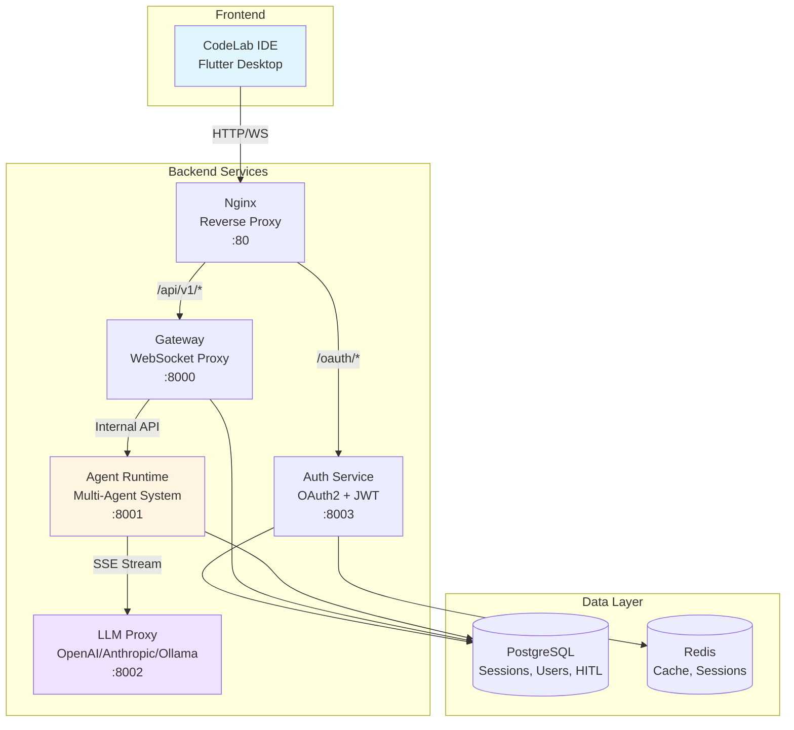

# Добро пожаловать в CodeLab

**CodeLab** — это AI-powered IDE платформа с мультиагентной системой, предназначенная для эффективной разработки программного обеспечения. Платформа объединяет кроссплатформенный Flutter IDE и микросервисную архитектуру AI Service для интеллектуальной помощи в разработке.

## 🎯 Что такое CodeLab?

CodeLab — это не просто IDE с AI помощником. Это полноценная платформа с **мультиагентной системой**, где 5 специализированных AI агентов работают вместе для решения сложных задач разработки:

- **🎭 Orchestrator** - координирует работу других агентов
- **💻 Coder** - пишет и модифицирует код
- **🏗️ Architect** - проектирует архитектуру и документацию
- **🐛 Debug** - находит и исправляет ошибки
- **💬 Ask** - отвечает на вопросы и консультирует

## ✨ Ключевые возможности

### 🤖 Мультиагентная система
- **Автономное выполнение задач** - агенты могут самостоятельно выполнять сложные задачи
- **Специализация** - каждый агент оптимизирован для своей области
- **Координация** - Orchestrator управляет взаимодействием агентов
- **Контекстное понимание** - агенты анализируют весь проект

### 🛡️ Human-in-the-Loop (HITL)
- **Контроль действий** - подтверждение опасных операций
- **Предпросмотр изменений** - просмотр перед применением
- **Гибкие настройки** - настройка уровня автономности
- **Персистентность** - сохранение решений в базе данных

### 💻 Кроссплатформенная IDE
- **Windows, Linux, macOS** - работает на всех платформах
- **Редактор кода** - подсветка синтаксиса для 10+ языков
- **Встроенный терминал** - PTY поддержка
- **Файловый менеджер** - навигация по проекту
- **AI чат** - интерактивное взаимодействие с агентами

### 🏗️ Микросервисная архитектура
- **Gateway** - WebSocket прокси для real-time коммуникации
- **Auth Service** - OAuth2 аутентификация с JWT
- **Agent Runtime** - мультиагентная система
- **LLM Proxy** - унифицированный доступ к LLM провайдерам
- **Event-Driven** - асинхронная обработка событий

### 🔌 Гибкость и расширяемость
- **Множество LLM** - OpenAI, Anthropic, Ollama
- **Docker Compose** - быстрый старт для разработки
- **Kubernetes** - production-ready развертывание
- **Helm Charts** - простое управление конфигурацией

## 🚀 Быстрый старт

### Для пользователей

1. **[Обзор платформы](getting-started/overview.md)** - узнайте о возможностях CodeLab
2. **[Системные требования](getting-started/system-requirements.md)** - проверьте требования
3. **[Установка](getting-started/installation.md)** - установите CodeLab
4. **[Быстрый старт](getting-started/quick-start.md)** - запустите первый проект
5. **[Первый проект](getting-started/first-project.md)** - создайте проект с AI помощником

### Для разработчиков

1. **[Архитектура](architecture/overview.md)** - изучите архитектуру системы
2. **[Разработка IDE](development/ide.md)** - работа с Flutter приложением
3. **[Разработка AI Service](development/ai-service.md)** - работа с микросервисами
4. **[Участие в проекте](development/contributing.md)** - внесите свой вклад

## 🏗️ Архитектура

Подробнее: [Архитектура платформы](architecture/overview.md)

## 📚 Документация

### 🚀 Начало работы
- [**Обзор платформы**](getting-started/overview.md) - что такое CodeLab
- [**Системные требования**](getting-started/system-requirements.md) - требования к системе
- [**Установка**](getting-started/installation.md) - установка компонентов
- [**Быстрый старт**](getting-started/quick-start.md) - первые шаги
- [**Первый проект**](getting-started/first-project.md) - создание проекта

### 🏗️ Архитектура
- [**Обзор архитектуры**](architecture/overview.md) - общая архитектура
- [**Архитектура IDE**](architecture/ide-architecture.md) - Flutter приложение
- [**Архитектура AI Service**](architecture/ai-service-architecture.md) - микросервисы
- [**Интеграция**](architecture/integration.md) - взаимодействие компонентов

### 🤖 AI Ассистент
- [**Обзор AI ассистента**](ai-assistant/overview.md) - мультиагентная система
- [**Мультиагентная система**](ai-assistant/multi-agent-system.md) - детальная архитектура
- [**Инструменты агентов**](ai-assistant/tools.md) - доступные инструменты
- [**HITL механизм**](ai-assistant/hitl.md) - контроль действий

### 🔌 API
- [**Gateway API**](api/gateway.md) - WebSocket прокси
- [**Agent Runtime API**](api/agent-runtime.md) - AI логика
- [**LLM Proxy API**](api/llm-proxy.md) - доступ к LLM
- [**Auth Service API**](api/auth-service.md) - OAuth2 аутентификация
- [**WebSocket Protocol**](api/websocket-protocol.md) - протокол взаимодействия
- [**Agent Protocol**](api/agent-protocol.md) - расширенный протокол

### 🚢 Развертывание
- [**Обзор развертывания**](deployment/overview.md) - варианты развертывания

### 📖 Руководства
- [**Интеграция аутентификации**](guides/auth-integration.md) - OAuth2 интеграция
- [**Интеграция мультиагентной системы**](guides/multi-agent-integration.md) - работа с агентами

### 💻 Разработка
- [**Разработка IDE**](development/ide.md) - Flutter приложение
- [**Разработка AI Service**](development/ai-service.md) - микросервисы
- [**Участие в проекте**](development/contributing.md) - как внести вклад
- [**Тестирование**](development/testing.md) - запуск тестов

### 🗺️ Backlog
- [**Roadmap 2026**](backlog/roadmap.md) - план развития на 2026 год

## 📊 Статус проекта

**Версия**: 1.0.0 (MVP)  
**Дата релиза**: Январь 2026
**Статус**: 🚧 In Development

### Реализовано
- ✅ Мультиагентная система (5 агентов)
- ✅ Event-Driven Architecture
- ✅ OAuth2 аутентификация
- ✅ HITL с database persistence
- ✅ Session persistence
- ✅ WebSocket + SSE streaming
- ✅ Поддержка множественных LLM провайдеров
- ✅ Flutter IDE (Windows, Linux, macOS)
- ✅ Docker Compose и Kubernetes развертывание

### В разработке (Q1-Q2 2026)
- 🚧 LSP интеграция для автодополнения
- 🚧 Visual Debugger
- 🚧 Git интеграция
- 🚧 Multi-tab редактор

Подробнее: [Roadmap 2026](backlog/roadmap.md)

## 🎓 Для кого CodeLab?

### Индивидуальные разработчики
- Работа над личными проектами
- Изучение новых технологий
- Прототипирование идей

### Команды разработки
- Совместная работа над проектами
- Стандартизация процессов
- Code review с AI помощником

### Enterprise
- On-premise развертывание
- Интеграция с корпоративными системами
- Кастомизация под специфические нужды

## 🤝 Участие в разработке

Мы приветствуем вклад в развитие проекта! 

**Как помочь:**
- 🐛 Сообщайте о багах
- 💡 Предлагайте новые функции
- 📝 Улучшайте документацию
- 💻 Вносите код

Подробнее: [Руководство по участию](development/contributing.md)

## 📝 Лицензия

Проект распространяется под лицензией MIT. Подробности в файле LICENSE.

## 🔗 Полезные ссылки

### Проект
- [GitHub Repository](https://github.com/pese-git/codelab-workspace)
- [CodeLab Organization](https://github.com/pese-git)

### Технологии
- [Flutter](https://flutter.dev) - UI фреймворк
- [FastAPI](https://fastapi.tiangolo.com) - Python web framework
- [LangChain](https://python.langchain.com) - LLM framework
- [Kubernetes](https://kubernetes.io) - Container orchestration

### Сообщество
- [Discussions](https://github.com/pese-git/codelab-workspace/discussions) - обсуждения
- [Issues](https://github.com/pese-git/codelab-workspace/issues) - баги и предложения

---

**Сделано с ❤️ командой CodeLab**

*CodeLab - AI-powered IDE для эффективной разработки*
